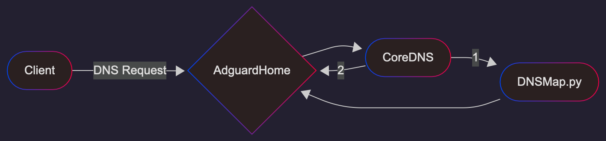

# AntiZapret VPN in Docker

Antizapret created to redirect only blocked domains to VPN tunnel. Its called split tunneling.
This repo is based on idea from original [AntiZapret LXD image](https://bitbucket.org/anticensority/antizapret-vpn-container/src/master/)

# Support and discussions group:
https://t.me/antizapret_support

# How  works?

1) List of blocked domains downloaded from open registry.
2) List parsed and rules for dns resolver (adguardhome) created.
3) Adguardhome resend requests for blocked domains to python script dnsmap.py.
4) Python script:
   a) resolve real address for domain
   b) create fake address from 10.244.0.0/15 subnet
   c) create iptables rule to forward all packets from fake ip to real ip.
5) Fake IP is sent in DNS response to client
6) All vpn tunnels configured with split tunneling. Only traffic to 10.244.0.0/15 subnet is routed through VPN.

# Features

- [openvpn-dco](https://openvpn.net/as-docs/tutorials/tutorial--turn-on-openvpn-dco.html) - a kernel extension for improving performance of OpenVPN
- Multiple VPN transports: Wireguard, OpenVPN, IPsec/XAuth ("Cisco IPsec")
- Adguard as main DNS resolver
- filebrowser as web viewer & editor for `*-custom.txt` files
- Unified dashboard
- Optional built-in reverse proxy based on caddy


# Installation

## Single Server (Easy)

Recommended to use server located in western countries. Some sites will block users from other countries. 

0. Install [Docker Engine](https://docs.docker.com/engine/install/):
   ```bash
   curl -fsSL https://get.docker.com -o get-docker.sh
   sudo sh get-docker.sh
   ```
1. Clone repository and start container:
   ```bash
   git clone https://github.com/xtrime-ru/antizapret-vpn-docker.git antizapret
   cd antizapret
   ```
2. Create docker-compose.override.yml with services you need. Minimal example with only wireguard:
```yml
services:
  adguard:
    environment:
      - ADGUARDHOME_PASSWORD=somestrongpassword
  wireguard:
     environment:
        - WIREGUARD_PASSWORD=somestrongpassword
     extends:
        file: services/wireguard/docker-compose.yml
        service: wireguard
```
Find full example in [docker-compose.override.sample.yml](./docker-compose.override.sample.yml)

3. Start services:
```shell
   docker compose pull
   docker compose build
   docker compose up -d
   docker system prune -f
```

## Docker Swarm, multiple exit nodes (Advanced)
Version 5 comes with ability to forward traffic to different exit nodes for different domains. 
For example, YouTube works best if exit node is close to client and other services require foreign IP to work. 
Docker swarm is used to build unified network between containers.

Its recommended to use local server as manager/primary node for VPN's, DNS and az-local containers.
Foreign server - as secondary/worker node for az-world container.

Most of the domains will be proxied through **local** server for maximum speed and performance. 
Some of the sites, which use geoip to block users, will be proxied through **foreign** server.

0. Repeat steps 0 and 1 from single server installation on **both servers**:
   - Install docker 
   - Checkout project in same location on both servers.
1. [Primary] Create docker-compose.override.yml on primary node and define which services you need. See step 2 from single server installation.
1. [Primary] Change hostnames of servers to az-local and az-world for ease of use: `hostnamectl set-hostname az-local`
1. [Secondary] Change hostnames of servers to az-local and az-world for ease of use: `hostnamectl set-hostname az-world`
1. [Optionally] hub.docker.com can be unreachable on local hostings. Proxy can be used. See instructions: https://dockerhub.timeweb.cloud
    Alternatively images can be build locally on **both servers**: `docker compose build`
1. [Primary]: `docker swarm init --advertise-addr <PRIMARY_SERVER_PUBLIC_IP_ADDRESS>`
1. [Secondary]: Copy command from results  and run it on secondary node: `docker swarm join --token <TOKEN> <MANAGER_IP_ADDRESS>:<PORT>`
1. [Primary]: Inspect swarm `docker node ls`
    ```text
    ID                            HOSTNAME   STATUS    AVAILABILITY   MANAGER STATUS   ENGINE VERSION
    6dzagr08r8d2iidkcumjjz3q7 *   az-local   Ready     Active         Leader           29.0.1
    vspy2m6w4tf7uv4ywgdnzttvr     az-world   Ready     Active                          29.0.1
    ```
1. [Primary] Add labels for nodes `docker node update --label-add location=local az-local && docker node update --label-add location=world az-world`
1. [Primary, Secondary]: create config folders on **both nodes**: ```docker compose pull; docker compose up -d; sleep 10; docker compose down;```
1. [Primary]: start swarm `docker compose config | docker run --rm -i xtrime/antizapret-vpn:5 compose2swarm | docker stack deploy -c - antizapret`


## Access admin panels:

### HTTP: 
By default panels have following http ports exposed to internet:
- dashboard: no exposed port
- adguard: 3000
- filebrowser: 2000
- openvpn: 8080
- wireguard: 51821
- wireguard-amnezia: 51831

If you do not wish to expose ports to internet override them in `docker-compose.override.yml`.
In this example adguard and wireguard admin panels are removed from internet, and wireguard udp server is exposed: 
```yml
services:
   antizapret:
      environment:
         - ADGUARDHOME_USERNAME=admin
         - ADGUARDHOME_PASSWORD=password
      ports: !reset []

   wireguard:
      extends:
         file: services/wireguard/docker-compose.yml
         service: wireguard
      environment:
         - WIREGUARD_PASSWORD=password
```

### HTTPS
To enable https server and create self-signed certificates - add `proxy` container to `docker-compose.override.yml`
When `proxy` container is started, access services with https at following ports at your host ip:
- dashboard: 443
- adguard: 1443
- filebrowser: 2443
- openvpn: 3443
- wireguard: 4443
- wireguard-amnezia: 5443

`proxy` container is optional.

### Local network
   When you connected to VPN, you can access containers without exposing ports to internet:
- http://adguard.antizapret:3000
- http://dashboard.antizapret:80
- http://wireguard-amnezia.antizapret:51821
- http://wireguard.antizapret:51821
- http://openvpn-ui.antizapret:8080
- http://filebrowser.antizapret:80

## Update

- Single instance
    ```shell
    git pull
    docker compose pull
    docker compose build
    docker compose down --remove-orphans && docker compose up -d --remove-orphans
    ```
- Swarm mode: 
    ```shell
  git pull
  docker pull xtrime/antizapret-vpn:5
  docker compose config | docker run --rm -i xtrime/antizapret-vpn:5 compose2swarm | docker stack deploy -c - antizapret
  ```

### Upgrade from v4

 - Wireguard/Amnezia - added new subnet for az-world exit node. Need to download new configs
 - OpenVPN - no actions needed
 - Aguard - Need to remove old config `rm -rf ./config/adguard`
 - Antizapret - adguard moved to separate container, all corresponding env variables must be moved to adguard container. 
    docker-compose.override.yml update needed
 - https/proxy - proxy container renamed to https. docker-compose.override.yml update needed. And rename old config folder: `mv ./config/caddy ./config/https`

```shell
docker compose down --remove-orphans
docker system prune -af
rm -rf ./config/adguard
```

Then follow installation steps.

## Reset:
Remove all settings, vpn configs and return initial state of service:
```shell
docker stack rm antizapret || docker compose down --remove-orphans
rm -rf config/*
```

# Documentation

## DNS resolving algorithm



1. DNS Request arrives into AdGuardHome
1. Adguard check it with blacklist rules. If domain in blacklist - return 0.0.0.0 and client not able to access domain.
1. Adguard Send DNS request to CoreDNS service.
1. CoreDNS Send DNS request to internal dnsmap.py server (antizapret container) and dnsmap.py sends request back to adguard
1. Adguard recieves requests one more time, but now applies rules with `$client=az-local` and real upstream server client (8.8.8.8 by default)
1. If domain in whitelist - adguard will resolve its address and return to dnsmap.py
1. If domain not in whitelist adguard return SERVFAIL
1. dnsmap.py send response to adguard:
   1. If it is valid IP, then replaces it with "internal" IP from `10.224.0.0/15` subnet, add masquerade to iptables and return internal ip to adguard 
   1. If is is SERVFAIL it sends this response to client.
1. If CoreDNS receives SERVFAIL it retries request and send it directly to Adguard. In this case rules with `$client=az-local` do not applied and request processed normally.

Why so complicated? 
- Windows and some other clients do not retry to Fallback DNS, even if  SERVFAIL received. So we added CoreDNS for that. 
- Adguard dont allow to redefine upstream in blacklist/whitelist rules. 
  But this rules have regex support and updated automatically, so we want to use them.
  So multiple requests from different clients are made internally.
- Adguard allows different upstreams for different clients. So we can use different DNS for blocked and non blocked domains.


## Adding Domains
There are two ways of adding domains. Via custom rules and via black lists.

### Adding Domains via rules
Open adguard panel: http://adguard.antizapret:3000/#custom_rules
Rules/syntaxes: https://adguard-dns.io/kb/general/dns-filtering-syntax/#basic-examples

By default, adguard rewrite all requests with SERVFAIL. This is a trick to make client retry DNS request to second, local DNS server.
Rules with the dnsrewrite response modifier have higher priority than other rules in AdGuard Home and AdGuard DNS.
To override default rule custom rules must have  `$dnsrewrite` modifier.

To support default adguard filters default SERVFAIL rule applied only to internal requests from client=az-local and client=az-world


Examples:
```
@@||subdomain.host.com^$dnsrewrite,client=az-local
@@||*.host.com^$dnsrewrite,client=az-local
@@||host.com^$dnsrewrite,client=az-world
@@||de^$dnsrewrite,client=az-world

@@/some_.*_regex/$dnsrewrite,client=az-local
```

### Adding Domains via lists
Also you can add any urls to blocklist. http://adguard.antizapret:3000/#dns_blocklist
Need to use adapter, to parse and adapt list in different formats.
 - Add domains for local exit node: `http://az-local.antizapret/list/?url=<ANY_URL>`
 - Add domains for world exit node `http://az-world.antizapret/list/?url=<ANY_URL>`
Supported formats: simple list of domains, adguard format, hosts format, json array of domains, regex list.


Options for adapter: 
 - `url` - download list from url
 - `file` - read local file. Used for include-host-{custom,dist}.txt
 - `filter_custom=1` - filter lists with rules from exclude-hosts-custom.txt.
 - `filter_dist=0` - filter lists with rules from exclude-hosts-dist.txt
 - `format=list` - 'list' or 'json'. Detected automatically.
 - `client=az-local` - name of client to add to rules. Detected automatically.
 - `allow=true` - disable this option, to block domains from list for this exit node.

## Adding IPs/Subnets
Add ips and subnets to `./config/antizapret/custom/include-ips-custom.txt` and run `docker compose exec antizapret doall`


## Environment Variables

You can define these variables in docker-compose.override.yml file for your needs:

Antizapret:
Consists of two containers: az-local and az-world. This is VPN exit nodes.
- `DNS=adguard` - Upstream DNS for resolving blocked sites (adguard by default)
- `AZ_SUBNET=10.224.0.0/15` Subnet for virtual addresses for blocked hosts.
- `ROUTES` - list of VPN containers and their virtual addresses. Used for iperf3 server.
- `DOALL_DISABLED=` - skip run on az-world node.

Adguard: 
- `ROUTES` - list of VPN containers and their virtual addresses. Used for uniq client addresses in adguard logs
- `ADGUARDHOME_PORT=3000`
- `ADGUARDHOME_USERNAME=admin`
- `ADGUARDHOME_PASSWORD=`
- `ADGUARDHOME_PASSWORD_HASH=` - hashed password, taken from the AdGuardHome.yaml file after the first run using `ADGUARDHOME_PASSWORD`. Dollar sign `$` in hash must be escaped with another dollar sign: `$$`

CoreDNS: 
- None

Filebrowser:
- `FILEBROWSER_PORT=admin`
- `FILEBROWSER_PASSWORD=password`

Proxy:
- `PROXY_DOMAIN=` - create lets-encrypt https certificate for domain. If not set host ip is used for self-signed certificate.
- `PROXY_EMAIL=` - email for letsecnrypt certificate.

Openvpn
- `ROUTES`
- `OBFUSCATE_TYPE=0` - custom obfuscation level of openvpn protocol.
   0 - disable.Act as regular openvpn client, support by all clients.
   1 - light obfuscation, works with microtics
   2 - strong obfuscation, works with some clients: openvpn gui client, asuswrt client...
- `AZ_LOCAL_SUBNET=10.224.0.0/15` - subnet for virtual blocked ips. Local exit node
- `AZ_WORLD_SUBNET=10.226.0.0/15` - subnet for virtual blocked ips. Remote exit node

Openvpn-ui
- `OPENVPN_ADMIN_PASSWORD=` — will be used as a server address in .ovpn profiles upon keys generation (default: your server's IP)
- `OPENVPN_DNS=10.224.0.1` - DNS address for clients. Must be in `ANTIZAPRET_SUBNET`
- `OPENVPN_LOCAL_IP_RANGE=10.1.165.0` - subnet for ovpn clients. Subnet can be viewed in adguard journal or in ovpn-ui panel

Wireguard/Wireguard Amnezia
- `ROUTES` 
- `WIREGUARD_PASSWORD=` - password for admin panel
- `WIREGUARD_PASSWORD_HASH=` - [hashed password](https://github.com/wg-easy/wg-easy/blob/v14.0.0/How_to_generate_an_bcrypt_hash.md) for admin panel
- `AZ_LOCAL_SUBNET=10.224.0.0/15` - subnet for virtual blocked ips. local exit node
- `AZ_WORLD_SUBNET=10.226.0.0/15` - subnet for virtual blocked ips. remote exit node
- `WG_DEFAULT_DNS=10.224.0.1` - DNS address for clients. Must be in `ANTIZAPRET_SUBNET`
- `WG_PERSISTENT_KEEPALIVE=25`
- `PORT=51821` - admin panel port
- `WG_PORT=51820` - wireguard server port
- `WG_DEVICE=eth0`

Wireguard, Wireguard Amnezia, Openvpn:
- `FORCE_FORWARD_DNS=true` - Redirects UDP traffic on port 53 to AntiZapret DNS (default: false)
- `FORCE_FORWARD_DNS_PORTS="53 5353"` - Parameter can be used to change port 53 for FORCE_FORWARD_DNS to one or more, separated by a space (default: 53)
- For other environment variables, see the original manual [Wireguard Amnezia](https://github.com/w0rng/amnezia-wg-easy) or [Wireguard](https://github.com/wg-easy/wg-easy).

## DNS
### Adguard Upstream DNS
Adguard uses Google DNS and Quad9 DNS to resolve unblocked domains. This upstreams support ECS requests (more info below).
Cloudflare DNS do not support ECS and is not recommended for use.  

Source code: [Adguard upstream DNS](./antizapret/root/adguardhome/upstream_dns_file_basis)
After container is started working copy is located here: `./config/adguard/conf/upstream_dns_file_basis`

### CDN + ECS
Some domains can resolve differently, depending on subnet (geoip) of client. In this case using of DNS located on remote server will break some services.
ECS allow to provide client IP in DNS requests to upstream server and get correct results.
Its enabled by default in Adguard and client ip is pointed to Moscow (Yandex Subnet).

If you located in other region, you need to replace `77.88.8.8` with your real ip address on this page `http://your-server-ip:3000/#dns`


## OpenVpn
### Create client certificates:
https://github.com/d3vilh/openvpn-ui?tab=readme-ov-file#generating-ovpn-client-profiles
1) go to `http://%your_ip%:8080/certificates`
2) click "create certificate"
3) enter unique name. Leave all other fields empty
4) click create
5) click on certificate name in list to download ovpn file.

### Enable OpenVPN Data Channel Offload (DCO)
[OpenVPN Data Channel Offload (DCO)](https://openvpn.net/as-docs/openvpn-dco.html) provides performance improvements by moving the data channel handling to the kernel space, where it can be handled more efficiently and with multi-threading.
**tl;dr** it increases speed and reduces CPU usage on a server.

Kernel extensions can be installed only on <u>a host machine</u>, not in a container.

#### Ubuntu 24.04
```bash
sudo apt install -y openvpn-dco-dkms
```

#### Ubuntu 20.04, 22.04
```bash
sudo apt update
sudo apt upgrade
echo "#### Please reboot your system after upgrade ###" && sleep 100
deb=openvpn-dco-dkms_0.0+git20231103-1_all.deb
sudo apt install -y efivar dkms linux-headers-$(uname -r)
wget http://archive.ubuntu.com/ubuntu/pool/universe/o/openvpn-dco-dkms/$deb
sudo dpkg -i $deb
```

### Legacy clients support
If your clients do not have GCM ciphers support you can use legacy CBC ciphers.
DCO is incompatible with legacy ciphers and will be disabled. This is also increase CPU load.


## Amnezia Wireguard

### Enable Amnezia Wireguard Kernel Extension

https://github.com/amnezia-vpn/amneziawg-linux-kernel-module?tab=readme-ov-file#ubuntu

#### Ubuntu 24.04
1. `sudo add-apt-repository ppa:amnezia/ppa`
2. `sudo apt install -y amneziawg`
3. restart server or `docker compose restart wireguard-amnezia`
4. check the list of kernel modules `dkms status`, 
   and check that bunch of `[kworker/X:X-wg-crypt-wg0]` processes are now running.

#### Ubuntu 20.04, 22.04
1. Edit `etc/apt/sources.list` and uncomment `deb-src http://archive.ubuntu.com/ubuntu ... main restricted`
2. `sudo apt update`
3. `sudo apt install -y software-properties-common python3-launchpadlib gnupg2 linux-headers-$(uname -r)`
4. install source for kernel `sudo apt-get source linux-image-$(uname -r)`
5. `sudo add-apt-repository ppa:amnezia/ppa`
6. `sudo apt install -y amneziawg`
7. `sudo dkms install -m amneziawg -v 1.0.0`
8. restart server or `docker compose restart wireguard-amnezia`
9. check the list of kernel modules `dkms status`, 
   and check that bunch of `[kworker/X:X-wg-crypt-wg0]` processes are now running.

### Amnezia Wireguard Block
Some providers can block AWG with default junk packets size. Large junk packets without response can be judged as DDOS attack.
Use env variables to change their size:

```
Jc=3
Jmin=20
Jmax=100
```
or
```
Jc=2
Jmin=10
Jmax=20
```
Example part of docker-compose.override.yml with JMIN and JMAX:
```yml
  wireguard-amnezia:
    environment:
      - WIREGUARD_PASSWORD=xxxxx
      - JC=3
      - JMIN=20
      - JMAX=100
    extends:
      file: services/wireguard/docker-compose.yml
      service: wireguard-amnezia
```
Settings/env variables are saved in ./config/wireguard_amnezia/ folder. To update them remove folder and run container again.
This will also remove all existing clients/certificates.
```shell
docker compose down && rm -rf ./config/wireguard_amnezia/ && docker compose up -d
```

### VPN / Hosting block
Most providers now block vpn to foreign IPs. Obfuscation in amnezia or openvpn not always fix the issue.
For stable vpn operation you can try to connect to  VPS inside of your country and then proxy  traffic to foreign server.

There are two ways: 
1. [Recommended] Install in [docker swarm mode](#docker-swarm-multiple-exit-nodes-advanced)
1. Proxy all traffic frought local proxy. See below.

Example of startup script.
Replace <SERVER_IP> with IP address of your server and run it on fresh VPS (ubuntu 24.04 is recommended):

```shell
#!/bin/sh

# Fill with your foreign server ip
export VPN_IP=<SERVER_IP>

echo "net.ipv4.ip_forward=1" >> /etc/sysctl.d/99-sysctl.conf
sysctl -w net.ipv4.ip_forward=1

# DNAT rules
iptables -t nat -A PREROUTING -p tcp ! --dport 22 -j DNAT --to-destination "$VPN_IP"
iptables -t nat -A PREROUTING -p udp ! --dport 22 -j DNAT --to-destination "$VPN_IP"
# MASQUERADE rules
iptables -t nat -A POSTROUTING -p tcp -d "$VPN_IP" -j MASQUERADE
iptables -t nat -A POSTROUTING -p udp -d "$VPN_IP"  -j MASQUERADE

echo iptables-persistent iptables-persistent/autosave_v4 boolean true | sudo debconf-set-selections
echo iptables-persistent iptables-persistent/autosave_v6 boolean false | sudo debconf-set-selections
apt install -y iptables-persistent

```

## Extra information
- [OpenWrt setup guide](./docs/guide_OpenWrt.md) - how to setup OpenWrt router with this solution to keep LAN clients happy.
- [Keenetic setup guide](./docs/guide_Keenetic.md) - instructions for configuring the server and connecting Keenetic routers to it [(на русском языке)](./docs/guide_Keenetic_RU.md)

## Test speed with iperf3
iperf3 server is included in antizapret-vpn container.
1. Connect to VPN
2. Use iperf3 client on your phone or computer to check upload/download speed.
    Example 10 threads for 10 seconds and report result every second:
    ```shell
    iperf3 -c core.antizapret -i1 -t10 -P10
    iperf3 -c core.antizapret -i1 -t10 -P10 -R
    ```

# Credits
- [ProstoVPN](https://antizapret.prostovpn.org) — the original project
- [AntiZapret VPN Container](https://bitbucket.org/anticensority/antizapret-vpn-container/src/master/) — source code of the LXD-based container
- [AntiZapret PAC Generator](https://bitbucket.org/anticensority/antizapret-pac-generator-light/src/master/) — proxy auto-configuration generator to bypass censorship of Russian Federation
- [Amnezia WireGuard VPN](https://github.com/w0rng/amnezia-wg-easy) — used for Amnezia Wireguard integration
- [WireGuard VPN](https://github.com/wg-easy/wg-easy) — used for Wireguard integration
- [OpenVPN](https://github.com/d3vilh/openvpn-ui) - used for OpenVPN integration
- [IPsec VPN](https://github.com/hwdsl2/docker-ipsec-vpn-server) — used for IPsec integration
- [AdGuardHome](https://github.com/AdguardTeam/AdGuardHome) - DNS resolver
- [filebrowser](https://github.com/filebrowser/filebrowser) - web file browser & editor
- [lighttpd](https://github.com/lighttpd/lighttpd1.4) - web server for unified dashboard
- [caddy](https://github.com/caddyserver/caddy) - reverse proxy
- [No Thought Is a Crime](https://ntc.party) — a forum about technical, political and economical aspects of internet censorship in different countries
