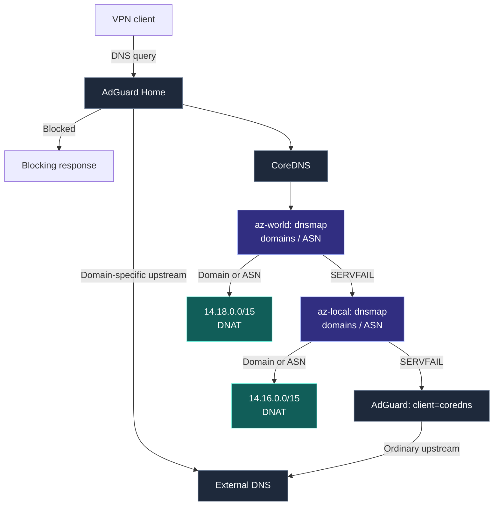
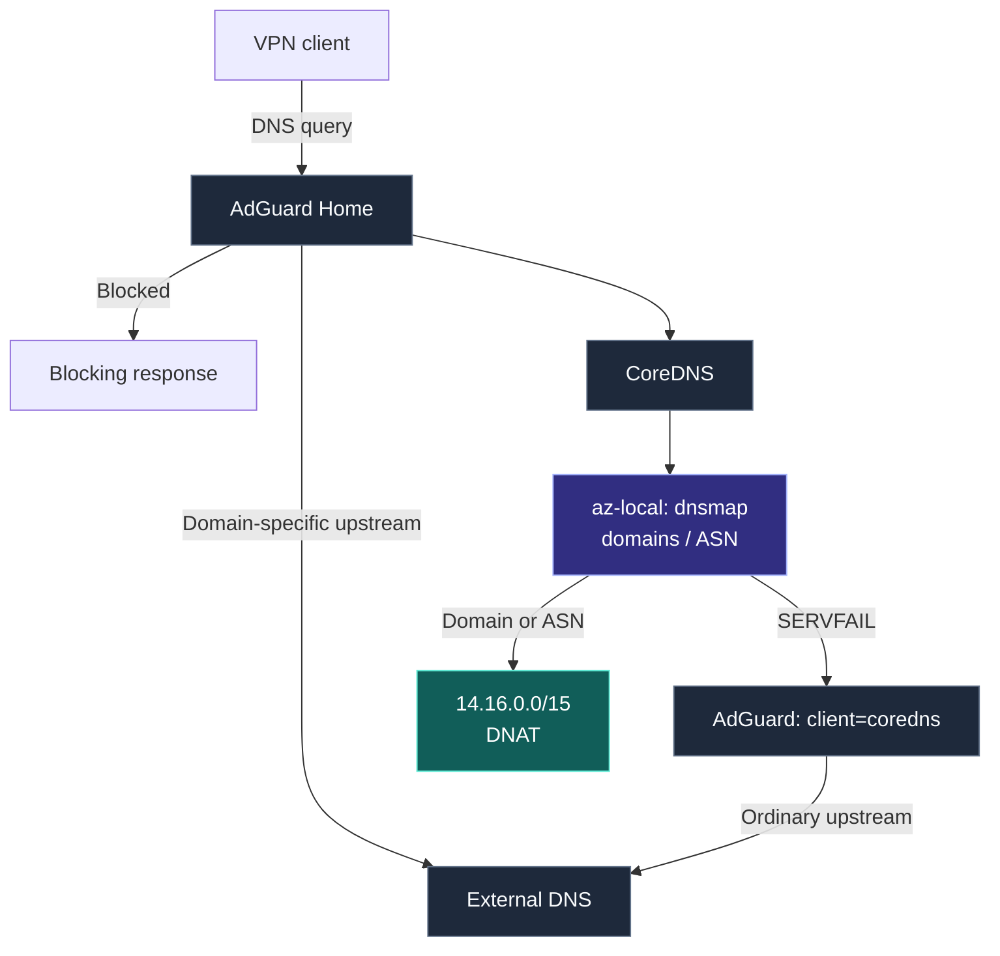
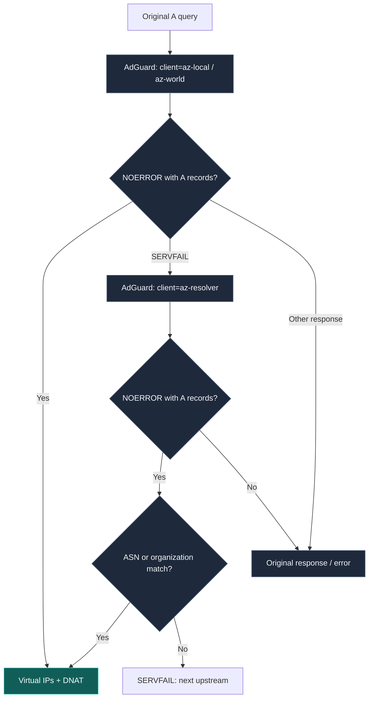

[English](README.md) | [Русский](README_RU.md)

# AntiZapret VPN in Docker

Antizapret created to redirect only blocked domains to VPN tunnel. Its called split tunneling.
This repo is based on idea from original [AntiZapret LXD image](https://bitbucket.org/anticensority/antizapret-vpn-container/src/master/)

## Table of contents

- [Support and discussions group](#support-and-discussions-group)
- [Features](#features)
- [How it works](#how-it-works)
- [Installation](#installation)
  - [Single Server (Easy)](#single-server-easy)
  - [Docker Swarm, multiple exit nodes (Advanced)](#docker-swarm-multiple-exit-nodes-advanced)
  - [VPN / Hosting block](#vpn--hosting-block)
  - [After installation](#after-installation)
  - [Access admin panels](#access-admin-panels)
    - [HTTPS](#https)
      - [Custom sites on ports 80 and 444](#custom-sites-on-ports-80-and-444)
    - [Local network](#local-network)
    - [HTTP](#http)
  - [Update](#update)
    - [Upgrade from v5](#upgrade-from-v5)
  - [Reset](#reset)
- [Documentation](#documentation)
  - [FAQ (Frequently Asked Questions)](#faq-frequently-asked-questions)
  - [DNS resolving algorithm](#dns-resolving-algorithm)
    - [Docker Swarm](#docker-swarm)
    - [Single node (Docker Compose)](#single-node-docker-compose)
    - [Inside an exit node: domains and ASN](#inside-an-exit-node-domains-and-asn)
    - [CNAME resolution and direct exceptions](#cname-resolution-and-direct-exceptions)
    - [Reading the query log](#reading-the-query-log)
  - [Routing rules: include, exclude and ASN](#routing-rules-include-exclude-and-asn)
    - [Custom rule files](#custom-rule-files)
    - [Including domains](#including-domains)
    - [Excluding domains](#excluding-domains)
    - [Adding ASNs](#adding-asns)
    - [Adding IPs/Subnets](#adding-ipssubnets)
    - [Direct DNS resolution for domains on VPN-listed CDN networks](#direct-dns-resolution-for-domains-on-vpn-listed-cdn-networks)
    - [Updating and checking rules](#updating-and-checking-rules)
  - [Adding Domains](#adding-domains)
    - [Adding Domains via rules](#adding-domains-via-rules)
    - [Adding Domains via lists](#adding-domains-via-lists)
    - [List adapter options](#list-adapter-options)
    - [Routing a website through VPN for a specific client](#routing-a-website-through-vpn-for-a-specific-client)
  - [SOCKS5 and HTTP(S) Proxy (per-application routing)](#socks5-and-https-proxy-per-application-routing)
    - [How it works](#how-it-works-1)
    - [How to disable HTTPS access from the internet](#how-to-disable-https-access-from-the-internet)
    - [When to use proxy instead of DNS-based routing](#when-to-use-proxy-instead-of-dns-based-routing)
    - [Configuration](#configuration)
    - [Client setup](#client-setup)
  - [zapret2](#zapret2)
    - [Changing configuration](#changing-configuration)
    - [Strategy selection](#strategy-selection)
  - [Cloudflare WARP](#cloudflare-warp)
    - [Docker Swarm](#docker-swarm-1)
  - [Environment Variables](#environment-variables)
    - [Antizapret](#antizapret)
    - [Adguard](#adguard)
    - [CoreDNS](#coredns)
    - [Filebrowser](#filebrowser)
    - [Https](#https-1)
    - [OpenConnect (ocserv)](#openconnect-ocserv)
    - [Openvpn](#openvpn)
    - [Openvpn-ui](#openvpn-ui)
    - [Wireguard/Wireguard Amnezia](#wireguardwireguard-amnezia)
    - [SOCKS5 Proxy (deprecated, use proxy below)](#socks5-proxy-deprecated-use-proxy-below)
    - [Proxy (http + socks5)](#proxy-http--socks5)
  - [DNS](#dns)
    - [Adguard Upstream DNS](#adguard-upstream-dns)
    - [CDN + ECS](#cdn--ecs)
  - [OpenConnect (ocserv)](#openconnect-ocserv-1)
    - [User management](#user-management)
    - [Client setup](#client-setup-1)
  - [OpenVPN](#openvpn-1)
    - [Create client certificates](#create-client-certificates)
    - [Enable OpenVPN Data Channel Offload (DCO)](#enable-openvpn-data-channel-offload-dco)
      - [Ubuntu 26.04/24.04/22.04/20.04](#ubuntu-2604240422042004)
    - [Legacy clients support](#legacy-clients-support)
  - [Amnezia Wireguard](#amnezia-wireguard)
    - [Enable Amnezia Wireguard Kernel Extension](#enable-amnezia-wireguard-kernel-extension)
      - [Ubuntu 26.04](#ubuntu-2604)
      - [Ubuntu 24.04](#ubuntu-2404)
      - [Ubuntu 20.04, 22.04](#ubuntu-2004-2204)
    - [AmneziaWG Parameters](#amneziawg-parameters)
      - [Parameter Compatibility Table](#parameter-compatibility-table)
      - [Notes](#notes)
    - [Amnezia Wireguard Block Size](#amnezia-wireguard-block-size)
  - [Extra information](#extra-information)
  - [Test speed with iperf3](#test-speed-with-iperf3)
- [Credits](#credits)

# Support and discussions group:
https://t.me/antizapret_support

# Features

- Modular design. External and high quality opensource modules/containers are used as builing blocks of our system. 
- User friendly web panels for administration of VPN's and DNS.
- Multiple VPN transports: WireGuard, AmneziaWG, OpenVPN, and OpenConnect (ocserv).
- AdguardHome as main DNS resolver and blocked domains manager
- Multi-Server Architecture to bypass services geo restrictions. Different domains use different servers as exit nodes.
- Firewall to protect from port scanning
- Support for kernel modules for OpenVPN and Amnezia Wireguard to decrease CPU usage.
- SOCKS5 and HTTP(S) proxies for per-application routing through local or world exit nodes
- Built-in anti-DPI support with [bol-van/zapret2](https://github.com/bol-van/zapret2) for HTTP, TLS, and QUIC traffic. Config bundled from [vernette/ss-zapret2](https://github.com/vernette/ss-zapret2)

# How it works?

1. AdGuard Home applies its DNS filters and forwards ordinary queries to CoreDNS. Domain-specific upstreams can resolve selected domains directly.
2. CoreDNS tries the VPN exit nodes in order: `az-world` → `az-local` in Swarm, or only `az-local` in single-server Compose.
3. Each exit node asks AdGuard using its ClientID. A matching domain rule enables VPN routing; otherwise, `dnsmap` resolves through `az-resolver` and checks the returned IPv4 addresses against ASN and organization rules.
4. For a match, `dnsmap` allocates virtual IPv4 addresses and creates iptables DNAT mappings to the real addresses. The default pools are `14.16.0.0/15` for the local exit and `14.18.0.0/15` for the world exit.
5. CoreDNS returns virtual addresses for VPN-routed domains or falls back to an ordinary DNS answer when no exit node matches. `finalize force_resolve` also checks CNAME targets through the same routing chain.
6. VPN clients route virtual addresses through the tunnel. Explicit IP/CIDR lists can also add routes for real addresses. See [Routing rules: include, exclude and ASN](#routing-rules-include-exclude-and-asn).


# Installation

> [!IMPORTANT]
> Commands must be run as root. Otherwise, config files will have inconsistent rights, and some containers will reboot infinitely.

## Single Server (Easy)

Recommended to use server located in western countries. Some sites will block users from other countries. 
The default Compose configuration runs one `az-local` exit container. It handles
both the local and world domain lists using the `14.16.0.0/15` range.

0. Install [Docker Engine](https://docs.docker.com/engine/install/):
   ```bash
   curl -fsSL https://get.docker.com -o get-docker.sh
   sudo sh get-docker.sh
   ```
1. Clone repository and start container:
   ```bash
   git clone https://github.com/xtrime-ru/antizapret-vpn-docker.git antizapret
   cd antizapret
   git checkout v6
   ```
2. Create docker-compose.override.yml with services you need. Minimal example with only wireguard:
```yml
services:
  adguard:
    environment:
      - ADGUARDHOME_PASSWORD=somestrongpassword
  wireguard:
     environment:
        - WIREGUARD_PASSWORD=somestrongpassword
     extends:
        file: services/wireguard/docker-compose.yml
        service: wireguard
```
Find full example in [docker-compose.override.sample.yml](./docker-compose.override.sample.yml)

3. Start services:
```shell
   docker compose up -d
   docker system prune -f
```

## Docker Swarm, multiple exit nodes (Advanced)
Version 5 and 6 comes with ability to forward traffic to different exit nodes for different domains. 
For example, YouTube works best if exit node is close to client and other services require foreign IP to work. 
Docker swarm is used to build unified network between containers.

Its recommended to use local server as manager/primary node for VPN's, DNS and az-local containers.
Foreign server – as secondary/worker node for az-world container.

Most of the domains will be proxied through **local** server for maximum speed and performance. 
Some of the sites, which use geoip to block users, will be proxied through **foreign** server.

0. Repeat steps 0 and 1 from single server installation on **both servers**:
   - Install docker 
   - Checkout project in same location on both servers.
1. [Primary] Create docker-compose.override.yml on primary node and define which services you need. See step 2 from single server installation.
1. [Primary] Change hostnames of servers to az-local and az-world for ease of use: `hostnamectl set-hostname az-local`
1. [Secondary] Change hostnames of servers to az-local and az-world for ease of use: `hostnamectl set-hostname az-world`
1. [Optionally] hub.docker.com can be unreachable on local hostings. Proxy can be used. See instructions: https://dockerhub.timeweb.cloud
    Alternatively images can be built locally on **both servers**: `docker compose --env-file compose.swarm.env build`
1. [Primary]: `docker swarm init --advertise-addr <PRIMARY_SERVER_PUBLIC_IP_ADDRESS>`
1. [Secondary]: Copy command from results  and run it on secondary node: `docker swarm join --token <TOKEN> <MANAGER_IP_ADDRESS>:<PORT>`
1. [Primary]: Inspect swarm `docker node ls`
    ```text
    ID                            HOSTNAME   STATUS    AVAILABILITY   MANAGER STATUS   ENGINE VERSION
    6dzagr08r8d2iidkcumjjz3q7 *   az-local   Ready     Active         Leader           29.0.1
    vspy2m6w4tf7uv4ywgdnzttvr     az-world   Ready     Active                          29.0.1
    ```
1. [Primary] Add labels for nodes `docker node update --label-add location=local az-local && docker node update --label-add location=world az-world`
1. [Primary]: start swarm. The last Compose file adds `az-world` and splits the address range between both exit nodes:
   ```shell
   docker compose --env-file compose.swarm.env config | docker run --pull always --rm -i xtrime/antizapret-vpn:6 compose2swarm | docker stack deploy --prune -c - antizapret
   ```
1. [Primary]: Docker Swarm does not support passing host devices to services in the same way as Docker Compose, so VPN containers require DKMS kernel modules:
    - [Enable OpenVPN Data Channel Offload (DCO)](#enable-openvpn-data-channel-offload-dco)
    - [Enable Amnezia Wireguard Kernel Extension](#enable-amnezia-wireguard-kernel-extension)

## VPN / Hosting block
Most providers now block vpn connections to foreign IPs. Obfuscation in Amnezia or OpenVpn not always fix the issue.
For stable vpn operation you can try to connect to VPS inside your country and then proxy traffic to foreign server.

There are two ways:
1. [Recommended] Installation in [docker swarm mode](#docker-swarm-multiple-exit-nodes-advanced)
1. Proxy all traffic via local proxy. See below.

Example of startup script.
Replace <SERVER_IP> with IP address of your server and run it on fresh VPS (ubuntu 24.04 is recommended):

```shell
#!/bin/sh

# Fill with your foreign server ip
export VPN_IP=<SERVER_IP>

echo "net.ipv4.ip_forward=1" >> /etc/sysctl.d/99-sysctl.conf
sysctl -w net.ipv4.ip_forward=1

# DNAT rules
iptables -t nat -A PREROUTING -p tcp ! --dport 22 -j DNAT --to-destination "$VPN_IP"
iptables -t nat -A PREROUTING -p udp ! --dport 22 -j DNAT --to-destination "$VPN_IP"
# MASQUERADE rules
iptables -t nat -A POSTROUTING -p tcp -d "$VPN_IP" -j MASQUERADE
iptables -t nat -A POSTROUTING -p udp -d "$VPN_IP"  -j MASQUERADE

echo iptables-persistent iptables-persistent/autosave_v4 boolean true | sudo debconf-set-selections
echo iptables-persistent iptables-persistent/autosave_v6 boolean false | sudo debconf-set-selections
apt install -y iptables-persistent

```

## After installation
1. Make sure Secure DNS is disabled in your browser settings. 
   In chrome: Navigate to Settings > Privacy and security > Security, scroll to the "Advanced" section, and toggle off "Use secure DNS"
2. Install DKMS modules for openvpn and/or amnezia wireguard (if you use them): 
    - [Enable OpenVPN Data Channel Offload (DCO)](#enable-openvpn-data-channel-offload-dco)
    - [Enable Amnezia Wireguard Kernel Extension](#enable-amnezia-wireguard-kernel-extension)

## Access admin panels

### HTTPS
By default, all container can be accessed via https. For certificated management separate `https` container is used.
If no domain is configured, Caddy detects the server's public IPv4 address and requests a short-lived Let's Encrypt certificate for that address. A persistent self-signed certificate is served until ACME validation succeeds, so HTTPS and ocserv can still start when `80/tcp` is not reachable from the Internet.
Caddy forwards all connections from its Layer 4 listener on `443/tcp` to ocserv and passes the original client address through PROXY protocol v2. The Dashboard uses the separate HTTPS port `444/tcp`, while the ocserv DTLS channel is exposed directly on `443/udp`.

- dashboard: https://%your-server-ip%:444
- adguard: https://%your-server-ip%:1443
- filebrowser: https://%your-server-ip%:2443
- openvpn: https://%your-server-ip%:3443
- wireguard: https://%your-server-ip%:4443
- wireguard-amnezia: https://%your-server-ip%:5443

#### Custom sites on ports 80 and 444

Additional Caddy configurations can be stored in `config/https/config/sites-enabled`. The directory is created automatically when the `https` container starts, and all files in it are imported into the main Caddyfile.

For example, to expose the `my-app` service available on port `8080` in the Docker network, create `config/https/config/sites-enabled/my-app.caddy`:

```caddyfile
example.com {
  reverse_proxy my-app:8080
}
```

Caddy will accept requests for `example.com` on ports 80 and 444, automatically redirect HTTP to HTTPS port 444, and manage the TLS certificate. The domain must point to the server, and the `my-app` service must be reachable from the `https` container through the shared Docker network.

Restart the container after adding or changing a configuration:

```shell
docker service update --force antizapret_https || docker compose restart https
```


### Local network
   When you connected to VPN, you can access containers without exposing ports to internet:
- http://adguard.antizapret:3000
- http://dashboard.antizapret:80
- http://wireguard-amnezia.antizapret:51821
- http://wireguard.antizapret:51821
- http://openvpn-ui.antizapret:8080
- http://filebrowser.antizapret:80

### HTTP:
By default, containers don't expose web panels to internet. All web panels are proxied via `https` container.
If you want to expose http to internet, add port forwarding to docker-compose.override.yml.
Example:
```yml
services:
   adguard:
      #...
      ports:
        - "3000:3000/tcp"
```

List of default ports: 

- adguard: http://%your-server-ip%:3000
- dashboard: http://%your-server-ip%:80
- wireguard-amnezia: http://%your-server-ip%:51821
- wireguard: http://%your-server-ip%:51821
- openvpn-ui: http://%your-server-ip%:8080
- filebrowser: http://%your-server-ip%:80

Some containers have same ports. So you need to choose unique external port in docker-compose.override.yml.

## Update

- Single instance
   ```shell
   git pull --rebase
   docker compose down --remove-orphans
   docker compose up -d --remove-orphans
   docker system prune -af
   ```
- Swarm mode: 
   ```shell
   git pull --rebase
   docker pull xtrime/antizapret-vpn:6
   docker compose --env-file compose.swarm.env config | docker run --pull always --rm -i xtrime/antizapret-vpn:6 compose2swarm | docker stack deploy --prune -c - antizapret
   docker system prune -af
   ```

### Upgrade from v5

1. Upgrade containers:
- Docker Compose mode (single server):
   ```shell
   docker compose down --remove-orphans
   git fetch && git checkout v6 && git pull --rebase
   docker compose down --remove-orphans
   docker compose up -d --remove-orphans
   docker system prune -af
   ```
- Swarm mode:
   - master node:
  ```shell
  docker stack rm antizapret && sleep 10
  git fetch && git checkout v6 && git pull --rebase
  docker compose --env-file compose.swarm.env config | docker run --pull always --rm -i xtrime/antizapret-vpn:6 compose2swarm | docker stack deploy --prune -c - antizapret
  docker system prune -af
   ```
  - worker nodes:
  ```shell
  git fetch && git checkout v6 && git pull --rebase
  ```

2. Update clients:
   - Wireguard/Amnezia 
     - Check if your password is longer than 12 symbols. Update if needed in docker-compose.override.yml
     - Download new client configs, or add `14.16.0.0/14` to AllowedIps manually in old configs.
   - OpenVPN 
     - Click save at openvpn-ui server config page: http://openvpn-ui.antizapret:8080/ov/config/ and then restart openvpn server.
     - Install new dkms module on host: `apt remove openvpn-dkms-dco` + https://github.com/xtrime-ru/antizapret-vpn-docker/blob/v6/README.md?tab=readme-ov-file#enable-openvpn-data-channel-offload-dco
   - Socks 
   Replace it with proxy container and rename ENV variables. See example: https://github.com/xtrime-ru/antizapret-vpn-docker/blob/v6/docker-compose.override.sample.yml#L63-L93
   Make sure you use strong password, because now HTTPS proxy accessible from internet.

## Reset:
Remove all settings, vpn configs and return initial state of service:
```shell
docker stack rm antizapret || docker compose down --remove-orphans
rm -rf config/*
git restore config
```

# Documentation

## FAQ (Frequently Asked Questions)

1. How to get VPN configs?
    - OVPN:
        1. https://%your-server-ip%:3443/certificates
        1. Create Certificate
        1. Enter Any Name and leave all other fields as is
        1. Click "Create". New certificate will appear in the list.
        1. Click on certificate name in the list to download it.
    - Wireguard or Amnezia:
        1. Go to https://%your-server-ip%:4443 or https://%your-server-ip%:5443
        2. Click "New"
        3. Enter any name.
        4. Create client
        5. Click download button in the list.
        6. QR Codes dont work for Amnezia Wireguard, because config is too big for QR code
2. Which Amnezia Wireguard client to use?
   A recommended client for Amnezia Wireguard is AmneziaWG:
    - [Android (Google Play)](https://play.google.com/store/apps/details?id=org.amnezia.awg)
    - [iOS (App Store)](https://apps.apple.com/app/amneziawg/id6478942365)
    - [Windows (GitHub)](https://github.com/amnezia-vpn/amneziawg-windows-client/releases)
3. Why don't OpenVPN client connect to server?
   Most providers block openvpn protocol, especially to foreign IPs. 
   The symptoms are: client connects, but after few transferred bytes server stops responding and connection is terminated.
   
   - By default, an openvpn container uses light obfuscation of UDP packets.  
     It works on most clients (including routers) but still can be blocked by providers.  
     See [OBFUSCATE_TYPE](#openvpn) env.  
     Try to change it from default `1` (light) to `2` (strong) or `0` (off).
   - Use cascade connection or swarm mode [cascade](#vpn--hosting-block)
4. Why can VPN connection be slow and have a lot of dropped packets?
   1. First, use reproducible test to detect issues: [Test speed with iperf3](#test-speed-with-iperf3)
   2. Check if CPU on your hosting is not overloaded during iperf test. 
   3. Ensure kernel modules for your VPN are installed and working: [OVPN DCO](#enable-openvpn-data-channel-offload-dco),  [Amnezia Wireguard Kernel Extension](#enable-amnezia-wireguard-kernel-extension). 
   4. Some inexpensive hostings have very slow CPUs, so even with all kernel modules installed, connection speed will not exceed 100 Mbit/s.
   5. Most routers have slow CPUs and provide only 30-60 Mbit/s via openvpn. Try to use Wireguard or Amnezia Wireguard if router supports it or update router to newer model.
   6. By default, new wireguard and openvpn setups use low MTU `1280`,  to ensure stable connection in all conditions. You can increase up to `1480` to sligtly increase speed.
      
      First, check if your VPN connection has issues with default MTU.  
      - MacOs: `ping -D -s 1100 youtube.com`
      - Linux: `ping -M do -s 1100 youtube.com`
      - Windows: `ping youtube.com -f -l 1100`

      For old setups you need manually reduce MTU in settings:
      - Wireguard/Amezia:
        MTU Must be lower on both server and client.
          1. Go to http://wireguard.antizapret:51821 or http://wireguard-amnezia.antizapret:51821 
          1. Go to `/admin/interface` and set MTU there too.
          1. click on client config icon. Lower MTU to `1280` and save.
          1. Download and apply new config to your client.
          1. [Test speed with iperf3](#test-speed-with-iperf3)
      - OpenVPN:
          1. Go to http://openvpn-ui.antizapret:8080/ov/config and add `tun-mtu 1200` and `mssfix 1232` to your server config.
          1. Save Config and restart server.
          1. Add `tun-mtu 1200` and `mssfix 1232` to your client.conf
          1. `tun-mtu 1200` limits packets inside the tunnel, while `mssfix 1232` leaves room for OpenVPN and IPv6/UDP overhead on a 1280-byte path.
   7. If nothing helps, try another hosting and/or [cascade](#vpn--hosting-block)
5. How to debug issues with VPN?
   1. Check if the VPN connection is established and the DNS server is working:
      ```shell
      > nslookup youtube.com
      
      Server:		14.16.0.1
      Address:	14.16.0.1#53
      
      Non-authoritative answer:
      Name:	youtube.com
      Address: 14.16.13.209
      ```
   2. Check if browser dont use DoH/Secure DNS.
   3. Check DIST filters have loaded and have non 0 rule counters: http://adguard.antizapret:3000/#filters
   4. Check DNS resolution steps: http://adguard.antizapret:3000/#logs?response_status=all&search=youtube.com
      The number of requests depends on domain rules, ASN fallback, CNAME chains and caching.
      See: [DNS resolving algorithm](#dns-resolving-algorithm)

## DNS resolving algorithm

The diagrams show IPv4 (`A`) queries. AdGuard's default configuration disables AAAA responses; `dnsmap` also returns empty responses for `AAAA` and `HTTPS` queries. AdGuard uses the ClientIDs `az-local`, `az-world` and `az-resolver` to apply different rules and upstreams to internal requests.

### Docker Swarm


```mermaid
flowchart TB
    client["VPN client"] -->|DNS query| adguard["AdGuard Home"]
    adguard -->|Blocked| deny["Blocking response"]
    adguard -->|Domain-specific upstream| external["External DNS"]
    adguard --> core["CoreDNS"]
    core --> world
    world["az-world: dnsmap<br/>domains / ASN"]
    world -->|Domain or ASN| worldip["14.18.0.0/15<br/>DNAT"]
    world -->|SERVFAIL| local
    local["az-local: dnsmap<br/>domains / ASN"]
    local -->|Domain or ASN| localip["14.16.0.0/15<br/>DNAT"]
    local -->|SERVFAIL| retry["AdGuard: client=coredns"]
    retry -->|Ordinary upstream| external
    classDef service fill:#1e293b,stroke:#64748b,color:#f8fafc
    classDef exit fill:#312e81,stroke:#a5b4fc,color:#ffffff
    classDef mapped fill:#115e59,stroke:#5eead4,color:#ffffff
    class adguard,core,retry,external service
    class local,world exit
    class localip,worldip mapped
```

### Single node (Docker Compose)


```mermaid
flowchart TB
    client["VPN client"] -->|DNS query| adguard["AdGuard Home"]
    adguard -->|Blocked| deny["Blocking response"]
    adguard -->|Domain-specific upstream| external["External DNS"]
    adguard --> core["CoreDNS"]
    core --> local
    local["az-local: dnsmap<br/>domains / ASN"]
    local -->|Domain or ASN| localip["14.16.0.0/15<br/>DNAT"]
    local -->|SERVFAIL| retry["AdGuard: client=coredns"]
    retry -->|Ordinary upstream| external
    classDef service fill:#1e293b,stroke:#64748b,color:#f8fafc
    classDef exit fill:#312e81,stroke:#a5b4fc,color:#ffffff
    classDef mapped fill:#115e59,stroke:#5eead4,color:#ffffff
    class adguard,core,retry,external service
    class local exit
    class localip mapped
```

In Swarm, CoreDNS uses `az-world`, then `az-local`, then a direct query to AdGuard. It proceeds to the next upstream only on `SERVFAIL`. The final AdGuard request uses the `coredns` client, whose upstreams are ordinary external resolvers, so it does not loop back into CoreDNS.

In single-server Compose, `az-local` also owns the aliases `az-world` and `az-world.antizapret`. CoreDNS detects the shared address and queries the exit container once, then falls back to AdGuard. Both local and world domain lists use the `az-local` ClientID, and `ASN_FILES` includes both generated ASN lists.

### Inside an exit node: domains and ASN


```mermaid
flowchart TB
    q["Original A query"] --> first["AdGuard: client=az-local / az-world"]
    first --> has{"NOERROR with A records?"}
    has -->|Yes| mapped["Virtual IPs + DNAT"]
    has -->|SERVFAIL| direct["AdGuard: client=az-resolver"]
    has -->|Other response| err["Original response / error"]
    direct --> res{"NOERROR with A records?"}
    res -->|Yes| asn{"ASN or organization match?"}
    res -->|No| err
    asn -->|Yes| mapped
    asn -->|No| fail["SERVFAIL: next upstream"]
    classDef service fill:#1e293b,stroke:#64748b,color:#f8fafc
    classDef exit fill:#312e81,stroke:#a5b4fc,color:#ffffff
    classDef mapped fill:#115e59,stroke:#5eead4,color:#ffffff
    class first,direct,err,has,res,asn service
    class mapped mapped
```

1. `dnsmap` sends the original query to AdGuard using the DoH protocol over internal HTTP at `/dns-query/<CLIENT>`, with `<CLIENT>` set to `az-local` or `az-world`. The default AdGuard DoH port is `3000`.
2. For that client, AdGuard's default `SERVFAIL` rewrite is overridden by a matching domain include rule. If the response contains IPv4 addresses, `dnsmap` maps them immediately; it does not check ASN or query `az-resolver` in this branch.
3. If the first response is `SERVFAIL`, `dnsmap` sends the same original query with ClientID `az-resolver`. The default upstreams for this client are Cloudflare, Google and Quad9, rather than CoreDNS.
4. A matching domain exclusion returns `SERVFAIL` for `az-resolver` and stops the ASN check. Other resolver errors are also returned without creating mappings.
5. If direct resolution succeeds, `dnsmap` checks the returned IPv4 addresses in the MaxMind ASN database. If any address matches an ASN number, organization substring or organization regex, all IPv4 addresses in that response are mapped through this exit node. With no matching address, the original `SERVFAIL` is returned to CoreDNS.
6. When mapping addresses, `dnsmap` removes CNAME records, replaces A records with virtual addresses under the original query name, and sets their TTL to 300 seconds. It installs DNAT mappings from the virtual addresses to the real addresses.

An empty answer does not create mappings. A failure to install mappings returns `SERVFAIL`. The default address pools and rule files are described in [Routing rules: include, exclude and ASN](#routing-rules-include-exclude-and-asn).

### CNAME resolution and direct exceptions

CoreDNS keeps `finalize force_resolve` enabled so that a domain whose CNAME points to a blocked CDN can still use the VPN. The finalizer repeats queries for CNAME targets even if the initial response already contains their real A records.

Each CNAME target is a new query through the exit-node chain. Excluding the original domain from ASN routing does not automatically exclude its CNAME targets. For a domain that works directly, use a [domain-specific AdGuard upstream](#direct-dns-resolution-for-domains-on-vpn-listed-cdn-networks). That bypasses CoreDNS for the original query while preserving CDN routing for other domains.

### Reading the query log

For a domain routed by ASN, the AdGuard log can show:

| Client | Response | Meaning |
|---|---|---|
| `az-world` or `az-local` | `SERVFAIL` | No domain rule allowed the first request; ASN fallback may still follow |
| `az-resolver` | `NOERROR`, real IPv4 addresses | Direct resolution for the subsequent ASN check |
| Original VPN client | `NOERROR`, `14.18.*` or `14.16.*` | An exit node mapped the addresses through the VPN |

A `SERVFAIL` entry for an exit ClientID alone does not prove that the exit was skipped: inspect the following `az-resolver` request and the `ASN match` messages in the exit container's logs. If all exits return `SERVFAIL`, a query from `coredns` to an ordinary upstream provides the direct answer. Caching and CNAME chains change the number of log entries per client query.

## Routing rules: include, exclude and ASN

Distribution (`dist`) domain, IP and ASN lists are enabled by default. AdGuard Home automatically refreshes the bundled domain lists from GitHub through the list adapter. The antizapret container downloads and updates the IP and ASN lists from GitHub separately. No manual rules are needed for the standard setup. Custom files are optional: use them only to add your own entries or exclude entries from the supplied lists.

Use custom files to route domains and IP networks through the VPN or remove rules from the distributed lists. `include` adds rules; `exclude` removes matching entries from a specific list. An exclusion is not a universal instruction to bypass every other routing rule.

### Custom rule files

Files are stored in `./config/antizapret/custom/` on the corresponding exit node and mounted into `/root/antizapret/config/custom/` inside the container. In Swarm mode, edit domain files on the node whose domain lists you want to change; `az-local` and `az-world` use the same filenames on their respective hosts.

| Include file | Exclude file | What it controls |
|---|---|---|
| `include-hosts-custom.txt` | `exclude-hosts-custom.txt` | Domain lists served by this exit node; domain exclusions also feed the AdGuard `az-resolver` filter |
| `include-ips-custom.txt` | `exclude-ips-custom.txt` | Local IPv4 addresses and CIDR prefixes |
| `include-ips-world-custom.txt` | `exclude-ips-world-custom.txt` | World IPv4 addresses and CIDR prefixes |
| `include-asn-custom.txt` | `exclude-asn-custom.txt` | Local ASN and organization rules |
| `include-asn-world-custom.txt` | `exclude-asn-world-custom.txt` | World ASN and organization rules |

### Including domains

Add one hostname per line to `include-hosts-custom.txt`, without a URL scheme or path:

```text
example.com
subdomain.example.net
```

A hostname becomes an AdGuard rule such as `@@||example.com^$dnsrewrite,client=az-local` (or `client=az-world` on the world node). It enables VPN address rewriting for the domain and its subdomains. Include lists also accept slash-delimited regular expressions, for example `/^service[0-9]+\.example\.net$/`.

For custom AdGuard rules and external domain lists, see [Adding Domains](#adding-domains).

### Excluding domains

Add extended regular expressions to `exclude-hosts-custom.txt`. Use expressions without surrounding `/` so that the same pattern works for both list filtering and the generated AdGuard rule. For example:

```text
^example\.com$
(^|\.)example\.net$
^steampipe\.akamaized\.net$
```

The first pattern removes the exact `example.com` list entry; the second matches `example.net` and its subdomain entries. Dots are escaped because these files contain regex patterns. Domain list filtering is case-sensitive.

Domain exclusions have two effects:

1. The list adapter removes matching input lines from lists with `filter_custom=1` (the default).
2. AdGuard loads exclusions from both exit nodes as `SERVFAIL` rewrite rules for `az-resolver`, stopping the ASN fallback for a matching query.

The adapter filters list entries, not all hostnames covered by the resulting AdGuard rules. Excluding `subdomain.example.com` does not remove an `example.com` entry, and a manually added AdGuard rule is not processed by the adapter. If another rule already allows the first request from `az-local` or `az-world`, `dnsmap` creates VPN addresses without querying `az-resolver`.

Because both exclusion filters target the shared `az-resolver` client, an exclusion loaded from either node can also prevent ASN fallback on the other node. Excluding a hostname does not remove independent IP/CIDR routes. CNAME targets are separate queries under `finalize force_resolve`; see [Direct DNS resolution for domains on VPN-listed CDN networks](#direct-dns-resolution-for-domains-on-vpn-listed-cdn-networks).

### Adding ASNs

ASN rules route domains through a VPN node based on the network that owns their resolved IPv4
addresses. When the regular AdGuard request for `az-local` or `az-world` returns `SERVFAIL`,
`dnsmap` resolves the domain directly through the `az-resolver` client and checks A
records in the MaxMind ASN database. If at least one address matches a rule, all IPv4 addresses
from that DNS response are mapped through the corresponding VPN node. If there are no A records
or none of their networks match, the original filtered response is preserved.

Each non-empty line may contain:

- An exact ASN number: `AS13335` or `13335`
- A case-insensitive substring of the raw MaxMind organization name: `Cloudflare`
- A case-insensitive regular expression enclosed in `/`: `/\bg-?core\b/`

Include lists support comments starting with `#`, on separate lines or after a rule. Put exact rule lines without comments in exclude files. Distribution rules
from `ASN_URL` and `ASN_WORLD_URL` are combined with the respective custom include files. Exclude
files remove exact lines case-insensitively before the runtime lists are generated.

Exclusions remove rule text, not every rule that can match the same network. To remove `AS20940`, use that exact line in the corresponding exclude file; `20940` is a different line for list filtering. If `Akamai` also remains in the include list, the network can still match that organization rule. Removing an ASN rule does not remove independent domain or IP rules.

In single-server Compose mode, `ASN_FILES` points `az-local` to both resulting ASN files, so both
lists are routed through the local exit node. In Swarm mode, each exit service receives only its own
ASN file.

For filter debugging, `dnsmap` logs the IP address, ASN, and organization for both matching and
non-matching networks. `ASN data not found` means that MaxMind has no record for the address.
Empty addresses and `0.0.0.0` are ignored without a database lookup. A successful match also
prints the exact ASN, substring, or regex rule that triggered routing.

### Adding IPs/Subnets

Use these files for custom IP routes:

- Local networks: `./config/antizapret/custom/include-ips-custom.txt` and `./config/antizapret/custom/exclude-ips-custom.txt`.
- World networks: `./config/antizapret/custom/include-ips-world-custom.txt` and `./config/antizapret/custom/exclude-ips-world-custom.txt`.

Add IPv4 addresses or CIDR prefixes, one per line, to the corresponding include file:

```text
192.0.2.10
198.51.100.0/24
```

The custom include file is combined with the distribution list from `IPS_URL` (local) or `IPS_WORLD_URL` (world). The corresponding exclude file filters that combined list using extended regular expressions. To remove the two example entries, add:

```text
^192\.0\.2\.10$
^198\.51\.100\.0/24$
```

This is text filtering, not subnet subtraction: excluding `198.51.100.10` does not remove it from an included `198.51.100.0/24`. Unlike domain and ASN rules, IP lists create routes for real addresses without DNS address rewriting. Removing an IP entry does not disable VPN routing triggered by a domain or ASN rule, and `exclude-hosts-custom.txt` does not remove IP routes.

The VPN client also needs routes for these real addresses. OpenVPN generates push routes from the IP lists; WireGuard/AmneziaWG adds them to its default AllowedIPs when `WG_ALLOWED_IPS` is unset. After changes, reconnect OpenVPN clients and export/apply updated WireGuard configurations, or use BGP on supported routers.

### Direct DNS resolution for domains on VPN-listed CDN networks

If a domain works without a VPN but resolves to IPv4 addresses in an ASN included in the VPN lists, add a domain-specific upstream in AdGuard Home under **Settings → DNS settings → Upstream DNS servers**. For example, to download Steam content directly:

```text
[/steampipe.akamaized.net/]https://cloudflare-dns.com/dns-query
```

This Steam upstream is included in the default configuration. Existing installations retain their saved AdGuard settings, so add it manually if it is missing.

Keep the existing upstreams, including `coredns`. The added upstream sends queries for this domain directly to Cloudflare, bypassing CoreDNS and VPN address rewriting. Other domains continue to use the existing VPN selection logic.

This is also needed when `exclude-hosts-custom.txt` excludes the original domain but its CNAME points to a CDN in a VPN-listed ASN. CoreDNS uses `finalize force_resolve` to query CNAME targets again through the VPN nodes; the original domain's exclusion does not apply to those separate queries. A domain-specific upstream bypasses this entire path without disabling CDN routing for other domains.

Save the DNS settings, clear the AdGuard DNS cache and the client's DNS cache, and repeat the lookup. The excluded domain should return real IP addresses instead of the VPN addresses in `14.16.0.0/14`. Upstream domain selectors are not regular expressions; add each required domain explicitly.

### Updating and checking rules

Exit containers check custom files every 10 seconds. Rebuilding lists may take longer while remote lists are being downloaded. AdGuard detects configuration changes, refreshes its filters and clears its DNS cache. Edit files on the correct exit host in Swarm mode.

After an update, inspect the generated filter in AdGuard, clear the device's DNS cache and repeat the lookup. Addresses in `14.16.0.0/15` indicate the local VPN node; `14.18.0.0/15` indicate the world node. If an exclusion does not work, check the query log for both the original domain and its CNAME targets, the client (`az-local`, `az-world` or `az-resolver`), and the matching rule. ASN matches are also logged by `dnsmap`.

[Online DPI check](https://hyperion-cs.github.io/dpi-checkers/ru/tcp-16-20/)

You can also check blocked ASNs from a Docker host using DPI Detector. Run this command on the network you want to test:

```shell
docker run --rm -it --pull=always ghcr.io/runnin4ik/dpi-detector:latest --tests 3
```

Rebuild IP and ASN lists manually: `docker exec $(docker ps -q --filter=name=az | head -n1) doall`. Domain exclusion matchers and AdGuard filters are refreshed by the healthchecks described above.

## Adding Domains
For custom include/exclude files, see [Routing rules: include, exclude and ASN](#routing-rules-include-exclude-and-asn). The following sections explain manual AdGuard rules, external domain lists and routing for a specific client.

### Adding Domains via rules
Open adguard panel: http://adguard.antizapret:3000/#custom_rules
Rules/syntaxes: https://adguard-dns.io/kb/general/dns-filtering-syntax/#basic-examples

By default, AdGuard returns `SERVFAIL` for internal requests from `az-local` and `az-world`. A domain rule with `@@` and `$dnsrewrite` allows the exit node to resolve and map that domain through the VPN. If no domain rule allows the request, `dnsmap` checks ASN rules; when neither path matches, CoreDNS tries the next upstream. Regular client queries keep the standard AdGuard filtering behavior.


Examples:
```
@@||subdomain.host.com^$dnsrewrite,client=az-local
@@||*.host.com^$dnsrewrite,client=az-local
# az-world rules apply only in Swarm mode
@@||host.com^$dnsrewrite,client=az-world
@@||de^$dnsrewrite,client=az-world

@@/some_.*_regex/$dnsrewrite,client=az-local
```

### Adding Domains via lists
Also you can add any urls to blocklist. http://adguard.antizapret:3000/#dns_blocklist
Need to use adapter, to parse and adapt list in different formats.
 - Add domains for local exit node: `http://az-local.antizapret/list/?url=<ANY_URL>`
 - Add domains for the separate world exit node in Swarm mode: `http://az-world.antizapret/list/?url=<ANY_URL>`
 - In single-server Compose mode, use `az-local` for both kinds of domains.
Use plain domain lists, slash-delimited regex lists or JSON arrays of domain strings. Use `raw=1` for already formatted AdGuard rules; hosts-file IP/name pairs must be converted to domain names before using this adapter.

### List adapter options

 - `url` - download list from url
 - `file` - read local file. Used for include-host-{custom,dist}.txt
 - `filter_custom=1` - filter lists with rules from exclude-hosts-custom.txt.
 - `filter_dist=0` - filter lists with rules from exclude-hosts-dist.txt
 - `format=list` - 'list' or 'json'. Detected automatically.
 - `client=az-local` - name of client to add to rules. Detected automatically.
 - `allow=1` - disable this option, to block domains from list for this exit node.
 - `raw=0` - dont modify rules
 - `suffix=1` - add "$dnsrewrite,client=xxx" to rules
 - `dnsrewrite=SERVFAIL` - set custom dnsrewrite value
 - `regex=0` - use `regex=1` to wrap each input line as an AdGuard regular expression rule

### Routing a website through VPN for a specific client

To route a specific website through VPN for only one client:

1. Find the client's internal IP address in the corresponding VPN server panel or in the AdGuard Home query log.
2. Open the AdGuard Home clients page: http://adguard.antizapret:3000/#clients, add the IP address to the client list, and configure the following upstream DNS servers for it:
   ```text
   coredns
   [/*.antizapret/]127.0.0.11
   [/example.com/]udp://coredns.antizapret
   ```
3. Open the AdGuard Home DNS settings: http://adguard.antizapret:3000/#dns and add an upstream for the required domain:
   ```text
   [/example.com/]1.1.1.1
   ```
4. Add `example.com` to `include-hosts-custom.txt`, or add the following rule on the custom filtering rules page: http://adguard.antizapret:3000/#custom_rules
   ```text
   @@||example.com^$dnsrewrite,client=az-local
   ```

After configuration, a regular local query in AdGuard Home returns the website's real IP address, while a query from the specified VPN client returns a rewritten internal IP address whose traffic is routed through the VPN.

## SOCKS5 and HTTP(S) Proxy (per-application routing)

DNS address rewriting handles connections made through domain names. A connection to a real IP address uses the VPN only if the client's routes and the IP/CIDR lists cover that address. Use a proxy when you want to route an entire application through an exit node without maintaining domain or IP lists.

`proxy` service is based on [3proxy](https://github.com/3proxy/3proxy) [container](https://github.com/tarampampam/3proxy-docker)
It's a solution for per-application routing.

### How it works

1. Connect to VPN (OpenVPN, WireGuard or Amnezia WireGuard)
2. Configure your application to use SOCKS5 or HTTP/HTTPS proxy via proxy settings or tools like [AntizapretSOCKS5](https://github.com/danayer/AntizapretSOCKS5) (Windows), ProxyBridge, Proxifier or proxy settings in a web browser.
3. All traffic from that application (including direct IP connections) will exit through the selected server node

Two proxy containers are available:
- **`proxy-local.antizapret`** — traffic exits through the **local** server
    - SOCKS5 port: `8118`
    - HTTP port: `8180`
    - HTTPS (local) via `https` container: `https://%your_ip%:8143`
- **`proxy-world.antizapret`** — traffic exits through the **world** server
    - SOCKS5 port: `8118`
    - HTTP port: `8180`
    - HTTPS (world) via `https` container: `https://%your_ip%:8243`

Authentication: Basic (SOCKS5/HTTP/HTTPS) configured via environment variables.
Authentication is required because the HTTPS proxy is accessible from the internet.

### How to disable HTTPS access from the internet

Without HTTPS it's safe to use a proxy with an empty username and password.

There are two options:
- Make https container ENV variables for proxy-local.antizapret and proxy-world.antizapret empty.
- Change the hostname in your docker-compose.override.yml, so caddy/https can't reach them by default proxy-local.antizapret.


### When to use proxy instead of DNS-based routing

| Scenario | DNS routing | Proxy |
|---|---|--------------------------|
| Application connects by domain | ✅ Works | ✅ Works                  |
| Application connects by IP | ❌ Not routed | ✅ Works                  |
| Large number of IPs to route | ❌ OpenVPN push routes limit | ✅ No limit               |
| Per-application exit node selection | ❌ | ✅ Choose local or world per app |

### Configuration

Add proxy services to `docker-compose.override.yml`:
```yml
  proxy-local:
    hostname: proxy-local.antizapret
    extends:
      file: services/proxy/compose.yml
      service: proxy
    environment:
      - PROXY_LOGIN=admin
      - PROXY_PASSWORD=password
    deploy:
      mode: replicated
      replicas: 1
      endpoint_mode: dnsrr
      placement:
        constraints: [ node.labels.location == local ]

  proxy-world:
    hostname: proxy-world.antizapret
    extends:
      file: services/proxy/compose.yml
      service: proxy
    environment:
      - PROXY_LOGIN=admin
      - PROXY_PASSWORD=password
    deploy:
      mode: replicated
      replicas: 1
      endpoint_mode: dnsrr
      placement:
        constraints: [ node.labels.location == world ]
```

> **Note:** `proxy-world` requires [Docker Swarm mode](#docker-swarm-multiple-exit-nodes-advanced) with two nodes.
> On a single server only `proxy-local` will work.

### Client setup

1. Connect to VPN
2. Configure the HTTPS proxy exposed by the `https` container in your application or browser:
    - **Host:** your server IP address or domain name
    - **Local proxy port:** `8143`
    - **World proxy port:** `8243`
    - **Username:** value of `PROXY_LOGIN`
    - **Password:** value of `PROXY_PASSWORD`

When connected to the VPN, the proxy containers are also available directly as `proxy-local.antizapret` and `proxy-world.antizapret`: SOCKS5 on port `8118` and HTTP on port `8180`.

## zapret2
zapret2 support is based on [bol-van/zapret2](https://github.com/bol-van/zapret2), an anti-DPI toolkit that can modify HTTP, TLS, and QUIC traffic, and uses the Docker packaging from [vernette/ss-zapret2](https://github.com/vernette/ss-zapret2) as the source of the bundled zapret2 files. In this container it runs on antizapret exit-node traffic and can be tuned with the variables below.

It is disabled by default because it can cause problems on some hostings. To enable anti-DPI processing for HTTP, TLS, and QUIC traffic passing through the antizapret exit node, add it to `docker-compose.override.yml`:

```yaml
services:
  az-local:
    environment:
      - ZAPRET_ENABLED=1
```

If the `az-world` Swarm node also suffers from DPI, enable it there too:
```yaml
services:
  az-world:
    environment:
      - ZAPRET_ENABLED=1
```

On the first start, the default zapret2 config is created at `./config/antizapret/zapret2/zapret.conf`.

### Changing configuration
Edit `NFQWS2_OPT` in this file to tune HTTP, TLS, and QUIC strategies. To disable zapret2 again, set `ZAPRET_ENABLED=0`.


Apply config changes with the command for your deployment mode:

- Compose mode:
```shell
# Docker Compose
docker compose up -d
docker compose restart az-local
```

- Swarm mode, run on the primary/manager node
```shell
docker compose --env-file compose.swarm.env config | docker run --pull always --rm -i xtrime/antizapret-vpn:6 compose2swarm | docker stack deploy --prune -c - antizapret
docker service update --force antizapret_az-local
docker service update --force antizapret_az-world
```

### Strategy selection
To search for working strategies, stop zapret2, run `blockcheck2.sh`, then start zapret2 again. In Docker Compose mode:

```sh
docker exec $(docker ps -q --filter=name=az-local) sh /opt/zapret2/init.d/sysv/zapret2 stop
docker exec $(docker ps -q --filter=name=az-local) sh /opt/zapret2/blockcheck2.sh
docker exec $(docker ps -q --filter=name=az-local) sh /opt/zapret2/init.d/sysv/zapret2 start
```

For a faster targeted search, pass domains and search options:

```sh
docker exec $(docker ps -q --filter=name=az-local) sh -c 'REPEATS=8 DOMAINS="youtube.com discord.com" /opt/zapret2/blockcheck2.sh'
```

## Cloudflare WARP

The official Cloudflare WARP client is included in the `antizapret` image but is
disabled by default. Enable it for an exit node in
`docker-compose.override.yml`:

```yaml
services:
  az-local:
    environment:
      - WARP_ENABLED=1
```

Use `az-world` instead to enable WARP on the world exit node. Examples for both
nodes are at the end of `docker-compose.override.sample.yml`; the world example
is commented out.

Apply the configuration normally. No additional WARP command is needed:

```shell
docker compose up -d
```

The registration is persisted in `./config/antizapret/warp`. WARP runs in
traffic-only mode to leave DNS under Antizapret control and uses MASQUE. Since
zapret2 starts first, its QUIC strategy processes the outer WARP tunnel traffic
on UDP/443.

### Docker Swarm

The same `WARP_ENABLED=1` setting works for `az-local` and `az-world` in Swarm.
Apply the override using the regular deployment command:

```shell
docker compose --env-file compose.swarm.env config | docker run --pull always --rm -i xtrime/antizapret-vpn:6 compose2swarm | docker stack deploy --prune -c - antizapret
```


## Environment Variables

You can define these variables in docker-compose.override.yml file for your needs:

### Antizapret:
- `DNS=adguard` - AdGuard host used for DNS-over-HTTPS requests (default: `adguard`; DoH port: `3000`).
- `CLIENT=az-local` - AdGuard ClientID used by dnsmap. Set to `az-world` on the world node.
- `AZ_SUBNET=14.16.0.0/15` - subnet for virtual addresses of blocked hosts. The world node uses `14.18.0.0/15`.
- `ROUTES` - container names and their routed addresses/subnets, used to maintain routes between VPN services, DNS and exit nodes.
- `DOALL_DISABLED=` - skip list generation inside the container. Normally leave unset: init uses a shared `result` owner file so Docker Compose generates lists only once, while Swarm nodes generate them independently on their local volumes.
- `IPTABLES_SAVE_DISABLED=` - skip iptables rules restore on startup and save on shutdown.
- `WARP_ENABLED=0` - set to `1` to route exit-node traffic through Cloudflare WARP.
- `IPS_URL=` - semicolon-separated URLs with IP prefixes for the local node. The merged result is written to `result/ips.txt`.
- `IPS_WORLD_URL=` - semicolon-separated URLs with IP prefixes for the world node. The merged result is written to `result/ips-world.txt`.
- `ASN_URL=` - semicolon-separated URLs with ASN numbers or organization names for the local node. The merged result is written to `result/asn.txt`.
- `ASN_WORLD_URL=` - semicolon-separated URLs with ASN numbers or organization names for the world node. The merged result is written to `result/asn-world.txt`.
- `ASN_FILES=` - semicolon-separated runtime ASN files read by `dnsmap`. Compose sets both `asn.txt` and `asn-world.txt` for `az-local`; Swarm sets only the corresponding file for each exit service.
- `ZAPRET_ENABLED=0` - set to `1` to enable zapret2 traffic modification for HTTP, HTTPS, and QUIC traffic passing through the container. 
- `ZAPRET_CONFIG=/opt/zapret2/config/zapret.conf` - path inside the container to the zapret2 configuration file. The default config is created automatically on first start and is persisted at `./config/antizapret/zapret2/zapret.conf`.

### Adguard: 
- `ROUTES` - container names and their routed addresses/subnets. The route updater provides reachability to VPN clients and exit nodes; ClientIDs and client IPs are configured separately by the AdGuard entrypoint and healthcheck.
- `AZ_WORLD_ENABLED=` - enables the separate `az-world` client, IP tracking, and world configuration checksum. Set automatically to `1` by `compose.swarm.yml`; leave unset in single-server Compose mode.
- `ADGUARDHOME_PORT=3000`
- `ADGUARDHOME_USERNAME=admin`
- `ADGUARDHOME_PASSWORD=`
- `ADGUARDHOME_PASSWORD_HASH=` - hashed password, taken from the AdGuardHome.yaml file after the first run using `ADGUARDHOME_PASSWORD`. Dollar sign `$` in hash must be escaped with another dollar sign: `$$`

### CoreDNS: 
- None

### Filebrowser:
- `FILEBROWSER_USERNAME=admin`
- `FILEBROWSER_PASSWORD=password`

### Https:
- `PROXY_DOMAIN=` - optional domain shared by the HTTPS services and ocserv. If empty, the public IPv4 address is detected at startup.
- `PROXY_EMAIL=` - optional email for the Let's Encrypt account.
- `PROXY_IP=` - optional public IPv4 override for environments where automatic detection is unavailable.
- `PROXY_CERT_MODE=auto` - certificate mode: `auto` keeps a self-signed fallback while requesting an ACME certificate; `selfsigned` disables ACME requests.
- `PROXY_ACME_CA=https://acme-v02.api.letsencrypt.org/directory` - ACME directory URL. Use the Let's Encrypt staging directory while testing certificate issuance.
- `PROXY_HTTPS_PORT=444` - HTTPS port for the Dashboard and custom Caddy sites. Port `443/tcp` is reserved for ocserv Layer 4 traffic.

### OpenConnect (ocserv)
- `ROUTES` - list of VPN containers and their virtual addresses.
- `OC_DEFAULT_ADDRESS=10.1.164.x` - client address range; the value must end in `.x`.
- `OC_PORT=443` - internal TCP and UDP port. Caddy forwards all public `443/tcp` connections to it; UDP is published directly.
- `OC_USER=admin` - user created on the first start.
- `OC_USERPASS=password` - password assigned on the first start.
- `OC_SECRET=kvn` - ocserv camouflage secret.

### Openvpn
- `ROUTES`
- `OBFUSCATE_TYPE=1` - custom obfuscation level of openvpn protocol.
   - 0 - disable. Regular openvpn client mode, supported by all clients.
   - 1 - light obfuscation. Works with microtic and old keenetic routers
   - 2 - strong obfuscation. Works with most of the clients: openvpn official gui client, asus routers, new keenetic routers, openwrt routers.
- `AZ_SUBNET=14.16.0.0/14` - subnet for virtual blocked ips.

### Openvpn-ui
- `AZ_SUBNET=14.16.0.0` - base address of the virtual `/14` route pushed to clients; this UI setting is an address without a CIDR suffix.
- `OPENVPN_ADMIN_USERNAME=` - replace default username with your username
- `OPENVPN_ADMIN_PASSWORD=` - replace default password with your password
- `OPENVPN_EXTERNAL_IP` - external ip of your server, by default detected automatically
- `OPENVPN_DNS=14.16.0.1` - DNS address for clients. Must be in `AZ_SUBNET`
- `OPENVPN_LOCAL_IP_RANGE=10.1.165.0` - subnet for ovpn clients. Subnet can be viewed in adguard journal or in ovpn-ui panel

### Openvpn build source images
- Default prebuilt images are `xtrime/antizapret-vpn-openvpn:latest` and `xtrime/antizapret-vpn-openvpn-ui:latest`.
- Prebuilt OZON08 variants are `xtrime/antizapret-vpn-openvpn-ozon08:latest` and `xtrime/antizapret-vpn-openvpn-ui-ozon08:latest`.
- To use OZON08 without local build, override `image` for both services in `docker-compose.override.yml`.
- If you build locally, you can also switch the base source images with build args:

### Wireguard/Wireguard Amnezia
- `ROUTES` 
- `WIREGUARD_PASSWORD=` - password for admin panel (used during initial setup only, change password via web UI afterwards)
- `WIREGUARD_USERNAME=admin` - username for admin panel (used during initial setup only)
- `AZ_SUBNET=14.16.0.0/14` - subnet for virtual blocked ips.
- `WG_DEFAULT_DNS=14.16.0.1` - DNS address for clients. Must be in `AZ_SUBNET`
- `WG_PERSISTENT_KEEPALIVE=25`
- `PORT=51821` - admin panel port
- `INSECURE=true` - allow HTTP access to admin panel
- `DISABLE_IPV6=true` - disable IPv6 support
- `WG_PORT=51820` - wireguard server port
- `MTU=1280` - default MTU for WireGuard interface and new clients
- `EXPERIMENTAL_AWG=true` - enable AmneziaWG support (wireguard-amnezia only)
- `OVERRIDE_AUTO_AWG=awg`- environment variable to force the tunnel type: `awg` to always use AmneziaWG, `wg` to always use standard WireGuard; by default it’s unset and automatic detection is used, useful to override auto-selection and lock the mode.
- `BGP_ENABLE=false` - start bird BGP server. Server will push routes to clients (some routers). Clients will receive route updates without updating wg/awg config.

### SOCKS5 Proxy (deprecated, use proxy below)
- `SOCKS_USERNAME` - legacy alias for `PROXY_LOGIN`, used by the compatibility `socks` service.
- `SOCKS_PASSWORD` - legacy alias for `PROXY_PASSWORD`, used by the compatibility `socks` service.

### Proxy (http + socks5)
- `PROXY_LOGIN` - username for HTTP and SOCKS5 authentication.
- `PROXY_PASSWORD` - password for HTTP and SOCKS5 authentication. If the login or password is empty, authentication is disabled.
- `PROXY_PORT=8180` - HTTP port to listen
- `SOCKS_PORT=8118` - SOCKS5 port to listen
- `EXTRA_ACCOUNTS` - Additional login:password pairs. Example: `login:password;login2:password2`
- `EXTRA_CONFIG` - Raw 3proxy config lines injected before proxy/socks directives (empty by default)

## DNS
### Adguard Upstream DNS
AdGuard sends ordinary client queries through CoreDNS, except domains with a dedicated upstream such as `steampipe.akamaized.net`. The default `az-local`, `az-world`, `coredns` and `az-resolver` clients use Cloudflare, Google and Quad9, with additional domain-specific upstreams where configured. `az-resolver` is used for direct resolution before ASN checks. Existing saved client settings are retained; when adding a missing `az-resolver` client to an older configuration, the entrypoint copies the `az-local` upstreams. The generated configuration is stored in `./config/adguard/conf/AdGuardHome.yaml` and can be changed through the AdGuard Home UI.

The third-party `xbox-dns.ru` resolver can be configured manually as a domain-specific upstream when Gemini incorrectly detects the country from the exit server's IP address and refuses to work because of geographic restrictions. For example:

```text
[/gemini.google.com/generativelanguage.googleapis.com/ai.google.dev/aistudio.google.com/]https://xbox-dns.ru/dns-query
```

This resolver may return proxy addresses instead of the service's original addresses. These proxy endpoints do not support QUIC or UDP forwarding. Applications that require HTTP/3/QUIC and do not reliably fall back to TCP may therefore fail to connect. For this reason, `xbox-dns.ru` is not enabled in the default configuration.

### CDN + ECS
Some domains can resolve differently, depending on subnet (geoip) of client. In this case using of DNS located on remote server will break some services.
ECS allow to provide client IP in DNS requests to upstream server and get correct results.
ECS is disabled by default. The AdGuard entrypoint does not enable it automatically in either Docker Compose or Docker Swarm mode.

To enable ECS, open the AdGuard Home DNS settings at `http://your-server-ip:3000/#dns`, enable EDNS Client Subnet, and replace the preconfigured example address `77.88.8.8` with an address appropriate for your location.

## OpenConnect (ocserv)

The `ocserv` service is compatible with OpenConnect and Cisco AnyConnect clients. It uses the `10.1.164.0/24` subnet and listens on TCP and UDP port `443`. Caddy forwards every public `443/tcp` connection to ocserv over the internal Docker network with PROXY protocol v2, while Docker publishes the UDP channel directly from the ocserv container. The Dashboard is available separately on `444/tcp`; no ALPN-based multiplexing is performed on port 443.

The service is already enabled in the complete `docker-compose.override.sample.yml`. For an existing installation, add it to `docker-compose.override.yml` and set a user and a strong password before the first start:

```yaml
services:
  ocserv:
    extends:
      file: services/ocserv/compose.yml
      service: ocserv
    environment:
      - OC_USER=admin
      - OC_USERPASS=strongpassword
```

Without additional settings, the `https` service detects the server's public IPv4 address and creates a persistent self-signed fallback certificate. Caddy serves it on port 444 while independently requesting a public Let's Encrypt certificate containing an `IP Address` SAN, then switches to the managed certificate without stopping the services. Because port 443 is reserved for ocserv, ACME validation uses HTTP-01 on port 80. IP certificates use the mandatory `shortlived` profile, are valid for 160 hours, and are renewed automatically. Failed ACME attempts are retried while the services remain available with the fallback. For a local installation without a public IP, set `PROXY_CERT_MODE=selfsigned` to disable ACME attempts. To use a domain for both HTTPS services and ocserv, set `PROXY_DOMAIN` for the `https` service.

Allow incoming `443/tcp` and `443/udp`, then start the service:

```shell
docker compose up -d ocserv
```

### User management

`OC_USER` and `OC_USERPASS` create the initial user only when `./config/ocserv/ocpasswd` does not exist. To add a user or change an existing user's password, run the following command and enter the new password twice:

```shell
docker compose exec ocserv \
  ocpasswd -g az -c /etc/ocserv/ocpasswd username
```

To delete, lock, or unlock a user:

```shell
docker compose exec ocserv ocpasswd -d -c /etc/ocserv/ocpasswd username
docker compose exec ocserv ocpasswd -l -c /etc/ocserv/ocpasswd username
docker compose exec ocserv ocpasswd -u -c /etc/ocserv/ocpasswd username
```

To inspect the server and currently connected users:

```shell
docker compose exec ocserv occtl show status
docker compose exec ocserv occtl show users
```

The password database is persisted in `./config/ocserv/ocpasswd`.

`./config/ocserv/ocserv.tmpl` and `./config/ocserv/az.tmpl` are persistent, editable templates created only when absent. On every start, environment placeholders are rendered into `/run/ocserv/ocserv.conf` and `/run/ocserv/config-per-group/az`; the generated `az` file is then extended with the current IP routes. Edit the `.tmpl` files, not the generated runtime files, and restart the container to apply changes. Templates containing literal values continue to work; an environment variable changes a setting only when its placeholder is present in the template.

### Client setup

The server address has the following format:

```text
https://SERVER/?SECRET
```

Use `PROXY_DOMAIN` as `SERVER` when configured; otherwise use the server's public IP. `SECRET` is the configured `OC_SECRET` and defaults to `kvn`. The query string is required by ocserv camouflage mode.

For OpenConnect, specify the AnyConnect protocol and the user created above:

```shell
sudo openconnect --protocol=anyconnect --user username \
  'https://SERVER/?kvn'
```

In an OpenConnect GUI, select the Cisco AnyConnect protocol and enter the same complete URL. In Cisco Secure Client/AnyConnect, enter `SERVER/?kvn` in the connection field, connect, and provide the username and password. Port 443 is dedicated to ocserv regardless of ALPN; open the Dashboard at `https://SERVER:444`.

With a public ACME certificate, no additional certificate setup is needed. When the self-signed fallback is active, inspect the active certificate before accepting the client warning:

```shell
openssl x509 -in ./config/https/data/ocserv/certificate.crt \
  -noout -subject -issuer -fingerprint -sha256
```

OpenConnect can pin the fingerprint offered in its warning with the `--servercert` option. The pin changes when Caddy switches from the fallback to a managed certificate.

The `https` service stores the fallback, active certificate, and selected identity in `./config/https/data/ocserv`; the original public certificate remains in Caddy's managed storage. Caddy copies a valid managed certificate to the active path and uses the self-signed fallback until one is available. If the managed certificate expires or disappears before renewal succeeds, Caddy switches back to the fallback and automatically activates the managed certificate when it becomes available again. ocserv reads the same active certificate, and its healthcheck restarts the container after renewal, certificate replacement, or an identity change. The fallback is retained between container restarts and regenerated only when the identity changes or it approaches expiration. If the server IP changes, restart the `https` service so it detects the new address.

Direct IP connections are supported by [OpenConnect](https://www.infradead.org/openconnect/manual.html) and [Cisco Secure Client](https://www.cisco.com/c/en/us/td/docs/security/vpn_client/anyconnect/Cisco-Secure-Client-5/admin/guide/b-cisco-secure-client-admin-guide-5-1/configure_vpn.html). A public IP certificate avoids the manual trust or certificate pinning required by a self-signed certificate.

## OpenVPN
### Create client certificates:
https://github.com/d3vilh/openvpn-ui?tab=readme-ov-file#generating-ovpn-client-profiles
1) go to `http://%your_ip%:8080/certificates`
2) click "create certificate"
3) enter unique name. Leave all other fields empty
4) click create
5) click on certificate name in list to download ovpn file.

### Enable OpenVPN Data Channel Offload (DCO)
[OpenVPN Data Channel Offload (DCO)](https://openvpn.net/as-docs/openvpn-dco.html) provides performance improvements by moving the data channel handling to the kernel space, where it can be handled more efficiently and with multi-threading.
**tl;dr** it increases speed and reduces CPU usage on a server.

Kernel extensions can be installed only on <u>a host machine</u>, not in a container.

#### Ubuntu 26.04/24.04/22.04/20.04
Ubuntu 26.04 already includes the OpenVPN DCO kernel module in the stock kernel. Installing `ovpn-dkms` from the OpenVPN repository for 26.04 is optional and is needed only to get a newer module version.

```bash
sudo rm -f /etc/apt/sources.list.d/openvpn.list
sudo mkdir -p /etc/apt/keyrings
curl -fsSL https://swupdate.openvpn.net/repos/repo-public.gpg | sudo tee /etc/apt/keyrings/openvpn-repo-public.asc > /dev/null
echo "deb [arch=amd64 signed-by=/etc/apt/keyrings/openvpn-repo-public.asc] https://build.openvpn.net/debian/openvpn/release/2.7 $(lsb_release -sc) main" | sudo tee /etc/apt/sources.list.d/openvpn-aptrepo.list > /dev/null
sudo apt update
sudo apt install -y ovpn-dkms
```

### Legacy clients support
If your clients do not have GCM ciphers support you can use legacy CBC ciphers.
DCO is incompatible with legacy ciphers and will be disabled. This is also increase CPU load.


## Amnezia Wireguard

### Enable Amnezia Wireguard Kernel Extension

https://github.com/amnezia-vpn/amneziawg-linux-kernel-module?tab=readme-ov-file#ubuntu

The WireGuard image is based on stable `wg-easy` 15.4.0 and replaces its AmneziaWG 3.0 tools with AmneziaWG 3.1 tools. Install only the matching DKMS kernel module on the host; `awg` and `awg-quick` are already included in the container image.

#### Ubuntu 26.04

```bash
sudo add-apt-repository ppa:amnezia/ppa
sudo sed -i 's/\bresolute\b/noble/g' /etc/apt/sources.list.d/amnezia-ubuntu-ppa-resolute.sources
sudo apt update
sudo apt install -y linux-headers-$(uname -r) amneziawg-dkms
```

#### Ubuntu 24.04

```bash
sudo add-apt-repository ppa:amnezia/ppa
sudo apt update
sudo apt install -y linux-headers-$(uname -r) amneziawg-dkms
```

#### Ubuntu 20.04, 22.04

1. Edit `/etc/apt/sources.list` and uncomment `deb-src http://archive.ubuntu.com/ubuntu ... main restricted`.
2. Run:

```bash
sudo apt update
sudo apt install -y software-properties-common python3-launchpadlib gnupg2 linux-headers-$(uname -r)
sudo apt-get source linux-image-$(uname -r)
sudo add-apt-repository ppa:amnezia/ppa
sudo apt update
sudo apt install -y amneziawg-dkms
```

Reboot the host after installing or updating the kernel module; restarting only the container does not replace a loaded module. Then verify that `dkms status` reports AmneziaWG as `installed` for the running kernel and that `lsmod | grep amneziawg` finds the loaded module.
   
### AmneziaWG Parameters

Parameter descriptions can be found in the [AmneziaWG documentation](https://docs.amnezia.org/documentation/amnezia-wg) and on the kernel module page.

Use [AmneziaWG Config Generator](https://architect.vai-rice.space/) to generate unique AmneziaWG parameters.

Parameters `Jc`, `Jmin`, `Jmax`, and `I1`-`I5` can be configured with environment variables. `JC`, `JMIN`, and `JMAX` have defaults; use the AmneziaWG documentation for valid `I1`-`I5` values.

- If an `I1`-`I5` parameter is **not set**, it will not be included in the configuration.
- If **all AmneziaWG-specific parameters are absent**, AmneziaWG is fully compatible with standard WireGuard.

Supported environment variables:

- `JC=3`
- `JMIN=20`
- `JMAX=100`
- `I1=...`
- `I2=...`
- `I3=...`
- `I4=...`
- `I5=...`

#### Parameter Compatibility Table

| Parameter | Can differ between server and client | Configurable on server | Configurable on client |
|-----------|-------------------------------------|----------------------|----------------------|
| Jc        | ✅ Yes                               | ✅ Yes               | ✅ Yes               |
| Jmin      | ✅ Yes                               | ✅ Yes               | ✅ Yes               |
| Jmax      | ✅ Yes                               | ✅ Yes               | ✅ Yes               |
| S1–S4     | ❌ No, must match                    | ✅ Yes               | ❌ No (copied from server) |
| H1–H4     | ❌ No, must match                    | ✅ Yes               | ❌ No (copied from server) |
| I1–I5     | ✅ Yes                               | ✅ Yes               | ✅ Yes               |

#### Notes

- Parameters Jc, Jmin, Jmax, I1–I5 can be configured independently on server and client if needed.
- Parameters S1–S4 and H1–H4 **must match** between server and client; client copies them automatically from the server.
- Use I1–I5 only if you need advanced customization. Otherwise, default automatic values are sufficient.

### Amnezia Wireguard Block Size
Amnezia adds random packets to change signature of wireguard protocol and bypass DPI. 
By default we use `JMIN=20; JMAX=100` for junk packet size in bytes.

Large junk packets can help to bypass DPI, but some firewalls can block them as DDOS attack.
Use env variables to change their size if you have issues with amnezia connection:

```
JC=3
JMIN=20
JMAX=100
```
or
```
JC=2
JMIN=10
JMAX=20
```
Example part of docker-compose.override.yml with JC, JMIN and JMAX:
```yml
  wireguard-amnezia:
    environment:
      - WIREGUARD_PASSWORD=xxxxx
      - JC=2
      - JMIN=10
      - JMAX=20
    extends:
      file: services/wireguard/docker-compose.yml
      service: wireguard-amnezia
```
Settings/env variables are saved in ./config/wireguard_amnezia/ folder. To update them remove folder and run container again.
This will also remove all existing clients/certificates.
```shell
docker compose down && rm -rf ./config/wireguard_amnezia/ && docker compose up -d
```


## Extra information
- [OpenWrt setup guide](./docs/guide_OpenWrt.md) - how to setup OpenWrt router with this solution to keep LAN clients happy.
- [Keenetic setup guide](./docs/guide_Keenetic.md) - instructions for configuring the server and connecting Keenetic routers to it [(на русском языке)](./docs/guide_Keenetic_RU.md)

## Test speed with iperf3
iperf3 server is included in antizapret-vpn container.
1. Connect to VPN
2. Use iperf3 client on your phone or computer to check upload/download speed.
    Example 10 threads for 10 seconds and report result every second:
    ```shell
    # local node
    iperf3 -c az-local.antizapret -i1 -t10 -P10
    iperf3 -c az-local.antizapret -i1 -t10 -P10 -R
   
   # world node
    iperf3 -c az-world.antizapret -i1 -t10 -P10
    iperf3 -c az-world.antizapret -i1 -t10 -P10 -R
    ```

# Credits
- [ProstoVPN](https://antizapret.prostovpn.org) — the original project
- [AntiZapret VPN Container](https://bitbucket.org/anticensority/antizapret-vpn-container/src/master/) — source code of the LXD-based container
- [AntiZapret PAC Generator](https://bitbucket.org/anticensority/antizapret-pac-generator-light/src/master/) — proxy auto-configuration generator to bypass censorship of Russian Federation
- [WireGuard VPN](https://github.com/wg-easy/wg-easy) — used for Wireguard integration
- [ocserv](https://gitlab.com/openconnect/ocserv) — OpenConnect server
- [OpenVPN](https://github.com/d3vilh/openvpn-ui) - used for OpenVPN integration
- [AdGuardHome](https://github.com/AdguardTeam/AdGuardHome) - DNS resolver
- [filebrowser](https://github.com/filebrowser/filebrowser) - web file browser & editor
- [lighttpd](https://github.com/lighttpd/lighttpd1.4) - web server for unified dashboard
- [caddy](https://github.com/caddyserver/caddy) - reverse proxy
- [No Thought Is a Crime](https://ntc.party) — a forum about technical, political and economical aspects of internet censorship in different countries
- [3proxy](https://github.com/3proxy/3proxy) - HTTP(S) and SOCKS5 proxy for per-application routing
