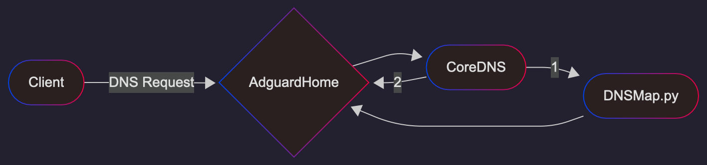

[English](README.md) | [Русский](README_RU.md)

# AntiZapret VPN в Docker

Antizapret создан для того, чтобы перенаправлять только заблокированные домены через VPN-туннель. Это называется раздельное туннелирование (split tunneling).
Этот репозиторий основан на идее оригинального [AntiZapret LXD image](https://bitbucket.org/anticensority/antizapret-vpn-container/src/master/).

## Содержание

- [Группа поддержки](#группа-поддержки-и-обсуждений)
- [Возможности](#возможности)
- [Как это работает](#как-это-работает)
- [Установка](#установка)
  - [Один сервер (Просто)](#один-сервер-просто)
  - [Docker Swarm, несколько узлов выхода (Продвинутый)](#docker-swarm-несколько-узлов-выхода-продвинутый)
  - [Блокировка VPN / Хостинга](#блокировка-vpn--хостинга)
  - [После установки](#после-установки)
  - [Доступ к админ-панелям](#доступ-к-админ-панелям)
    - [HTTPS](#https)
      - [Собственные сайты на портах 80 и 444](#собственные-сайты-на-портах-80-и-444)
    - [Локальная сеть](#локальная-сеть)
    - [HTTP](#http)
  - [Обновление](#обновление)
    - [Обновление с v5](#обновление-с-v5)
  - [Сброс](#сброс)
- [Документация](#документация)
  - [FAQ (Часто задаваемые вопросы)](#faq-часто-задаваемые-вопросы)
  - [Алгоритм разрешения DNS](#алгоритм-разрешения-dns)
  - [Добавление доменов](#добавление-доменов)
    - [Добавление доменов через правила](#добавление-доменов-через-правила)
    - [Добавление доменов через списки](#добавление-доменов-через-списки)
    - [Перенаправление сайта через VPN для отдельного клиента](#перенаправление-сайта-через-vpn-для-отдельного-клиента)
  - [Добавление IP/подсетей](#добавление-ipподсетей)
  - [SOCKS5 и HTTP(S) прокси (маршрутизация для конкретных приложений)](#socks5-и-https-прокси-маршрутизация-для-конкретных-приложений)
    - [Как это работает](#как-это-работает-1)
    - [Как отключить HTTPS-доступ из интернета](#как-отключить-https-доступ-из-интернета)
    - [Когда использовать proxy вместо DNS-маршрутизации](#когда-использовать-proxy-вместо-dns-маршрутизации)
    - [Конфигурация](#конфигурация)
    - [Настройка клиента](#настройка-клиента)
    - [Примеры использования](#примеры-использования)
  - [HTTP(S) Прокси](#https-прокси)
  - [Использование zapret2](#zapret2)
    - [Изменение конфигураций](#изменение-конфигураций)
    - [Подбор стратегий](#подбор-стратегий)
  - [Переменные окружения](#переменные-окружения)
  - [DNS](#dns)
    - [Upstream DNS для Adguard](#upstream-dns-для-adguard)
    - [CDN + ECS](#cdn--ecs)
  - [OpenConnect (ocserv)](#openconnect-ocserv)
  - [OpenVPN](#openvpn)
    - [Создание клиентских сертификатов](#создание-клиентских-сертификатов)
    - [Включение OpenVPN Data Channel Offload (DCO)](#включение-openvpn-data-channel-offload-dco)
    - [Поддержка устаревших клиентов](#поддержка-устаревших-клиентов)
  - [Amnezia Wireguard](#amnezia-wireguard)
    - [Включение расширения ядра Amnezia Wireguard](#включение-расширения-ядра-amnezia-wireguard)
    - [Параметры AmneziaWG](#параметры-amneziawg)
    - [Размер блока Amnezia Wireguard](#размер-блока-amnezia-wireguard)
  - [Дополнительная информация](#дополнительная-информация)
  - [Тест скорости с iperf3](#тест-скорости-с-iperf3)
- [Благодарности](#благодарности)

# Группа поддержки и обсуждений:
https://t.me/antizapret_support

# Возможности

- Модульный дизайн. В качестве строительных блоков нашей системы используются внешние высококачественные open-source модули/контейнеры.
- Удобные веб-панели для администрирования VPN и DNS.
- Множество VPN-транспортов: WireGuard, AmneziaWG, OpenVPN и OpenConnect (ocserv).
- AdguardHome в качестве основного DNS-резолвера и менеджера заблокированных доменов.
- Многосерверная архитектура для обхода гео-ограничений сервисов. Разные домены используют разные серверы в качестве узлов выхода.
- Файрвол для защиты от сканирования портов.
- Поддержка модулей ядра для OpenVPN и Amnezia Wireguard для снижения нагрузки на процессор.
- SOCKS5 и HTTP(S) прокси для маршрутизации конкретных приложений через локальные или зарубежные узлы выхода.
- Встроенная поддержка anti-DPI через [bol-van/zapret2](https://github.com/bol-van/zapret2) для HTTP-, TLS- и QUIC-трафика. Конфигурация от [vernette/ss-zapret2](https://github.com/vernette/ss-zapret2).

# Как это работает?

1) Список заблокированных доменов загружается из открытого реестра.
2) Список парсится и создаются правила для DNS-резолвера (adguardhome).
3) Adguardhome перенаправляет запросы для заблокированных доменов в python-скрипт dnsmap.py.
4) Python-скрипт:
   а) разрешает реальный адрес для домена
   б) создает фейковый адрес из подсети 14.16.0.0/14
   в) создает правило iptables для перенаправления всех пакетов с фейкового ip на реальный ip.
5) Фейковый IP отправляется в DNS-ответе клиенту.
6) VPN-туннели настроены с раздельным туннелированием. Только трафик в подсеть 14.16.0.0/14 маршрутизируется через VPN.

# Установка

> [!IMPORTANT]
> Команды должны выполняться от имени root пользователя. Иначе у конфигурационных файлов будут некорректные права, и некоторые контейнеры будут бесконечно перезапускаться.

## Один сервер (Просто)

Рекомендуется использовать сервер, расположенный в западных странах. Некоторые сайты будут блокировать пользователей из других стран.
По умолчанию Compose запускает один контейнер выхода `az-local`. Он обслуживает
и локальный, и мировой списки доменов в диапазоне `14.16.0.0/15`.

0. Установите [Docker Engine](https://docs.docker.com/engine/install/):
   ```bash
   curl -fsSL https://get.docker.com -o get-docker.sh
   sudo sh get-docker.sh
   ```
1. Клонируйте репозиторий и запустите контейнер:
   ```bash
   git clone https://github.com/xtrime-ru/antizapret-vpn-docker.git antizapret
   cd antizapret
   git checkout v6
   ```
2. Создайте docker-compose.override.yml с нужными вам сервисами. Минимальный пример только с wireguard:
```yml
services:
  adguard:
    environment:
      - ADGUARDHOME_PASSWORD=somestrongpassword
  wireguard:
     environment:
        - WIREGUARD_PASSWORD=somestrongpassword
     extends:
        file: services/wireguard/docker-compose.yml
        service: wireguard
```
Полный пример можно найти в [docker-compose.override.sample.yml](./docker-compose.override.sample.yml)

3. Запустите сервисы:
```shell
   docker compose up -d
   docker system prune -f
```

## Docker Swarm, несколько узлов выхода (Продвинутый)

Версии 5 и 6 обладают возможностью перенаправлять трафик на разные узлы выхода для разных доменов.
Например, YouTube лучше всего работает, если узел выхода находится близко к клиенту, а другие сервисы требуют зарубежный IP для работы.
Docker swarm используется для построения единой сети между контейнерами.

Рекомендуется использовать локальный сервер в качестве менеджера/первичного узла для VPN, DNS и контейнеров az-local.
Зарубежный сервер — в качестве вторичного/воркер-узла для контейнера az-world.

Большинство доменов будут проксироваться через **локальный** сервер для максимальной скорости и производительности.
Некоторые сайты, использующие geoip для блокировки пользователей, будут проксироваться через **зарубежный** сервер.

0. Повторите шаги 0 и 1 из установки на одном сервере на **обоих серверах**:
   - Установите docker
   - Зачекаутьте проект в том же месте на обоих серверах.
1. [Первичный] Создайте docker-compose.override.yml на первичном узле и определите, какие сервисы вам нужны. См. шаг 2 из установки на одном сервере.
2. [Первичный] Измените имена хостов серверов на az-local и az-world для удобства: `hostnamectl set-hostname az-local`
3. [Вторичный] Измените имена хостов серверов на az-local и az-world для удобства: `hostnamectl set-hostname az-world`
4. [Опционально] hub.docker.com может быть недоступен на локальных хостингах. Можно использовать прокси. См. инструкции: https://dockerhub.timeweb.cloud
   Альтернативно образы можно собрать локально на **обоих серверах**: `docker compose --env-file compose.swarm.env build`
5. [Первичный]: `docker swarm init --advertise-addr <PRIMARY_SERVER_PUBLIC_IP_ADDRESS>`
6. [Вторичный]: Скопируйте команду из результатов и выполните ее на вторичном узле: `docker swarm join --token <TOKEN> <MANAGER_IP_ADDRESS>:<PORT>`
7. [Первичный]: Проверьте swarm `docker node ls`
    ```text
    ID                            HOSTNAME   STATUS    AVAILABILITY   MANAGER STATUS   ENGINE VERSION
    6dzagr08r8d2iidkcumjjz3q7 *   az-local   Ready     Active         Leader           29.0.1
    vspy2m6w4tf7uv4ywgdnzttvr     az-world   Ready     Active                          29.0.1
    ```
8. [Первичный] Добавьте метки для узлов `docker node update --label-add location=local az-local && docker node update --label-add location=world az-world`
9. [Первичный]: запустите swarm. Последний Compose-файл добавляет `az-world` и разделяет диапазон адресов между двумя узлами выхода:
   ```shell
   docker compose --env-file compose.swarm.env config | docker run --pull always --rm -i xtrime/antizapret-vpn:6 compose2swarm | docker stack deploy --prune -c - antizapret
   ```
10. [Первичный]: Docker Swarm не поддерживает передачу устройств хоста в сервисы так же, как Docker Compose, поэтому для работы VPN-контейнеров требуются DKMS-модули ядра:
    - [Включение OpenVPN Data Channel Offload (DCO)](#включение-openvpn-data-channel-offload-dco)
    - [Включение расширения ядра Amnezia Wireguard](#включение-расширения-ядра-amnezia-wireguard)

## Блокировка VPN / Хостинга
Большинство провайдеров сейчас блокируют VPN-соединения с зарубежными IP-адресами. Обфускация в Amnezia или OpenVpn не всегда решает проблему.
Для стабильной работы VPN вы можете попробовать подключиться к VPS внутри вашей страны, а затем проксировать трафик на зарубежный сервер.

Есть два способа:
1. [Рекомендуется] Установка в режиме [docker swarm](#docker-swarm-несколько-узлов-выхода-продвинутый)
2. Проксирование всего трафика через локальный прокси. См. ниже.

Пример скрипта запуска.
Замените <SERVER_IP> на IP-адрес вашего сервера и запустите его на чистой VPS (рекомендуется ubuntu 24.04):

```shell
#!/bin/sh

# Укажите ip вашего зарубежного сервера
export VPN_IP=<SERVER_IP>

echo "net.ipv4.ip_forward=1" >> /etc/sysctl.d/99-sysctl.conf
sysctl -w net.ipv4.ip_forward=1

# DNAT правила
iptables -t nat -A PREROUTING -p tcp ! --dport 22 -j DNAT --to-destination "$VPN_IP"
iptables -t nat -A PREROUTING -p udp ! --dport 22 -j DNAT --to-destination "$VPN_IP"
# MASQUERADE правила
iptables -t nat -A POSTROUTING -p tcp -d "$VPN_IP" -j MASQUERADE
iptables -t nat -A POSTROUTING -p udp -d "$VPN_IP"  -j MASQUERADE

echo iptables-persistent iptables-persistent/autosave_v4 boolean true | sudo debconf-set-selections
echo iptables-persistent iptables-persistent/autosave_v6 boolean false | sudo debconf-set-selections
apt install -y iptables-persistent
```

## После установки
1. Убедитесь, что безопасный DNS отключен в настройках вашего браузера.
   В chrome: Перейдите в Настройки > Конфиденциальность и безопасность > Безопасность, прокрутите до раздела "Дополнительные" и выключите "Использовать безопасный DNS"
2. Установите модули DKMS для openvpn и/или amnezia wireguard (если вы их используете):
    - [Включение OpenVPN Data Channel Offload (DCO)](#включение-openvpn-data-channel-offload-dco)
    - [Включение расширения ядра Amnezia Wireguard](#включение-расширения-ядра-amnezia-wireguard)

## Доступ к админ-панелям

### HTTPS
По умолчанию все контейнеры доступны через https. Для управления сертификатами используется отдельный контейнер `https`.
Если домен не задан, Caddy определяет публичный IPv4 сервера и запрашивает для него краткосрочный сертификат Let's Encrypt. До успешной проверки ACME используется постоянный самоподписанный сертификат, поэтому HTTPS и ocserv запускаются, даже когда `80/tcp` недоступен из Интернета.
Caddy передаёт все соединения со своего Layer 4 listener на `443/tcp` в ocserv и сообщает исходный адрес клиента через PROXY protocol v2. Dashboard использует отдельный HTTPS-порт `444/tcp`, а канал DTLS ocserv публикуется напрямую на `443/udp`.

- dashboard: https://%your-server-ip%:444
- adguard: https://%your-server-ip%:1443
- filebrowser: https://%your-server-ip%:2443
- openvpn: https://%your-server-ip%:3443
- wireguard: https://%your-server-ip%:4443
- wireguard-amnezia: https://%your-server-ip%:5443

#### Собственные сайты на портах 80 и 444

Дополнительные конфигурации Caddy можно сохранять в каталоге `config/https/config/sites-enabled`. Каталог создаётся автоматически при запуске контейнера `https`, а все файлы из него подключаются к основному Caddyfile.

Например, чтобы опубликовать сервис `my-app`, доступный в Docker-сети на порту `8080`, создайте файл `config/https/config/sites-enabled/my-app.caddy`:

```caddyfile
example.com {
  reverse_proxy my-app:8080
}
```

Caddy будет принимать запросы к `example.com` на портах 80 и 444, автоматически перенаправлять HTTP на HTTPS-порт 444 и управлять TLS-сертификатом. Домен должен указывать на сервер, а сервис `my-app` должен быть доступен контейнеру `https` в общей Docker-сети.

После добавления или изменения конфигурации перезапустите контейнер:

```shell
docker service update --force antizapret_https || docker compose restart https
```


### Локальная сеть
Когда вы подключены к VPN, вы можете получить доступ к контейнерам, не открывая порты в интернет:
- http://adguard.antizapret:3000
- http://dashboard.antizapret:80
- http://wireguard-amnezia.antizapret:51821
- http://wireguard.antizapret:51821
- http://openvpn-ui.antizapret:8080
- http://filebrowser.antizapret:80

### HTTP:
По умолчанию контейнеры не открывают веб-панели в интернет. Все веб-панели проксируются через контейнер `https`.
Если вы хотите открыть HTTP в интернет, добавьте перенаправление портов в docker-compose.override.yml.
Пример:
```yml
services:
   adguard:
      #...
      ports:
        - "3000:3000/tcp"
```

Список портов по умолчанию:

- adguard: http://%your-server-ip%:3000
- dashboard: http://%your-server-ip%:80
- wireguard-amnezia: http://%your-server-ip%:51821
- wireguard: http://%your-server-ip%:51821
- openvpn-ui: http://%your-server-ip%:8080
- filebrowser: http://%your-server-ip%:80

Некоторые контейнеры используют одинаковые порты. Поэтому вам нужно выбрать уникальный внешний порт в docker-compose.override.yml.

## Обновление

- Одиночный экземпляр
   ```shell
   git pull --rebase
   docker compose down --remove-orphans
   docker compose up -d --remove-orphans
   docker system prune -af
   ```
- Режим Swarm:
   ```shell
   git pull --rebase
   docker pull xtrime/antizapret-vpn:6
   docker compose --env-file compose.swarm.env config | docker run --pull always --rm -i xtrime/antizapret-vpn:6 compose2swarm | docker stack deploy --prune -c - antizapret
   docker system prune -af
   ```

### Обновление с v5

1. Обновите контейнеры:
- Режим Docker Compose (один сервер):
   ```shell
   docker compose down --remove-orphans
   git fetch && git checkout v6 && git pull --rebase
   docker compose down --remove-orphans
   docker compose up -d --remove-orphans
   docker system prune -af
   ```
- Режим Swarm:
   ```shell
   docker stack rm antizapret && sleep 10
   git fetch && git checkout v6 && git pull --rebase
   docker compose --env-file compose.swarm.env config | docker run --pull always --rm -i xtrime/antizapret-vpn:6 compose2swarm | docker stack deploy --prune -c - antizapret
   docker system prune -af
   ```
2. Обновите клиентов:
   - Wireguard/Amnezia
     - Проверьте, что ваш пароль длиннее 12 символов. Обновите при необходимости в docker-compose.override.yml
     - Скачайте новые конфигурации клиентов или вручную добавьте `14.16.0.0/14` в AllowedIps в старых конфигурациях.
   - OpenVPN
     - Нажмите save на странице конфигурации сервера openvpn-ui: http://openvpn-ui.antizapret:8080/ov/config/ а затем перезапустите сервер openvpn.
     - Установите новый dkms модуль на хост: `apt remove openvpn-dkms-dco` + https://github.com/xtrime-ru/antizapret-vpn-docker/blob/v6/README.md?tab=readme-ov-file#enable-openvpn-data-channel-offload-dco
   - Socks
   Замените его на контейнер proxy и переименуйте переменные окружения. См. пример: https://github.com/xtrime-ru/antizapret-vpn-docker/blob/v6/docker-compose.override.sample.yml#L63-L93
   Убедитесь, что используете надежный пароль, потому что теперь HTTPS прокси доступен из интернета.

## Сброс:
Удалить все настройки, VPN-конфигурации и вернуть начальное состояние сервиса:
```shell
docker stack rm antizapret || docker compose down --remove-orphans
rm -rf config/*
git restore config
```

# Документация

## FAQ (Часто задаваемые вопросы)

1. Как получить VPN-конфигурации?
    - OVPN:
        1. https://%your-server-ip%:3443/certificates
        1. Создать сертификат
        1. Введите любое имя и оставьте остальные поля как есть
        1. Нажмите "Create". Новый сертификат появится в списке.
        1. Нажмите на имя сертификата в списке, чтобы скачать его.
    - Wireguard или Amnezia:
        1. Перейдите на https://%your-server-ip%:4443 или https://%your-server-ip%:5443
        2. Нажмите "New"
        3. Введите любое имя.
        4. Создайте клиента
        5. Нажмите кнопку скачивания в списке.
        6. QR-коды не работают для Amnezia Wireguard, так как конфиг слишком большой для QR-кода
2. Какой клиент Amnezia Wireguard использовать?
   Рекомендуемый клиент для Amnezia Wireguard - AmneziaWG:
    - [Android (Google Play)](https://play.google.com/store/apps/details?id=org.amnezia.awg)
    - [iOS (App Store)](https://apps.apple.com/app/amneziawg/id6478942365)
    - [Windows (GitHub)](https://github.com/amnezia-vpn/amneziawg-windows-client/releases)
3. Почему OpenVPN-клиент не подключается к серверу?
   Большинство провайдеров блокируют протокол openvpn, особенно к зарубежным IP.
   Симптомы: клиент подключается, но после передачи нескольких байт сервер перестает отвечать, и соединение разрывается.

   - По умолчанию контейнер openvpn использует легкую обфускацию UDP-пакетов.
     Это работает на большинстве клиентов (включая роутеры), но все еще может блокироваться провайдерами.
     См. переменную окружения [OBFUSCATE_TYPE](#openvpn).
     Попробуйте изменить ее со значения по умолчанию `1` (легкая) на `2` (сильная) или `0` (выкл).
   - Используйте каскадное соединение или swarm-режим [cascade](#блокировка-vpn--хостинга)
4. Почему VPN-соединение может быть медленным и иметь много потерянных пакетов?
   1. Сначала используйте воспроизводимый тест для обнаружения проблем: [Тест скорости с iperf3](#тест-скорости-с-iperf3)
   2. Проверьте, не перегружен ли процессор на вашем хостинге во время iperf-теста.
   3. Убедитесь, что модули ядра для вашего VPN установлены и работают: [OVPN DCO](#включение-openvpn-data-channel-offload-dco), [расширение ядра Amnezia Wireguard](#включение-расширения-ядра-amnezia-wireguard).
   4. Некоторые недорогие хостинги имеют очень медленные процессоры, поэтому даже с установленными модулями ядра скорость соединения не превысит 100 Мбит/с.
   5. Большинство роутеров имеют медленные процессоры и обеспечивают только 30-60 Мбит/с через openvpn. Попробуйте использовать Wireguard или Amnezia Wireguard, если роутер поддерживает это, или обновите роутер до более новой модели.
   6. По умолчанию новые установки wireguard и openvpn используют низкий MTU `1280` для стабильного соединения в любых условиях. Можно увеличить до `1480`, чтобы немного повысить скорость.
      
      Сначала проверьте, есть ли у вашего VPN-соединения проблемы со стандартным MTU.
      - MacOs: `ping -D -s 1100 youtube.com`
      - Linux: `ping -M -s 1100 youtube.com`
      - Windows: `ping youtube.com -f -l 1100`

      Для старых установок нужно вручную уменьшить MTU в настройках:
      - Wireguard/Amezia:
        MTU должен быть меньше на сервере и клиенте.
          1. Перейдите на http://wireguard.antizapret:51821 или http://wireguard-amnezia.antizapret:51821
          1. Перейдите в `/admin/interface` и задайте MTU там тоже.
          1. Нажмите на иконку конфига клиента. Уменьшите MTU до `1280` и сохраните.
          1. Скачайте и примените новый конфиг к вашему клиенту.
          1. [Тест скорости с iperf3](#тест-скорости-с-iperf3)
      - OpenVPN:
          1. Перейдите на http://openvpn-ui.antizapret:8080/ov/config и добавьте `tun-mtu 1200` и `mssfix 1232` в конфиг сервера.
          1. Сохраните конфигурацию и перезапустите сервер.
          1. Добавьте `tun-mtu 1200` и `mssfix 1232` в ваш client.conf
          1. `tun-mtu 1200` ограничивает пакеты внутри туннеля, а `mssfix 1232` оставляет место для служебных данных OpenVPN и IPv6/UDP при MTU пути 1280 байт.
   7. Если ничего не помогает, попробуйте другой хостинг и/или [каскад](#блокировка-vpn--хостинга)
5. Как отладить проблемы с VPN?
    1. Проверьте, установлено ли VPN-соединение и работает ли DNS-сервер:
       ```shell
       > nslookup youtube.com
       
       Server:         14.16.0.1
       Address:        14.16.0.1#53
       
       Non-authoritative answer:
       Name:   youtube.com
       Address: 14.16.13.209
       ```
    2. Убедитесь, что браузер не использует DoH/Secure DNS.
    3. Проверьте, загружены ли DIST-фильтры и имеют ли они ненулевые счетчики правил: http://adguard.antizapret:3000/#filters
    4. Проверьте этапы разрешения DNS: http://adguard.antizapret:3000/#logs?response_status=all&search=youtube.com  
       Каждый домен разрешается через 2-4 DNS-запроса. Подробнее: [Алгоритм разрешения DNS](#алгоритм-разрешения-dns)

## Алгоритм разрешения DNS



В односерверном Compose-режиме контейнер `az-local` также получает сетевые
alias `az-world` и `az-world.antizapret`. CoreDNS определяет, что имена обоих
узлов выхода имеют один адрес, и опрашивает контейнер только один раз; AdGuard
создаёт для клиента `az-local` правила из локального и мирового списков. В
Swarm-режиме короткие и полные alias разделяются между двумя сервисами, поэтому
CoreDNS сначала опрашивает `az-world`, затем `az-local`.

1. DNS-запрос поступает в AdGuardHome
2. Adguard проверяет его правилами черного списка. Если домен в черном списке - возвращается 0.0.0.0, и клиент не может получить доступ к домену.
3. Adguard отправляет DNS-запрос в сервис CoreDNS.
4. CoreDNS отправляет DNS-запрос на внутренний сервер dnsmap.py (контейнер antizapret), а dnsmap.py отправляет запрос обратно в adguard.
5. Adguard получает запросы еще раз, но теперь применяет правила с `$client=az-local` и реальным upstream-сервером клиента (по умолчанию 8.8.8.8)
6. Если домен в белом списке - adguard разрешит его адрес и вернет в dnsmap.py.
7. Если домен не в белом списке, adguard возвращает SERVFAIL.
8. dnsmap.py отправляет ответ в adguard:
   1. Если это валидный IP, то заменяет его на «внутренний» IP из подсети контейнера выхода (`14.16.0.0/15` для `az-local`), добавляет маскарадинг в iptables и возвращает внутренний IP в AdGuard.
   2. Если это SERVFAIL, он отправляет этот ответ клиенту.
9. Если CoreDNS получает SERVFAIL, он повторяет запрос и отправляет его напрямую в Adguard. В этом случае правила с `$client=az-local` не применяются, и запрос обрабатывается нормально.

**Почему так сложно?**
- Windows и некоторые другие клиенты не повторяют запрос к Fallback DNS, даже если получен SERVFAIL. Поэтому мы добавили для этого CoreDNS.
- Adguard не позволяет переопределять upstream в правилах черного/белого списка.
  Но эти правила имеют поддержку regex и обновляются автоматически, поэтому мы хотим их использовать.
  Поэтому внутри совершается несколько запросов от разных клиентов.
- Adguard позволяет разные upstreams для разных клиентов. Поэтому мы можем использовать разный DNS для заблокированных и незаблокированных доменов.

**Пример:**
Мы запросили `youtube.com`, который должен маршрутизироваться через узел az-local.
1. DNS-запрос от клиента в Adguard. Перенаправлен в coredns. Ответ появится после того, как будут обработаны все последующие запросы.
   ```text
   Status: Processed
   DNS server: coredns:53
   Elapsed: 91 ms
   Served from cache: False
   Response code: NOERROR
   Response:
   A: 14.16.13.209 (ttl=300)
   A: 14.16.13.207 (ttl=300)
   A: 14.16.13.206 (ttl=300)
   A: 14.16.13.208 (ttl=300)
   ```
2. В Swarm-режиме DNS-запрос от coredns в az-world и запрос от az-world в Adguard (в односерверном Compose-режиме этот шаг пропускается):
   ```text
   Status: Rewritten
   Elapsed: 0.10 ms
   Response code: SERVFAIL
   Rule(s):
   ||*^$dnsrewrite=SERVFAIL,client=az-world
   Custom filtering rules
   ```
   Ответ SERVFAIL означает, что эти домены не маршрутизируются через az-world.
3. DNS-запрос от coredns в az-local. И запрос от az-local в Adguard:
   ```text
   Status: Processed
   DNS server: 149.112.112.11:53
   Elapsed: 50 ms
   Response code: NOERROR
   Response
   A: 173.194.221.190 (ttl=300)
   A: 173.194.221.91 (ttl=300)
   A: 173.194.221.136 (ttl=300)
   A: 173.194.221.93 (ttl=300)
   ```
   В этом случае домен должен обслуживаться через az-local и быть исключен из черного списка для клиента az-local.
   Adguard не может найти этот домен в черном списке для az-local и возвращает реальные адреса клиенту az-local.
4. Контейнер az-local добавляет маскарадинг в iptables и возвращает внутренний ip в coredns.
5. coredns отправляет ответ в adguard, adguard кеширует его и возвращает клиенту.


## Добавление доменов
Есть два способа добавления доменов. Через пользовательские правила и через черные списки.

### Добавление доменов через правила
Откройте панель adguard: http://adguard.antizapret:3000/#custom_rules
Правила/синтаксис: https://adguard-dns.io/kb/general/dns-filtering-syntax/#basic-examples

По умолчанию adguard перезаписывает все запросы с SERVFAIL. Это трюк, чтобы заставить клиент повторить DNS-запрос ко второму, локальному DNS-серверу.
Правила с модификатором ответа dnsrewrite имеют более высокий приоритет, чем другие правила в AdGuard Home и AdGuard DNS.
Чтобы переопределить стандартное правило, пользовательские правила должны иметь модификатор `$dnsrewrite`.

Для поддержки стандартных фильтров adguard стандартное правило SERVFAIL применяется только к внутренним запросам от client=az-local и client=az-world


Примеры:
```
@@||subdomain.host.com^$dnsrewrite,client=az-local
@@||*.host.com^$dnsrewrite,client=az-local
# правила az-world применяются только в Swarm-режиме
@@||host.com^$dnsrewrite,client=az-world
@@||de^$dnsrewrite,client=az-world

@@/some_.*_regex/$dnsrewrite,client=az-local
```

### Добавление доменов через списки
Также вы можете добавить любые url в blocklist. http://adguard.antizapret:3000/#dns_blocklist
Необходимо использовать адаптер для парсинга и адаптации списка в различных форматах.
 - Добавить домены для локального узла выхода: `http://az-local.antizapret/list/?url=<ANY_URL>`
 - Добавить домены для отдельного мирового узла выхода в Swarm-режиме: `http://az-world.antizapret/list/?url=<ANY_URL>`
 - В односерверном Compose-режиме для обоих типов доменов используйте `az-local`.
Поддерживаемые форматы: простой список доменов, формат adguard, формат hosts, json-массив доменов, список regex.

### Перенаправление сайта через VPN для отдельного клиента

Чтобы направить определенный сайт через VPN только для одного клиента:

1. Найдите внутренний IP-адрес клиента в панели соответствующего VPN-сервера или в журнале запросов AdGuard Home.
2. Откройте страницу клиентов AdGuard Home: http://adguard.antizapret:3000/#clients, добавьте найденный IP-адрес в список клиентов и задайте для него следующие upstream DNS-серверы:
   ```text
   coredns
   [/*.antizapret/]127.0.0.11
   [/example.com/]udp://coredns.antizapret
   ```
3. Откройте настройки DNS AdGuard Home: http://adguard.antizapret:3000/#dns и добавьте upstream для нужного домена:
   ```text
   [/example.com/]1.1.1.1
   ```
4. Добавьте `example.com` в файл `include-hosts-custom.txt`, либо добавьте на странице пользовательских правил http://adguard.antizapret:3000/#custom_rules следующее правило:
   ```text
   @@||example.com^$dnsrewrite,client=az-local
   ```

После настройки обычный локальный запрос в AdGuard Home будет возвращать реальный IP-адрес сайта, а запрос от указанного VPN-клиента — подменный внутренний IP-адрес, трафик к которому направляется через VPN.


Опции для адаптера:
 - `url` - скачать список по url
 - `file` - прочитать локальный файл. Используется для include-host-{custom,dist}.txt
 - `filter_custom=1` - фильтровать списки правилами из exclude-hosts-custom.txt.
 - `filter_dist=0` - фильтровать списки правилами из exclude-hosts-dist.txt
 - `format=list` - 'list' или 'json'. Определяется автоматически.
 - `client=az-local` - имя клиента для добавления в правила. Определяется автоматически.
 - `allow=1` - отключить эту опцию, чтобы блокировать домены из списка для этого узла выхода.
 - `raw=0` - не изменять правила
 - `suffix=1` - добавить "$dnsrewrite,client=xxx" в правила
 - `dnsrewrite=SERVFAIL` - указать зачение директивы dnsrewrite
 - `regex=0` - обернуть каждую входную строку как регулярное выражение AdGuard

Файл `exclude-hosts-custom.txt` из каждого контейнера выхода также загружается в AdGuard как блокирующее DNS rewrite-правило для клиента `az-resolver`. Благодаря этому совпавший домен не маршрутизируется через VPN-узел по правилу ASN. Шаблоны используют синтаксис расширенных регулярных выражений; также поддерживаются выражения, уже обрамлённые символами `/`.

## Добавление IP/подсетей
Добавьте ip и подсети в `./config/antizapret/custom/include-ips-custom.txt`.
Контейнеры периодически проверяют изменения в папке config (каждые 5-10 секунд) и перезапускаются/обновляются после любых изменений.

## Добавление ASN

Правила ASN позволяют направлять домены через VPN-узел на основании сети, которой принадлежат
разрешённые IPv4-адреса. Если обычный запрос AdGuard для `az-local` или `az-world` вернул
`SERVFAIL`, `dnsmap` разрешает домен напрямую через клиента `az-resolver` и проверяет каждую
A-запись по базе ASN MaxMind. Если хотя бы один адрес совпал с правилом, все IPv4-адреса из
этого DNS-ответа заменяются внутренними адресами `dnsmap`, трафик к которым направляется через
соответствующий VPN-узел. Если A-записей нет или ни одна сеть не совпала, сохраняется исходный
отфильтрованный ответ.

Файлы пользовательских правил:

- Локальный узел: `./config/antizapret/custom/include-asn-custom.txt`
- Зарубежный узел: `./config/antizapret/custom/include-asn-world-custom.txt`
- Исключения локального узла: `./config/antizapret/custom/exclude-asn-custom.txt`
- Исключения зарубежного узла: `./config/antizapret/custom/exclude-asn-world-custom.txt`

Каждая непустая строка может содержать:

- Точный номер ASN: `AS13335` или `13335`
- Регистронезависимую подстроку исходного названия организации MaxMind: `Cloudflare`
- Регистронезависимое регулярное выражение между символами `/`: `/\bg-?core\b/`

Комментарии начинаются с `#` и могут располагаться на отдельных строках или после правила.
Дистрибутивные правила из `ASN_URL` и `ASN_WORLD_URL` объединяются с соответствующими файлами
пользовательских включений. Файлы исключений удаляют точные строки без учёта регистра до
создания рабочих списков.

Для отладки фильтров `dnsmap` записывает в лог IP-адрес, ASN и организацию как для совпавших,
так и для несовпавших сетей. Сообщение `ASN data not found` означает, что в MaxMind нет записи
для адреса. Пустые адреса и `0.0.0.0` игнорируются без обращения к базе. При успешном совпадении
в лог также выводится конкретное правило ASN, подстрока или регулярное выражение, запустившее
маршрутизацию.

[Онлайн-проверка DPI](https://hyperion-cs.github.io/dpi-checkers/ru/tcp-16-20/)

Запустить обновление вручную: `docker exec $(docker ps -q --filter=name=az | head -n1) doall`

## SOCKS5 и HTTP(S) прокси (маршрутизация для конкретных приложений)

AntiZapret использует DNS-маршрутизацию (split tunneling), которая работает только для соединений по доменным именам.
Если приложение подключается напрямую по IP-адресу, перехват DNS не работает, и трафик не маршрутизируется через VPN-туннель.

Сервис `proxy` основан на [3proxy](https://github.com/3proxy/3proxy) [контейнере](https://github.com/tarampampam/3proxy-docker).
Это решение для маршрутизации конкретных приложений.

### Как это работает

1. Подключитесь к VPN (OpenVPN, WireGuard или Amnezia WireGuard)
2. Настройте приложение на использование SOCKS5 или HTTP/HTTPS прокси через настройки прокси или инструменты вроде [AntizapretSOCKS5](https://github.com/danayer/AntizapretSOCKS5) (Windows), ProxyBridge, Proxifier или настроек прокси в браузере.
3. Весь трафик от этого приложения (включая прямые IP-соединения) будет выходить через выбранный серверный узел.

Доступны два контейнера прокси:
- **`proxy-local.antizapret`** — трафик выходит через **локальный** сервер
    - SOCKS5 порт: `8118`
    - HTTP порт: `8180`
    - HTTPS (local) через контейнер `https`: `https://%your_ip%:8143`
- **`proxy-world.antizapret`** — трафик выходит через **зарубежный** сервер
    - SOCKS5 порт: `8118`
    - HTTP порт: `8180`
    - HTTPS (world) через контейнер `https`: `https://%your_ip%:8243`

Аутентификация: Basic (SOCKS5/HTTP/HTTPS), настраивается через переменные окружения.
Аутентификация обязательна, потому что HTTPS-прокси доступен из интернета.

### Как отключить HTTPS-доступ из интернета
Есть два варианта:
- Очистите переменные окружения контейнера `https` для `proxy-local.antizapret` и `proxy-world.antizapret`.
- Измените `hostname` в `docker-compose.override.yml`, чтобы `caddy`/`https` не мог обращаться к ним по стандартным именам `proxy-local.antizapret` и `proxy-world.antizapret`.
Без HTTPS безопасно использовать прокси с пустыми именем пользователя и паролем.

### Когда использовать proxy вместо DNS-маршрутизации

| Сценарий | DNS-маршрутизация | Proxy |
|---|---|---|
| Приложение соединяется по домену | ✅ Работает | ✅ Работает                            |
| Приложение соединяется по IP | ❌ Не маршрутизируется | ✅ Работает                            |
| Большое количество IP для маршрутизации | ❌ Лимит OpenVPN push routes | ✅ Без лимитов                         |
| Выбор узла выхода для приложения | ❌ | ✅ Выбор local или world для приложения |

### Конфигурация

Добавьте proxy-сервисы в `docker-compose.override.yml`:
```yml
  proxy-local:
    hostname: proxy-local.antizapret
    extends:
      file: services/proxy/compose.yml
      service: proxy
    environment:
      - PROXY_LOGIN=admin
      - PROXY_PASSWORD=password
    deploy:
      mode: replicated
      replicas: 1
      endpoint_mode: dnsrr
      placement:
        constraints: [ node.labels.location == local ]

  proxy-world:
    hostname: proxy-world.antizapret
    extends:
      file: services/proxy/compose.yml
      service: proxy
    environment:
      - PROXY_LOGIN=admin
      - PROXY_PASSWORD=password
    deploy:
      mode: replicated
      replicas: 1
      endpoint_mode: dnsrr
      placement:
        constraints: [ node.labels.location == world ]
```

> **Примечание:** `proxy-world` требует режима [Docker Swarm](#docker-swarm-несколько-узлов-выхода-продвинутый) с двумя узлами.
> На одном сервере будет работать только `proxy-local`.

### Настройка клиента

1. Подключитесь к VPN
2. Настройте HTTPS-прокси, опубликованный контейнером `https`, в вашем приложении или браузере:
    - **Хост:** IP-адрес или доменное имя вашего сервера
    - **Порт локального прокси:** `8143`
    - **Порт зарубежного прокси:** `8243`
    - **Имя пользователя:** значение `PROXY_LOGIN`
    - **Пароль:** значение `PROXY_PASSWORD`

После подключения к VPN контейнеры прокси также доступны напрямую как `proxy-local.antizapret` и `proxy-world.antizapret`: SOCKS5 на порту `8118` и HTTP на порту `8180`.

## zapret2

Поддержка zapret2 основана на [bol-van/zapret2](https://github.com/bol-van/zapret2), наборе инструментов anti-DPI для модификации HTTP-, TLS- и QUIC-трафика, и использует Docker-упаковку из [vernette/ss-zapret2](https://github.com/vernette/ss-zapret2) как источник встроенных файлов zapret2. В этом контейнере zapret2 работает с трафиком узлов выхода antizapret и настраивается переменными ниже.

По умолчанию zapret2 отключен, так как может вызывать проблемы на некоторых хостингах. Чтобы включить anti-DPI обработку HTTP-, TLS- и QUIC-трафика, проходящего через узел выхода antizapret, добавьте настройку в `docker-compose.override.yml`:

```yaml
services:
  az-local:
    environment:
      - ZAPRET_ENABLED=1
```
Если Swarm-узел `az-world` также страдает от DPI, включите настройку и для него:
```yaml
services:
  az-world:
    environment:
      - ZAPRET_ENABLED=1
```

При первом запуске конфигурация zapret2 создается в `./config/antizapret/zapret2/zapret.conf`. 

### Изменение конфигураций
Изменяйте `NFQWS2_OPT` в этом файле, чтобы подобрать стратегии для HTTP, TLS и QUIC. Чтобы снова отключить zapret2, установите `ZAPRET_ENABLED=0`.


Примените изменения командой для вашего режима запуска:

- Режим Compose:
```shell
# Docker Compose
docker compose up -d
docker compose restart az-local
```

- Режим Swarm, выполнять на primary/manager-узле
```shell
docker compose --env-file compose.swarm.env config | docker run --pull always --rm -i xtrime/antizapret-vpn:6 compose2swarm | docker stack deploy --prune -c - antizapret
docker service update --force antizapret_az-local
docker service update --force antizapret_az-world
```

### Подбор стратегий
Для поиска рабочих стратегий остановите zapret2, запустите `blockcheck2.sh`, затем снова запустите zapret2. В режиме Docker Compose:

```sh
docker exec $(docker ps -q --filter=name=az-local) sh /opt/zapret2/init.d/sysv/zapret2 stop
docker exec $(docker ps -q --filter=name=az-local) sh /opt/zapret2/blockcheck2.sh
docker exec $(docker ps -q --filter=name=az-local) sh /opt/zapret2/init.d/sysv/zapret2 start
```

Для более быстрого точечного поиска передайте домены и параметры поиска:

```sh
docker exec $(docker ps -q --filter=name=az-local) sh -c 'REPEATS=8 DOMAINS="youtube.com discord.com" /opt/zapret2/blockcheck2.sh'
```

## Переменные окружения

Вы можете определить эти переменные в файле docker-compose.override.yml для своих нужд:

### Antizapret:
- `DNS=adguard` - адрес AdGuard для DNS-over-HTTPS запросов (по умолчанию `adguard`, порт DoH — `3000`).
- `CLIENT=az-local` - ClientID AdGuard, используемый dnsmap. Для зарубежного узла задаётся `az-world`.
- `AZ_SUBNET=14.16.0.0/15` - подсеть виртуальных адресов заблокированных хостов. На зарубежном узле используется `14.18.0.0/15`.
- `ROUTES` - список VPN-контейнеров и их виртуальных адресов. Используется для iperf3 сервера.
- `DOALL_DISABLED=` - пропустить генерацию списков внутри контейнера. Обычно оставляйте пустым: init использует owner-файл на общем volume `result`, поэтому в Docker Compose списки генерируются только один раз, а в Swarm узлы генерируют их независимо на своих локальных volumes.
- `IPTABLES_SAVE_DISABLED=` - пропустить восстановление правил iptables при запуске и сохранение при остановке.
- `IPS_URL=` - URL списков IP-префиксов для локального узла, разделённые точкой с запятой. Объединённый результат записывается в `result/ips.txt`.
- `IPS_WORLD_URL=` - URL списков IP-префиксов для зарубежного узла, разделённые точкой с запятой. Объединённый результат записывается в `result/ips-world.txt`.
- `ASN_URL=` - URL списков номеров ASN или названий организаций для локального узла, разделённые точкой с запятой. Объединённый результат записывается в `result/asn.txt`.
- `ASN_WORLD_URL=` - URL списков номеров ASN или названий организаций для зарубежного узла, разделённые точкой с запятой. Объединённый результат записывается в `result/asn-world.txt`.
- `ZAPRET_ENABLED=0` - установите `1`, чтобы включить модификацию проходящего через контейнер HTTP-, HTTPS- и QUIC-трафика с помощью zapret2.
- `ZAPRET_CONFIG=/opt/zapret2/config/zapret.conf` - путь внутри контейнера к файлу конфигурации zapret2. Конфигурация по умолчанию создается автоматически при первом запуске и сохраняется в `./config/antizapret/zapret2/zapret.conf`.

### Adguard:
- `ROUTES` - список VPN-контейнеров и их виртуальных адресов. Используется для уникальных клиентских адресов в логах adguard
- `AZ_WORLD_ENABLED=` - включает отдельного клиента `az-world`, отслеживание его IP и checksum мировой конфигурации. Автоматически устанавливается в `1` файлом `compose.swarm.yml`; в односерверном Compose-режиме оставьте переменную пустой.
- `ADGUARDHOME_PORT=3000`
- `ADGUARDHOME_USERNAME=admin`
- `ADGUARDHOME_PASSWORD=`
- `ADGUARDHOME_PASSWORD_HASH=` - хешированный пароль, берется из файла AdGuardHome.yaml после первого запуска с использованием `ADGUARDHOME_PASSWORD`. Знак доллара `$` в хеше должен быть экранирован вторым знаком доллара: `$$`

### CoreDNS:
- Нет

### Filebrowser:
- `FILEBROWSER_PORT=admin`
- `FILEBROWSER_PASSWORD=password`

### Https:
- `PROXY_DOMAIN=` - необязательный общий домен HTTPS-сервисов и ocserv. Если значение пустое, при запуске определяется публичный IPv4 сервера.
- `PROXY_EMAIL=` - необязательный email учётной записи Let's Encrypt.
- `PROXY_IP=` - необязательное переопределение публичного IPv4 для окружений, где автоматическое определение недоступно.
- `PROXY_CERT_MODE=auto` - режим сертификата: `auto` сохраняет самоподписанный fallback и запрашивает сертификат через ACME; `selfsigned` отключает ACME-запросы.
- `PROXY_ACME_CA=https://acme-v02.api.letsencrypt.org/directory` - URL каталога ACME. Для тестирования выпуска сертификатов используйте staging-каталог Let's Encrypt.
- `PROXY_HTTPS_PORT=444` - HTTPS-порт Dashboard и пользовательских сайтов Caddy. Порт `443/tcp` зарезервирован для Layer 4-трафика ocserv.

### OpenConnect (ocserv)
- `ROUTES` - список VPN-контейнеров и их виртуальных адресов.
- `OC_DEFAULT_ADDRESS=10.1.164.x` - диапазон адресов клиентов; значение должно оканчиваться на `.x`.
- `OC_PORT=443` - внутренний TCP- и UDP-порт. Caddy передаёт на него все публичные соединения с `443/tcp`, UDP публикуется напрямую.
- `OC_USER=admin` - пользователь, создаваемый при первом запуске.
- `OC_USERPASS=password` - пароль пользователя, задаваемый при первом запуске.
- `OC_SECRET=kvn` - секрет маскировки ocserv.

### Openvpn
- `ROUTES`
- `OBFUSCATE_TYPE=1` - уровень кастомной обфускации протокола openvpn.
   - 0 - отключить. Обычный режим openvpn-клиента, поддерживается всеми клиентами.
   - 1 - легкая обфускация. Работает с роутерами microtic и старыми keenetic
   - 2 - сильная обфускация. Работает с большинством клиентов: официальный openvpn gui клиент, роутеры asus, новые роутеры keenetic, роутеры openwrt.
- `AZ_SUBNET=14.16.0.0/14` - подсеть для виртуальных заблокированных ip.

### Openvpn-ui
- `OPENVPN_ADMIN_USERNAME=` - замените имя пользователя по умолчанию на свое
- `OPENVPN_ADMIN_PASSWORD=` - замените пароль по умолчанию на свой
- `OPENVPN_EXTERNAL_IP` - внешний ip вашего сервера, по умолчанию определяется автоматически
- `OPENVPN_DNS=14.16.0.1` - DNS-адрес для клиентов. Должен быть в `ANTIZAPRET_SUBNET`
- `OPENVPN_LOCAL_IP_RANGE=10.1.165.0` - подсеть для ovpn-клиентов. Подсеть можно увидеть в журнале adguard или в панели ovpn-ui

### Wireguard/Wireguard Amnezia
- `ROUTES`
- `WIREGUARD_PASSWORD=` - пароль для админ-панели (используется только во время первичной настройки, пароль можно изменить через веб-интерфейс позже)
- `WIREGUARD_USERNAME=admin` - имя пользователя для админ-панели (используется только во время первичной настройки)
- `AZ_SUBNET=14.16.0.0/14` - подсеть для виртуальных заблокированных ip.
- `WG_DEFAULT_DNS=14.16.0.1` - DNS-адрес для клиентов. Должен быть в `ANTIZAPRET_SUBNET`
- `WG_PERSISTENT_KEEPALIVE=25`
- `PORT=51821` - порт админ-панели
- `INSECURE=true` - разрешить доступ к админ-панели по HTTP
- `DISABLE_IPV6=true` - отключить поддержку IPv6
- `WG_PORT=51820` - порт сервера wireguard
- `MTU=1280` - MTU по умолчанию для интерфейса WireGuard и новых клиентов
- `EXPERIMENTAL_AWG=true` - включить поддержку AmneziaWG (только wireguard-amnezia)
- `OVERRIDE_AUTO_AWG=awg`- переменная окружения для принудительного типа туннеля: `awg` для всегда AmneziaWG, `wg` для всегда стандартного WireGuard; по умолчанию не задано и используется автоматическое определение, полезно для переопределения автовыбора и фиксации режима.
- `BGP_ENABLE=false` - запустить bird BGP сервер. Сервер будет передавать маршруты клиентам (некоторым роутерам). Клиенты будут получать обновления маршрутов без обновления конфига wg/awg.

### SOCKS5 прокси (устарело, используйте proxy ниже)
- `SOCKS_USERNAME` - имя пользователя для аутентификации SOCKS5 (пропустите, чтобы отключить аутентификацию)
- `SOCKS_PASSWORD` - пароль для аутентификации SOCKS5 (пропустите, чтобы отключить аутентификацию)

### Proxy (http + socks5)
- `PROXY_LOGIN` - имя пользователя для HTTP аутентификации (пропуск отключает аутентификацию)
- `PROXY_PASSWORD` - пароль для HTTP аутентификации (пропуск отключает аутентификацию)
- `PROXY_PORT=8180` - HTTP порт для прослушивания
- `SOCKS_PORT=8118` - SOCKS5 порт для прослушивания
- `EXTRA_ACCOUNTS` - Дополнительные пары логин:пароль. Пример: `login:password;login2:password2`
- `EXTRA_CONFIG` - Сырые строки конфигурации 3proxy, внедряемые перед директивами proxy/socks (по умолчанию пусто)

## DNS
### Upstream DNS для Adguard
Обычные клиентские запросы AdGuard отправляет через CoreDNS. Для прямого разрешения, используемого при проверке ASN, entrypoint настраивает клиент `az-resolver` с upstream-серверами Cloudflare, Google и Quad9. Сгенерированная конфигурация хранится в `./config/adguard/conf/AdGuardHome.yaml`; её можно изменить через интерфейс AdGuard Home.

### CDN + ECS
Некоторые домены могут разрешаться по-разному в зависимости от подсети (geoip) клиента. В этом случае использование DNS, расположенного на удаленном сервере, сломает некоторые сервисы.
ECS позволяет предоставить IP клиента в DNS-запросах к upstream-серверу и получить корректные результаты.
По умолчанию ECS отключён. Entrypoint AdGuard не включает его автоматически ни в режиме Docker Compose, ни в режиме Docker Swarm.

Чтобы включить ECS, откройте настройки DNS AdGuard Home по адресу `http://your-server-ip:3000/#dns`, включите EDNS Client Subnet и замените предзаполненный пример `77.88.8.8` на адрес, подходящий для вашего региона.

## OpenConnect (ocserv)

Сервис `ocserv` совместим с клиентами OpenConnect и Cisco AnyConnect. Он использует подсеть `10.1.164.0/24` и принимает TCP- и UDP-соединения на порту `443`. Caddy передаёт в ocserv все публичные соединения с `443/tcp` по внутренней Docker-сети с PROXY protocol v2, а Docker напрямую публикует UDP-канал контейнера ocserv. Dashboard доступен отдельно на `444/tcp`; разделение трафика на порту 443 по ALPN не выполняется.

В полном примере `docker-compose.override.sample.yml` сервис уже включён. Для существующей установки добавьте его в `docker-compose.override.yml` и задайте пользователя и надёжный пароль до первого запуска:

```yaml
services:
  ocserv:
    extends:
      file: services/ocserv/compose.yml
      service: ocserv
    environment:
      - OC_USER=admin
      - OC_USERPASS=strongpassword
```

Без дополнительных настроек сервис `https` определяет публичный IPv4 сервера и создаёт постоянный резервный самоподписанный сертификат. Caddy обслуживает им соединения на порту 444, независимо запрашивает публичный сертификат Let's Encrypt с SAN типа `IP Address`, а затем переключается на managed-сертификат без остановки сервисов. Поскольку порт 443 зарезервирован для ocserv, проверка ACME выполняется методом HTTP-01 через порт 80. Сертификаты на IP используют обязательный профиль `shortlived`, действуют 160 часов и обновляются автоматически. Неудачные ACME-попытки повторяются, а сервисы в это время остаются доступны с резервным сертификатом. Для локальной установки без публичного IP задайте `PROXY_CERT_MODE=selfsigned`, чтобы отключить ACME-запросы. Чтобы использовать один домен для HTTPS-сервисов и ocserv, задайте `PROXY_DOMAIN` сервису `https`.

Разрешите входящие `443/tcp` и `443/udp`, затем запустите сервис:

```shell
docker compose up -d ocserv
```

### Управление пользователями

`OC_USER` и `OC_USERPASS` создают начального пользователя, только если файла `./config/ocserv/ocpasswd` ещё нет. Чтобы добавить пользователя или сменить пароль существующего пользователя, выполните команду и дважды введите новый пароль:

```shell
docker compose exec ocserv \
  ocpasswd -g az -c /etc/ocserv/ocpasswd username
```

Удаление, блокировка и разблокировка пользователя:

```shell
docker compose exec ocserv ocpasswd -d -c /etc/ocserv/ocpasswd username
docker compose exec ocserv ocpasswd -l -c /etc/ocserv/ocpasswd username
docker compose exec ocserv ocpasswd -u -c /etc/ocserv/ocpasswd username
```

Проверка состояния сервера и подключённых пользователей:

```shell
docker compose exec ocserv occtl show status
docker compose exec ocserv occtl show users
```

База паролей сохраняется в `./config/ocserv/ocpasswd`.

`./config/ocserv/ocserv.tmpl` и `./config/ocserv/az.tmpl` — постоянные редактируемые шаблоны, которые создаются только при отсутствии. При каждом запуске ENV-плейсхолдеры подставляются в `/run/ocserv/ocserv.conf` и `/run/ocserv/config-per-group/az`, после чего в сгенерированный `az` добавляются актуальные IP-маршруты. Редактировать нужно `.tmpl`-файлы, а не runtime-файлы; для применения изменений перезапустите контейнер. Шаблоны с уже подставленными значениями продолжат работать; ENV меняет параметр, только если в шаблоне оставлен соответствующий плейсхолдер.

### Настройка клиента

Адрес сервера имеет следующий формат:

```text
https://SERVER/?SECRET
```

Если настроен `PROXY_DOMAIN`, используйте его вместо `SERVER`; иначе укажите публичный IP сервера. `SECRET` — значение `OC_SECRET`, по умолчанию `kvn`. Строка запроса обязательна из-за режима маскировки ocserv.

Для OpenConnect укажите протокол AnyConnect и созданного выше пользователя:

```shell
sudo openconnect --protocol=anyconnect --user username \
  'https://SERVER/?kvn'
```

В графическом клиенте OpenConnect выберите протокол Cisco AnyConnect и укажите тот же полный URL. В Cisco Secure Client/AnyConnect введите `SERVER/?kvn` в поле подключения, подключитесь и укажите имя пользователя и пароль. Порт 443 выделен ocserv независимо от ALPN; Dashboard открывается по адресу `https://SERVER:444`.

При использовании публичного ACME-сертификата дополнительная настройка сертификатов не нужна. Если активен резервный самоподписанный сертификат, перед подтверждением предупреждения проверьте активный сертификат:

```shell
openssl x509 -in ./config/https/data/ocserv/certificate.crt \
  -noout -subject -issuer -fingerprint -sha256
```

OpenConnect позволяет закрепить fingerprint из предупреждения параметром `--servercert`. После переключения Caddy с fallback на managed-сертификат pin изменится.

Сервис `https` хранит резервный, активный сертификат и выбранный identity в `./config/https/data/ocserv`; оригинал публичного сертификата остаётся в управляемом хранилище Caddy. Caddy копирует действующий управляемый сертификат в активный путь, а до его появления использует самоподписанный fallback. Если managed-сертификат истёк или исчез до успешного продления, Caddy возвращается на fallback и автоматически активирует managed-сертификат, когда тот снова появляется. ocserv читает тот же активный сертификат, а healthcheck перезапускает контейнер после продления, замены сертификата или изменения identity. Резервный сертификат сохраняется между перезапусками и генерируется заново только при изменении identity или приближении срока окончания. Если IP сервера изменился, перезапустите сервис `https`, чтобы он определил новый адрес.

Подключение напрямую по IP поддерживается [OpenConnect](https://www.infradead.org/openconnect/manual.html) и [Cisco Secure Client](https://www.cisco.com/c/en/us/td/docs/security/vpn_client/anyconnect/Cisco-Secure-Client-5/admin/guide/b-cisco-secure-client-admin-guide-5-1/configure_vpn.html). Публичный сертификат на IP не требует ручной установки доверия или закрепления сертификата, необходимых при использовании самоподписанного сертификата.

## OpenVPN
### Создание клиентских сертификатов:
https://github.com/d3vilh/openvpn-ui?tab=readme-ov-file#generating-ovpn-client-profiles
1) перейдите на `http://%your_ip%:8080/certificates`
2) нажмите "create certificate"
3) введите уникальное имя. Оставьте остальные поля пустыми
4) нажмите create
5) нажмите на имя сертификата в списке, чтобы скачать файл ovpn.

### Включение OpenVPN Data Channel Offload (DCO)
[OpenVPN Data Channel Offload (DCO)](https://openvpn.net/as-docs/openvpn-dco.html) обеспечивает повышение производительности за счет перемещения обработки канала данных в пространство ядра, где она может обрабатываться более эффективно и с многопоточностью.
**tl;dr** увеличивает скорость и снижает нагрузку на процессор сервера.

Расширения ядра можно установить только на <u>хостовую машину</u>, а не в контейнер.

#### Ubuntu 26.04/24.04/22.04/20.04
Ubuntu 26.04 уже имеет модуль OpenVPN DCO в штатном ядре. Установка `ovpn-dkms` из репозитория OpenVPN для 26.04 опциональна и нужна только для получения более новой версии модуля.

```bash
sudo rm -f /etc/apt/sources.list.d/openvpn.list
sudo mkdir -p /etc/apt/keyrings
curl -fsSL https://swupdate.openvpn.net/repos/repo-public.gpg | sudo tee /etc/apt/keyrings/openvpn-repo-public.asc > /dev/null
echo "deb [arch=amd64 signed-by=/etc/apt/keyrings/openvpn-repo-public.asc] https://build.openvpn.net/debian/openvpn/release/2.7 $(lsb_release -sc) main" | sudo tee /etc/apt/sources.list.d/openvpn-aptrepo.list > /dev/null
sudo apt update
sudo apt install -y ovpn-dkms
```

### Поддержка устаревших клиентов
Если ваши клиенты не поддерживают шифры GCM, вы можете использовать устаревшие шифры CBC.
DCO несовместим с устаревшими шифрами и будет отключен. Это также увеличит нагрузку на процессор.

## Amnezia Wireguard

### Включение расширения ядра Amnezia Wireguard

https://github.com/amnezia-vpn/amneziawg-linux-kernel-module?tab=readme-ov-file#ubuntu

Образ WireGuard основан на стабильном `wg-easy` 15.4.0 и заменяет встроенные инструменты AmneziaWG 3.0 на инструменты AmneziaWG 3.1. На хост установите только соответствующий DKMS-модуль ядра; `awg` и `awg-quick` уже включены в образ контейнера.

#### Ubuntu 26.04

```bash
sudo add-apt-repository ppa:amnezia/ppa
sudo sed -i 's/\bresolute\b/noble/g' /etc/apt/sources.list.d/amnezia-ubuntu-ppa-resolute.sources
sudo apt update
sudo apt install -y linux-headers-$(uname -r) amneziawg-dkms
```

#### Ubuntu 24.04

```bash
sudo add-apt-repository ppa:amnezia/ppa
sudo apt update
sudo apt install -y linux-headers-$(uname -r) amneziawg-dkms
```

#### Ubuntu 20.04, 22.04

1. Отредактируйте `/etc/apt/sources.list` и раскомментируйте `deb-src http://archive.ubuntu.com/ubuntu ... main restricted`.
2. Выполните:

```bash
sudo apt update
sudo apt install -y software-properties-common python3-launchpadlib gnupg2 linux-headers-$(uname -r)
sudo apt-get source linux-image-$(uname -r)
sudo add-apt-repository ppa:amnezia/ppa
sudo apt update
sudo apt install -y amneziawg-dkms
```

После установки или обновления модуля перезагрузите хост: перезапуска одного контейнера недостаточно для замены загруженного модуля. Затем убедитесь, что `dkms status` показывает AmneziaWG со статусом `installed` для запущенного ядра, а команда `lsmod | grep amneziawg` находит загруженный модуль.

### Параметры AmneziaWG

Описание параметров можно найти в [документации AmneziaWG](https://docs.amnezia.org/documentation/amnezia-wg) и на странице модуля ядра.

Для генерации уникальных параметров AmneziaWG используйте [генератор конфигурации AmneziaWG](https://architect.vai-rice.space/).

Параметры `Jc`, `Jmin`, `Jmax` и `I1`-`I5` можно настроить через переменные окружения. Для `JC`, `JMIN` и `JMAX` есть значения по умолчанию; допустимые значения `I1`-`I5` смотрите в документации AmneziaWG.

- Если параметр `I1`-`I5` **не задан**, он не будет включен в конфигурацию.
- Если **все специфичные для AmneziaWG параметры отсутствуют**, AmneziaWG полностью совместим со стандартным WireGuard.

Поддерживаемые переменные окружения:

- `JC=3`
- `JMIN=20`
- `JMAX=100`
- `I1=...`
- `I2=...`
- `I3=...`
- `I4=...`
- `I5=...`

## Таблица совместимости параметров

| Параметр | Может отличаться на сервере и клиенте | Настраивается на сервере | Настраивается на клиенте |
|-----------|-------------------------------------|----------------------|----------------------|
| Jc        | ✅ Да                               | ✅ Да                | ✅ Да                |
| Jmin      | ✅ Да                               | ✅ Да                | ✅ Да                |
| Jmax      | ✅ Да                               | ✅ Да                | ✅ Да                |
| S1–S4     | ❌ Нет, должны совпадать            | ✅ Да                | ❌ Нет (копируется с сервера) |
| H1–H4     | ❌ Нет, должны совпадать            | ✅ Да                | ❌ Нет (копируется с сервера) |
| I1–I5     | ✅ Да                               | ✅ Да                | ✅ Да                |

## Примечания

- Параметры Jc, Jmin, Jmax, I1–I5 могут быть настроены независимо на сервере и клиенте, если это необходимо.
- Параметры S1–S4 и H1–H4 **должны совпадать** между сервером и клиентом; клиент копирует их автоматически с сервера.
- Используйте I1–I5 только если вам нужна расширенная настройка. В остальных случаях достаточно стандартных автоматических значений.

### Размер блока Amnezia Wireguard
Amnezia добавляет случайные пакеты для изменения сигнатуры протокола wireguard и обхода DPI.
По умолчанию мы используем `JMIN=20; JMAX=100` для размера "мусорного" пакета в байтах.

Большие "мусорные" пакеты могут помочь обойти DPI, но некоторые файрволы могут блокировать их как DDOS-атаку.
Используйте переменные окружения, чтобы изменить их размер, если у вас проблемы с подключением amnezia:

```
JC=3
JMIN=20
JMAX=100
```
или
```
JC=2
JMIN=10
JMAX=20
```
Пример части docker-compose.override.yml с JC, JMIN и JMAX:
```yml
  wireguard-amnezia:
    environment:
      - WIREGUARD_PASSWORD=xxxxx
      - JC=2
      - JMIN=10
      - JMAX=20
    extends:
      file: services/wireguard/docker-compose.yml
      service: wireguard-amnezia
```
Настройки/переменные окружения сохраняются в папке ./config/wireguard_amnezia/. Чтобы обновить их, удалите папку и запустите контейнер снова.
Это также удалит всех существующих клиентов/сертификаты.
```shell
docker compose down && rm -rf ./config/wireguard_amnezia/ && docker compose up -d
```


## Дополнительная информация
- [Руководство по настройке OpenWrt](./docs/guide_OpenWrt.md) - как настроить роутер OpenWrt с этим решением, чтобы локальные клиенты работали нормально.
- [Руководство по настройке Keenetic](./docs/guide_Keenetic_RU.md) - инструкции по настройке сервера и подключению к нему роутеров Keenetic [(на русском языке)](./docs/guide_Keenetic_RU.md)

## Тест скорости с iperf3
iperf3 сервер включен в контейнер antizapret-vpn.
1. Подключитесь к VPN
2. Используйте iperf3 клиент на вашем телефоне или компьютере, чтобы проверить скорость загрузки/отгрузки.
    Пример с 10 потоками на 10 секунд и отчетом результата каждую секунду:
    ```shell
    # локальный узел
    iperf3 -c az-local.antizapret -i1 -t10 -P10
    iperf3 -c az-local.antizapret -i1 -t10 -P10 -R

   # мировой узел
    iperf3 -c az-world.antizapret -i1 -t10 -P10
    iperf3 -c az-world.antizapret -i1 -t10 -P10 -R
    ```

# Благодарности
- [ProstoVPN](https://antizapret.prostovpn.org) — оригинальный проект
- [AntiZapret VPN Container](https://bitbucket.org/anticensority/antizapret-vpn-container/src/master/) — исходный код LXD-контейнера
- [AntiZapret PAC Generator](https://bitbucket.org/anticensority/antizapret-pac-generator-light/src/master/) — генератор автоконфигурации прокси для обхода цензуры в Российской Федерации
- [WireGuard VPN](https://github.com/wg-easy/wg-easy) — используется для интеграции Wireguard
- [ocserv](https://gitlab.com/openconnect/ocserv) — сервер OpenConnect
- [OpenVPN](https://github.com/d3vilh/openvpn-ui) - используется для интеграции OpenVPN
- [AdGuardHome](https://github.com/AdguardTeam/AdGuardHome) - DNS-резолвер
- [filebrowser](https://github.com/filebrowser/filebrowser) - веб-браузер файлов и редактор
- [lighttpd](https://github.com/lighttpd/lighttpd1.4) - веб-сервер для единой панели управления
- [caddy](https://github.com/caddyserver/caddy) - обратный прокси
- [No Thought Is a Crime](https://ntc.party) — форум о технических, политических и экономических аспектах интернет-цензуры в разных странах
- [Dante](https://www.inet.no/dante/) - SOCKS5 прокси-сервер для маршрутизации конкретных приложений
