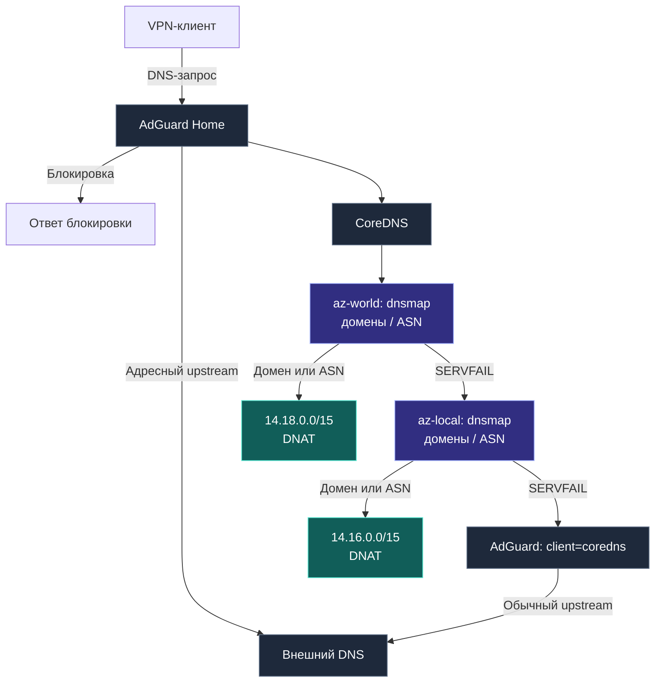
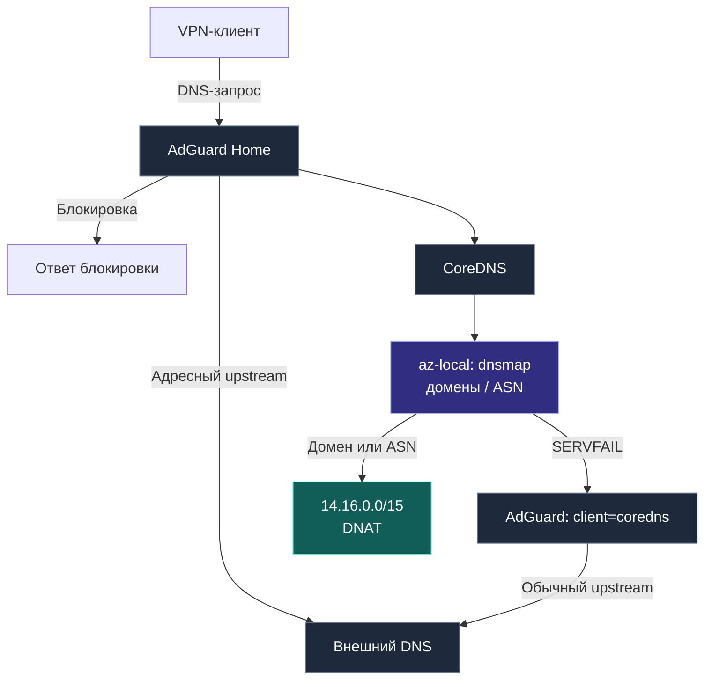
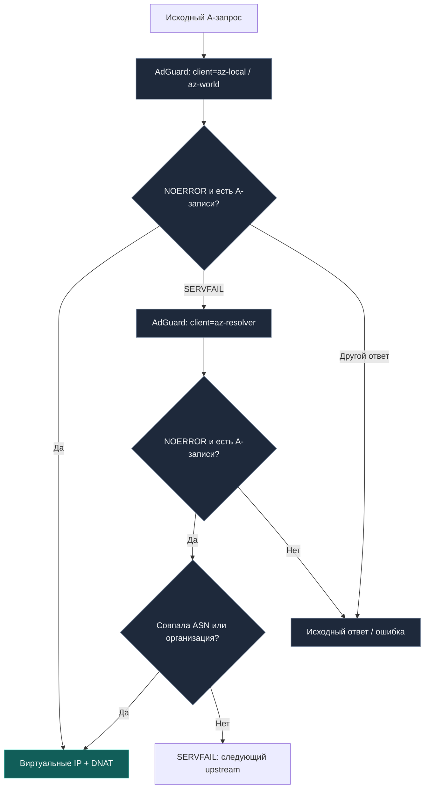

[English](README.md) | [Русский](README_RU.md)

# AntiZapret VPN в Docker

Antizapret создан для того, чтобы перенаправлять только заблокированные домены через VPN-туннель. Это называется раздельное туннелирование (split tunneling).
Этот репозиторий основан на идее оригинального [AntiZapret LXD image](https://bitbucket.org/anticensority/antizapret-vpn-container/src/master/).

## Содержание

- [Группа поддержки и обсуждений](#группа-поддержки-и-обсуждений)
- [Возможности](#возможности)
- [Как это работает](#как-это-работает)
- [Установка](#установка)
  - [Один сервер (Просто)](#один-сервер-просто)
  - [Docker Swarm, несколько узлов выхода (Продвинутый)](#docker-swarm-несколько-узлов-выхода-продвинутый)
  - [Блокировка VPN / Хостинга](#блокировка-vpn--хостинга)
  - [После установки](#после-установки)
  - [Доступ к админ-панелям](#доступ-к-админ-панелям)
    - [HTTPS](#https)
      - [Собственные сайты на портах 80 и 444](#собственные-сайты-на-портах-80-и-444)
    - [Локальная сеть](#локальная-сеть)
    - [HTTP](#http)
  - [Обновление](#обновление)
    - [Обновление с v5](#обновление-с-v5)
  - [Сброс](#сброс)
- [Документация](#документация)
  - [FAQ (Часто задаваемые вопросы)](#faq-часто-задаваемые-вопросы)
  - [Алгоритм разрешения DNS](#алгоритм-разрешения-dns)
    - [Docker Swarm](#docker-swarm)
    - [Один сервер (Docker Compose)](#один-сервер-docker-compose)
    - [Внутри узла выхода: домены и ASN](#внутри-узла-выхода-домены-и-asn)
    - [Разрешение CNAME и прямые исключения](#разрешение-cname-и-прямые-исключения)
    - [Как читать журнал запросов](#как-читать-журнал-запросов)
  - [Правила маршрутизации: include, exclude и ASN](#правила-маршрутизации-include-exclude-и-asn)
    - [Файлы пользовательских правил](#файлы-пользовательских-правил)
    - [Включение доменов](#включение-доменов)
    - [Исключение доменов](#исключение-доменов)
    - [Добавление ASN](#добавление-asn)
    - [Добавление IP/подсетей](#добавление-ipподсетей)
    - [Прямое разрешение доменов на CDN из VPN-списков](#прямое-разрешение-доменов-на-cdn-из-vpn-списков)
    - [Обновление и проверка правил](#обновление-и-проверка-правил)
  - [Добавление доменов](#добавление-доменов)
    - [Добавление доменов через правила](#добавление-доменов-через-правила)
    - [Добавление доменов через списки](#добавление-доменов-через-списки)
    - [Опции адаптера списков](#опции-адаптера-списков)
    - [Перенаправление сайта через VPN для отдельного клиента](#перенаправление-сайта-через-vpn-для-отдельного-клиента)
  - [SOCKS5 и HTTP(S) прокси (маршрутизация для конкретных приложений)](#socks5-и-https-прокси-маршрутизация-для-конкретных-приложений)
    - [Как это работает](#как-это-работает-1)
    - [Как отключить HTTPS-доступ из интернета](#как-отключить-https-доступ-из-интернета)
    - [Когда использовать proxy вместо DNS-маршрутизации](#когда-использовать-proxy-вместо-dns-маршрутизации)
    - [Конфигурация](#конфигурация)
    - [Настройка клиента](#настройка-клиента)
  - [zapret2](#zapret2)
    - [Изменение конфигураций](#изменение-конфигураций)
    - [Подбор стратегий](#подбор-стратегий)
  - [Cloudflare WARP](#cloudflare-warp)
    - [Docker Swarm](#docker-swarm-1)
  - [Переменные окружения](#переменные-окружения)
    - [Antizapret](#antizapret)
    - [Adguard](#adguard)
    - [CoreDNS](#coredns)
    - [Filebrowser](#filebrowser)
    - [Https](#https-1)
    - [OpenConnect (ocserv)](#openconnect-ocserv)
    - [Openvpn](#openvpn)
    - [Openvpn-ui](#openvpn-ui)
    - [Wireguard/Wireguard Amnezia](#wireguardwireguard-amnezia)
    - [SOCKS5 прокси (устарело, используйте proxy ниже)](#socks5-прокси-устарело-используйте-proxy-ниже)
    - [Proxy (http + socks5)](#proxy-http--socks5)
  - [DNS](#dns)
    - [Upstream DNS для Adguard](#upstream-dns-для-adguard)
    - [CDN + ECS](#cdn--ecs)
  - [OpenConnect (ocserv)](#openconnect-ocserv-1)
    - [Управление пользователями](#управление-пользователями)
    - [Настройка клиента](#настройка-клиента-1)
  - [OpenVPN](#openvpn-1)
    - [Создание клиентских сертификатов](#создание-клиентских-сертификатов)
    - [Включение OpenVPN Data Channel Offload (DCO)](#включение-openvpn-data-channel-offload-dco)
      - [Ubuntu 26.04/24.04/22.04/20.04](#ubuntu-2604240422042004)
    - [Поддержка устаревших клиентов](#поддержка-устаревших-клиентов)
  - [Amnezia Wireguard](#amnezia-wireguard)
    - [Включение расширения ядра Amnezia Wireguard](#включение-расширения-ядра-amnezia-wireguard)
      - [Ubuntu 26.04](#ubuntu-2604)
      - [Ubuntu 24.04](#ubuntu-2404)
      - [Ubuntu 20.04, 22.04](#ubuntu-2004-2204)
    - [Параметры AmneziaWG](#параметры-amneziawg)
      - [Таблица совместимости параметров](#таблица-совместимости-параметров)
      - [Примечания](#примечания)
    - [Размер блока Amnezia Wireguard](#размер-блока-amnezia-wireguard)
  - [Дополнительная информация](#дополнительная-информация)
  - [Тест скорости с iperf3](#тест-скорости-с-iperf3)
- [Благодарности](#благодарности)

# Группа поддержки и обсуждений:
https://t.me/antizapret_support

# Возможности

- Модульный дизайн. В качестве строительных блоков нашей системы используются внешние высококачественные open-source модули/контейнеры.
- Удобные веб-панели для администрирования VPN и DNS.
- Множество VPN-транспортов: WireGuard, AmneziaWG, OpenVPN и OpenConnect (ocserv).
- AdguardHome в качестве основного DNS-резолвера и менеджера заблокированных доменов.
- Многосерверная архитектура для обхода гео-ограничений сервисов. Разные домены используют разные серверы в качестве узлов выхода.
- Файрвол для защиты от сканирования портов.
- Поддержка модулей ядра для OpenVPN и Amnezia Wireguard для снижения нагрузки на процессор.
- SOCKS5 и HTTP(S) прокси для маршрутизации конкретных приложений через локальные или зарубежные узлы выхода.
- Встроенная поддержка anti-DPI через [bol-van/zapret2](https://github.com/bol-van/zapret2) для HTTP-, TLS- и QUIC-трафика. Конфигурация от [vernette/ss-zapret2](https://github.com/vernette/ss-zapret2).

# Как это работает?

1. AdGuard Home применяет DNS-фильтры и направляет обычные запросы в CoreDNS. Адресные upstream могут разрешать отдельные домены напрямую.
2. CoreDNS последовательно опрашивает VPN-узлы: `az-world` → `az-local` в Swarm или только `az-local` в односерверном Compose.
3. Каждый узел выхода обращается к AdGuard со своим ClientID. Совпавшее доменное правило включает VPN-маршрутизацию; иначе `dnsmap` разрешает имя через `az-resolver` и проверяет полученные IPv4-адреса по правилам ASN и организаций.
4. При совпадении `dnsmap` выделяет виртуальные IPv4-адреса и создаёт правила DNAT к реальным адресам. Пулы по умолчанию: `14.16.0.0/15` для локального узла и `14.18.0.0/15` для зарубежного.
5. CoreDNS возвращает VPN-адреса либо обычный DNS-ответ, если ни один узел выхода не дал совпадения. `finalize force_resolve` также проверяет CNAME-цели через ту же цепочку маршрутизации.
6. VPN-клиенты направляют виртуальные адреса через туннель. Явные IP/CIDR-списки могут дополнительно создавать маршруты для реальных адресов. См. [Правила маршрутизации: include, exclude и ASN](#правила-маршрутизации-include-exclude-и-asn).


# Установка

> [!IMPORTANT]
> Команды должны выполняться от имени root пользователя. Иначе у конфигурационных файлов будут некорректные права, и некоторые контейнеры будут бесконечно перезапускаться.

## Один сервер (Просто)

Рекомендуется использовать сервер, расположенный в западных странах. Некоторые сайты будут блокировать пользователей из других стран.
По умолчанию Compose запускает один контейнер выхода `az-local`. Он обслуживает
и локальный, и мировой списки доменов в диапазоне `14.16.0.0/15`.

0. Установите [Docker Engine](https://docs.docker.com/engine/install/):
   ```bash
   curl -fsSL https://get.docker.com -o get-docker.sh
   sudo sh get-docker.sh
   ```
1. Клонируйте репозиторий и запустите контейнер:
   ```bash
   git clone https://github.com/xtrime-ru/antizapret-vpn-docker.git antizapret
   cd antizapret
   git checkout v6
   ```
2. Создайте docker-compose.override.yml с нужными вам сервисами. Минимальный пример только с wireguard:
```yml
services:
  adguard:
    environment:
      - ADGUARDHOME_PASSWORD=somestrongpassword
  wireguard:
     environment:
        - WIREGUARD_PASSWORD=somestrongpassword
     extends:
        file: services/wireguard/docker-compose.yml
        service: wireguard
```
Полный пример можно найти в [docker-compose.override.sample.yml](./docker-compose.override.sample.yml)

3. Запустите сервисы:
```shell
   docker compose up -d
   docker system prune -f
```

## Docker Swarm, несколько узлов выхода (Продвинутый)

Версии 5 и 6 обладают возможностью перенаправлять трафик на разные узлы выхода для разных доменов.
Например, YouTube лучше всего работает, если узел выхода находится близко к клиенту, а другие сервисы требуют зарубежный IP для работы.
Docker swarm используется для построения единой сети между контейнерами.

Рекомендуется использовать локальный сервер в качестве менеджера/первичного узла для VPN, DNS и контейнеров az-local.
Зарубежный сервер — в качестве вторичного/воркер-узла для контейнера az-world.

Большинство доменов будут проксироваться через **локальный** сервер для максимальной скорости и производительности.
Некоторые сайты, использующие geoip для блокировки пользователей, будут проксироваться через **зарубежный** сервер.

0. Повторите шаги 0 и 1 из установки на одном сервере на **обоих серверах**:
   - Установите docker
   - Зачекаутьте проект в том же месте на обоих серверах.
1. [Первичный] Создайте docker-compose.override.yml на первичном узле и определите, какие сервисы вам нужны. См. шаг 2 из установки на одном сервере.
2. [Первичный] Измените имена хостов серверов на az-local и az-world для удобства: `hostnamectl set-hostname az-local`
3. [Вторичный] Измените имена хостов серверов на az-local и az-world для удобства: `hostnamectl set-hostname az-world`
4. [Опционально] hub.docker.com может быть недоступен на локальных хостингах. Можно использовать прокси. См. инструкции: https://dockerhub.timeweb.cloud
   Альтернативно образы можно собрать локально на **обоих серверах**: `docker compose --env-file compose.swarm.env build`
5. [Первичный]: `docker swarm init --advertise-addr <PRIMARY_SERVER_PUBLIC_IP_ADDRESS>`
6. [Вторичный]: Скопируйте команду из результатов и выполните ее на вторичном узле: `docker swarm join --token <TOKEN> <MANAGER_IP_ADDRESS>:<PORT>`
7. [Первичный]: Проверьте swarm `docker node ls`
    ```text
    ID                            HOSTNAME   STATUS    AVAILABILITY   MANAGER STATUS   ENGINE VERSION
    6dzagr08r8d2iidkcumjjz3q7 *   az-local   Ready     Active         Leader           29.0.1
    vspy2m6w4tf7uv4ywgdnzttvr     az-world   Ready     Active                          29.0.1
    ```
8. [Первичный] Добавьте метки для узлов `docker node update --label-add location=local az-local && docker node update --label-add location=world az-world`
9. [Первичный]: запустите swarm. Последний Compose-файл добавляет `az-world` и разделяет диапазон адресов между двумя узлами выхода:
   ```shell
   docker compose --env-file compose.swarm.env config | docker run --pull always --rm -i xtrime/antizapret-vpn:6 compose2swarm | docker stack deploy --prune -c - antizapret
   ```
10. [Первичный]: Docker Swarm не поддерживает передачу устройств хоста в сервисы так же, как Docker Compose, поэтому для работы VPN-контейнеров требуются DKMS-модули ядра:
    - [Включение OpenVPN Data Channel Offload (DCO)](#включение-openvpn-data-channel-offload-dco)
    - [Включение расширения ядра Amnezia Wireguard](#включение-расширения-ядра-amnezia-wireguard)

## Блокировка VPN / Хостинга
Большинство провайдеров сейчас блокируют VPN-соединения с зарубежными IP-адресами. Обфускация в Amnezia или OpenVpn не всегда решает проблему.
Для стабильной работы VPN вы можете попробовать подключиться к VPS внутри вашей страны, а затем проксировать трафик на зарубежный сервер.

Есть два способа:
1. [Рекомендуется] Установка в режиме [docker swarm](#docker-swarm-несколько-узлов-выхода-продвинутый)
2. Проксирование всего трафика через локальный прокси. См. ниже.

Пример скрипта запуска.
Замените <SERVER_IP> на IP-адрес вашего сервера и запустите его на чистой VPS (рекомендуется ubuntu 24.04):

```shell
#!/bin/sh

# Укажите ip вашего зарубежного сервера
export VPN_IP=<SERVER_IP>

echo "net.ipv4.ip_forward=1" >> /etc/sysctl.d/99-sysctl.conf
sysctl -w net.ipv4.ip_forward=1

# DNAT правила
iptables -t nat -A PREROUTING -p tcp ! --dport 22 -j DNAT --to-destination "$VPN_IP"
iptables -t nat -A PREROUTING -p udp ! --dport 22 -j DNAT --to-destination "$VPN_IP"
# MASQUERADE правила
iptables -t nat -A POSTROUTING -p tcp -d "$VPN_IP" -j MASQUERADE
iptables -t nat -A POSTROUTING -p udp -d "$VPN_IP"  -j MASQUERADE

echo iptables-persistent iptables-persistent/autosave_v4 boolean true | sudo debconf-set-selections
echo iptables-persistent iptables-persistent/autosave_v6 boolean false | sudo debconf-set-selections
apt install -y iptables-persistent
```

## После установки
1. Убедитесь, что безопасный DNS отключен в настройках вашего браузера.
   В chrome: Перейдите в Настройки > Конфиденциальность и безопасность > Безопасность, прокрутите до раздела "Дополнительные" и выключите "Использовать безопасный DNS"
2. Установите модули DKMS для openvpn и/или amnezia wireguard (если вы их используете):
    - [Включение OpenVPN Data Channel Offload (DCO)](#включение-openvpn-data-channel-offload-dco)
    - [Включение расширения ядра Amnezia Wireguard](#включение-расширения-ядра-amnezia-wireguard)

## Доступ к админ-панелям

### HTTPS
По умолчанию все контейнеры доступны через https. Для управления сертификатами используется отдельный контейнер `https`.
Если домен не задан, Caddy определяет публичный IPv4 сервера и запрашивает для него краткосрочный сертификат Let's Encrypt. До успешной проверки ACME используется постоянный самоподписанный сертификат, поэтому HTTPS и ocserv запускаются, даже когда `80/tcp` недоступен из Интернета.
Caddy передаёт все соединения со своего Layer 4 listener на `443/tcp` в ocserv и сообщает исходный адрес клиента через PROXY protocol v2. Dashboard использует отдельный HTTPS-порт `444/tcp`, а канал DTLS ocserv публикуется напрямую на `443/udp`.

- dashboard: https://%your-server-ip%:444
- adguard: https://%your-server-ip%:1443
- filebrowser: https://%your-server-ip%:2443
- openvpn: https://%your-server-ip%:3443
- wireguard: https://%your-server-ip%:4443
- wireguard-amnezia: https://%your-server-ip%:5443

#### Собственные сайты на портах 80 и 444

Дополнительные конфигурации Caddy можно сохранять в каталоге `config/https/config/sites-enabled`. Каталог создаётся автоматически при запуске контейнера `https`, а все файлы из него подключаются к основному Caddyfile.

Например, чтобы опубликовать сервис `my-app`, доступный в Docker-сети на порту `8080`, создайте файл `config/https/config/sites-enabled/my-app.caddy`:

```caddyfile
example.com {
  reverse_proxy my-app:8080
}
```

Caddy будет принимать запросы к `example.com` на портах 80 и 444, автоматически перенаправлять HTTP на HTTPS-порт 444 и управлять TLS-сертификатом. Домен должен указывать на сервер, а сервис `my-app` должен быть доступен контейнеру `https` в общей Docker-сети.

После добавления или изменения конфигурации перезапустите контейнер:

```shell
docker service update --force antizapret_https || docker compose restart https
```


### Локальная сеть
Когда вы подключены к VPN, вы можете получить доступ к контейнерам, не открывая порты в интернет:
- http://adguard.antizapret:3000
- http://dashboard.antizapret:80
- http://wireguard-amnezia.antizapret:51821
- http://wireguard.antizapret:51821
- http://openvpn-ui.antizapret:8080
- http://filebrowser.antizapret:80

### HTTP:
По умолчанию контейнеры не открывают веб-панели в интернет. Все веб-панели проксируются через контейнер `https`.
Если вы хотите открыть HTTP в интернет, добавьте перенаправление портов в docker-compose.override.yml.
Пример:
```yml
services:
   adguard:
      #...
      ports:
        - "3000:3000/tcp"
```

Список портов по умолчанию:

- adguard: http://%your-server-ip%:3000
- dashboard: http://%your-server-ip%:80
- wireguard-amnezia: http://%your-server-ip%:51821
- wireguard: http://%your-server-ip%:51821
- openvpn-ui: http://%your-server-ip%:8080
- filebrowser: http://%your-server-ip%:80

Некоторые контейнеры используют одинаковые порты. Поэтому вам нужно выбрать уникальный внешний порт в docker-compose.override.yml.

## Обновление

- Одиночный экземпляр
   ```shell
   git pull --rebase
   docker compose down --remove-orphans
   docker compose up -d --remove-orphans
   docker system prune -af
   ```
- Режим Swarm:
   ```shell
   git pull --rebase
   docker pull xtrime/antizapret-vpn:6
   docker compose --env-file compose.swarm.env config | docker run --pull always --rm -i xtrime/antizapret-vpn:6 compose2swarm | docker stack deploy --prune -c - antizapret
   docker system prune -af
   ```

### Обновление с v5

1. Обновите контейнеры:
- Режим Docker Compose (один сервер):
   ```shell
   docker compose down --remove-orphans
   git fetch && git checkout v6 && git pull --rebase
   docker compose down --remove-orphans
   docker compose up -d --remove-orphans
   docker system prune -af
   ```
- Режим Swarm:
   ```shell
   docker stack rm antizapret && sleep 10
   git fetch && git checkout v6 && git pull --rebase
   docker compose --env-file compose.swarm.env config | docker run --pull always --rm -i xtrime/antizapret-vpn:6 compose2swarm | docker stack deploy --prune -c - antizapret
   docker system prune -af
   ```
2. Обновите клиентов:
   - Wireguard/Amnezia
     - Проверьте, что ваш пароль длиннее 12 символов. Обновите при необходимости в docker-compose.override.yml
     - Скачайте новые конфигурации клиентов или вручную добавьте `14.16.0.0/14` в AllowedIps в старых конфигурациях.
   - OpenVPN
     - Нажмите save на странице конфигурации сервера openvpn-ui: http://openvpn-ui.antizapret:8080/ov/config/ а затем перезапустите сервер openvpn.
     - Установите новый dkms модуль на хост: `apt remove openvpn-dkms-dco` + https://github.com/xtrime-ru/antizapret-vpn-docker/blob/v6/README.md?tab=readme-ov-file#enable-openvpn-data-channel-offload-dco
   - Socks
   Замените его на контейнер proxy и переименуйте переменные окружения. См. пример: https://github.com/xtrime-ru/antizapret-vpn-docker/blob/v6/docker-compose.override.sample.yml#L63-L93
   Убедитесь, что используете надежный пароль, потому что теперь HTTPS прокси доступен из интернета.

## Сброс:
Удалить все настройки, VPN-конфигурации и вернуть начальное состояние сервиса:
```shell
docker stack rm antizapret || docker compose down --remove-orphans
rm -rf config/*
git restore config
```

# Документация

## FAQ (Часто задаваемые вопросы)

1. Как получить VPN-конфигурации?
    - OVPN:
        1. https://%your-server-ip%:3443/certificates
        1. Создать сертификат
        1. Введите любое имя и оставьте остальные поля как есть
        1. Нажмите "Create". Новый сертификат появится в списке.
        1. Нажмите на имя сертификата в списке, чтобы скачать его.
    - Wireguard или Amnezia:
        1. Перейдите на https://%your-server-ip%:4443 или https://%your-server-ip%:5443
        2. Нажмите "New"
        3. Введите любое имя.
        4. Создайте клиента
        5. Нажмите кнопку скачивания в списке.
        6. QR-коды не работают для Amnezia Wireguard, так как конфиг слишком большой для QR-кода
2. Какой клиент Amnezia Wireguard использовать?
   Рекомендуемый клиент для Amnezia Wireguard - AmneziaWG:
    - [Android (Google Play)](https://play.google.com/store/apps/details?id=org.amnezia.awg)
    - [iOS (App Store)](https://apps.apple.com/app/amneziawg/id6478942365)
    - [Windows (GitHub)](https://github.com/amnezia-vpn/amneziawg-windows-client/releases)
3. Почему OpenVPN-клиент не подключается к серверу?
   Большинство провайдеров блокируют протокол openvpn, особенно к зарубежным IP.
   Симптомы: клиент подключается, но после передачи нескольких байт сервер перестает отвечать, и соединение разрывается.

   - По умолчанию контейнер openvpn использует легкую обфускацию UDP-пакетов.
     Это работает на большинстве клиентов (включая роутеры), но все еще может блокироваться провайдерами.
     См. переменную окружения [OBFUSCATE_TYPE](#openvpn).
     Попробуйте изменить ее со значения по умолчанию `1` (легкая) на `2` (сильная) или `0` (выкл).
   - Используйте каскадное соединение или swarm-режим [cascade](#блокировка-vpn--хостинга)
4. Почему VPN-соединение может быть медленным и иметь много потерянных пакетов?
   1. Сначала используйте воспроизводимый тест для обнаружения проблем: [Тест скорости с iperf3](#тест-скорости-с-iperf3)
   2. Проверьте, не перегружен ли процессор на вашем хостинге во время iperf-теста.
   3. Убедитесь, что модули ядра для вашего VPN установлены и работают: [OVPN DCO](#включение-openvpn-data-channel-offload-dco), [расширение ядра Amnezia Wireguard](#включение-расширения-ядра-amnezia-wireguard).
   4. Некоторые недорогие хостинги имеют очень медленные процессоры, поэтому даже с установленными модулями ядра скорость соединения не превысит 100 Мбит/с.
   5. Большинство роутеров имеют медленные процессоры и обеспечивают только 30-60 Мбит/с через openvpn. Попробуйте использовать Wireguard или Amnezia Wireguard, если роутер поддерживает это, или обновите роутер до более новой модели.
   6. По умолчанию новые установки wireguard и openvpn используют низкий MTU `1280` для стабильного соединения в любых условиях. Можно увеличить до `1480`, чтобы немного повысить скорость.
      
      Сначала проверьте, есть ли у вашего VPN-соединения проблемы со стандартным MTU.
      - MacOs: `ping -D -s 1100 youtube.com`
      - Linux: `ping -M do -s 1100 youtube.com`
      - Windows: `ping youtube.com -f -l 1100`

      Для старых установок нужно вручную уменьшить MTU в настройках:
      - Wireguard/Amezia:
        MTU должен быть меньше на сервере и клиенте.
          1. Перейдите на http://wireguard.antizapret:51821 или http://wireguard-amnezia.antizapret:51821
          1. Перейдите в `/admin/interface` и задайте MTU там тоже.
          1. Нажмите на иконку конфига клиента. Уменьшите MTU до `1280` и сохраните.
          1. Скачайте и примените новый конфиг к вашему клиенту.
          1. [Тест скорости с iperf3](#тест-скорости-с-iperf3)
      - OpenVPN:
          1. Перейдите на http://openvpn-ui.antizapret:8080/ov/config и добавьте `tun-mtu 1200` и `mssfix 1232` в конфиг сервера.
          1. Сохраните конфигурацию и перезапустите сервер.
          1. Добавьте `tun-mtu 1200` и `mssfix 1232` в ваш client.conf
          1. `tun-mtu 1200` ограничивает пакеты внутри туннеля, а `mssfix 1232` оставляет место для служебных данных OpenVPN и IPv6/UDP при MTU пути 1280 байт.
   7. Если ничего не помогает, попробуйте другой хостинг и/или [каскад](#блокировка-vpn--хостинга)
5. Как отладить проблемы с VPN?
    1. Проверьте, установлено ли VPN-соединение и работает ли DNS-сервер:
       ```shell
       > nslookup youtube.com
       
       Server:         14.16.0.1
       Address:        14.16.0.1#53
       
       Non-authoritative answer:
       Name:   youtube.com
       Address: 14.16.13.209
       ```
    2. Убедитесь, что браузер не использует DoH/Secure DNS.
    3. Проверьте, загружены ли DIST-фильтры и имеют ли они ненулевые счетчики правил: http://adguard.antizapret:3000/#filters
    4. Проверьте этапы разрешения DNS: http://adguard.antizapret:3000/#logs?response_status=all&search=youtube.com  
       Число запросов зависит от доменных правил, проверки ASN, CNAME-цепочек и кэширования. Подробнее: [Алгоритм разрешения DNS](#алгоритм-разрешения-dns)

## Алгоритм разрешения DNS

Схемы показывают IPv4-запросы (`A`). Конфигурация AdGuard по умолчанию отключает ответы AAAA; `dnsmap` также возвращает пустые ответы на запросы `AAAA` и `HTTPS`. ClientID `az-local`, `az-world` и `az-resolver` позволяют AdGuard применять разные правила и upstream к внутренним запросам.

### Docker Swarm


```mermaid
flowchart TB
    client["VPN-клиент"] -->|DNS-запрос| adguard["AdGuard Home"]
    adguard -->|Блокировка| deny["Ответ блокировки"]
    adguard -->|Адресный upstream| external["Внешний DNS"]
    adguard --> core["CoreDNS"]
    core --> world
    world["az-world: dnsmap<br/>домены / ASN"]
    world -->|Домен или ASN| worldip["14.18.0.0/15<br/>DNAT"]
    world -->|SERVFAIL| local
    local["az-local: dnsmap<br/>домены / ASN"]
    local -->|Домен или ASN| localip["14.16.0.0/15<br/>DNAT"]
    local -->|SERVFAIL| retry["AdGuard: client=coredns"]
    retry -->|Обычный upstream| external
    classDef service fill:#1e293b,stroke:#64748b,color:#f8fafc
    classDef exit fill:#312e81,stroke:#a5b4fc,color:#ffffff
    classDef mapped fill:#115e59,stroke:#5eead4,color:#ffffff
    class adguard,core,retry,external service
    class local,world exit
    class localip,worldip mapped
```

### Один сервер (Docker Compose)


```mermaid
flowchart TB
    client["VPN-клиент"] -->|DNS-запрос| adguard["AdGuard Home"]
    adguard -->|Блокировка| deny["Ответ блокировки"]
    adguard -->|Адресный upstream| external["Внешний DNS"]
    adguard --> core["CoreDNS"]
    core --> local
    local["az-local: dnsmap<br/>домены / ASN"]
    local -->|Домен или ASN| localip["14.16.0.0/15<br/>DNAT"]
    local -->|SERVFAIL| retry["AdGuard: client=coredns"]
    retry -->|Обычный upstream| external
    classDef service fill:#1e293b,stroke:#64748b,color:#f8fafc
    classDef exit fill:#312e81,stroke:#a5b4fc,color:#ffffff
    classDef mapped fill:#115e59,stroke:#5eead4,color:#ffffff
    class adguard,core,retry,external service
    class local exit
    class localip mapped
```

В Swarm CoreDNS использует `az-world`, затем `az-local`, затем прямой запрос в AdGuard. Переход к следующему upstream происходит только при `SERVFAIL`. Последний запрос в AdGuard относится к клиенту `coredns`, для которого настроены обычные внешние DNS-серверы: запрос не возвращается обратно в CoreDNS.

В односерверном Compose контейнер `az-local` также получает alias `az-world` и `az-world.antizapret`. CoreDNS определяет общий адрес, опрашивает узел выхода один раз и затем использует AdGuard. Локальные и зарубежные доменные списки применяются к ClientID `az-local`, а `ASN_FILES` включает оба итоговых ASN-списка.

### Внутри узла выхода: домены и ASN


```mermaid
flowchart TB
    q["Исходный A-запрос"] --> first["AdGuard: client=az-local / az-world"]
    first --> has{"NOERROR и есть A-записи?"}
    has -->|Да| mapped["Виртуальные IP + DNAT"]
    has -->|SERVFAIL| direct["AdGuard: client=az-resolver"]
    has -->|Другой ответ| err["Исходный ответ / ошибка"]
    direct --> res{"NOERROR и есть A-записи?"}
    res -->|Да| asn{"Совпала ASN или организация?"}
    res -->|Нет| err
    asn -->|Да| mapped
    asn -->|Нет| fail["SERVFAIL: следующий upstream"]
    classDef service fill:#1e293b,stroke:#64748b,color:#f8fafc
    classDef exit fill:#312e81,stroke:#a5b4fc,color:#ffffff
    classDef mapped fill:#115e59,stroke:#5eead4,color:#ffffff
    class first,direct,err,has,res,asn service
    class mapped mapped
```

1. `dnsmap` отправляет исходный запрос в AdGuard по протоколу DoH через внутренний HTTP на `/dns-query/<CLIENT>`, где `<CLIENT>` — `az-local` или `az-world`. Порт DoH AdGuard по умолчанию — `3000`.
2. Совпавшее доменное правило включения отменяет стандартный rewrite `SERVFAIL` для этого клиента. Если ответ содержит IPv4-адреса, `dnsmap` сразу подменяет их: в этой ветке ASN не проверяется и запрос к `az-resolver` не выполняется.
3. Если первый ответ — `SERVFAIL`, `dnsmap` повторяет тот же исходный запрос с ClientID `az-resolver`. Для этого клиента по умолчанию используются Cloudflare, Google и Quad9 вместо CoreDNS.
4. Совпавшее доменное исключение возвращает `SERVFAIL` для `az-resolver` и останавливает проверку ASN. Другие ошибки резолвера также возвращаются без создания подменных адресов.
5. При успешном прямом разрешении `dnsmap` проверяет IPv4-адреса по базе ASN MaxMind. Если хотя бы один адрес совпал с номером ASN, подстрокой организации или regex организации, все IPv4-адреса ответа подменяются для этого узла выхода. При отсутствии совпадений CoreDNS получает исходный `SERVFAIL`.
6. При подмене `dnsmap` удаляет CNAME-записи, заменяет A-записи виртуальными адресами под исходным именем запроса и устанавливает TTL 300 секунд. Для виртуальных адресов создаются DNAT-правила к реальным адресам.

Пустой ответ не создаёт подменных адресов. Ошибка установки правил подмены возвращает `SERVFAIL`. Пулы адресов и файлы правил описаны в разделе [Правила маршрутизации: include, exclude и ASN](#правила-маршрутизации-include-exclude-и-asn).

### Разрешение CNAME и прямые исключения

CoreDNS сохраняет `finalize force_resolve`, чтобы домен с CNAME на заблокированный CDN также мог использовать VPN. Finalizer повторно запрашивает CNAME-цели, даже если исходный ответ уже содержит их реальные A-записи.

Каждая CNAME-цель — новый запрос через цепочку узлов выхода. Исключение исходного домена из проверки ASN не исключает его CNAME-цели автоматически. Для домена, работающего напрямую, используйте [адресный upstream AdGuard](#прямое-разрешение-доменов-на-cdn-из-vpn-списков). Он обходит CoreDNS для исходного запроса, сохраняя маршрутизацию CDN для остальных доменов.

### Как читать журнал запросов

Для домена, направленного через VPN по ASN, журнал AdGuard может показывать:

| Клиент | Ответ | Что означает |
|---|---|---|
| `az-world` или `az-local` | `SERVFAIL` | Доменное правило не разрешило первый запрос; далее ещё возможна проверка ASN |
| `az-resolver` | `NOERROR`, реальные IPv4-адреса | Прямое разрешение для последующей проверки ASN |
| Исходный VPN-клиент | `NOERROR`, `14.18.*` или `14.16.*` | Узел выхода подменил адреса для VPN |

Одна запись `SERVFAIL` для ClientID узла выхода не доказывает, что узел пропущен: проверьте последующий запрос `az-resolver` и сообщения `ASN match` в логах контейнера выхода. Если все узлы вернули `SERVFAIL`, запрос от `coredns` к обычному upstream даёт прямой ответ. Кэширование и CNAME-цепочки меняют число записей в журнале для одного клиентского запроса.

## Правила маршрутизации: include, exclude и ASN

По умолчанию подключены дистрибутивные (`dist`) списки доменов, IP и ASN. Доменные списки проекта автоматически обновляются самим AdGuard Home через GitHub с использованием адаптера списков. IP- и ASN-списки отдельно загружает и обновляет контейнер antizapret из GitHub. Для стандартной настройки вручную добавлять правила не нужно. Пользовательские файлы необязательны: используйте их только для своих дополнений или исключений из готовых списков.

Пользовательские файлы позволяют направлять домены и IP-сети через VPN или удалять правила из дистрибутивных списков. `include` добавляет правила, а `exclude` удаляет совпавшие записи из конкретного списка. Исключение не является универсальной командой обходить все остальные правила маршрутизации.

### Файлы пользовательских правил

Файлы находятся в `./config/antizapret/custom/` на соответствующем узле выхода и подключаются в `/root/antizapret/config/custom/` внутри контейнера. В Swarm-режиме доменные файлы редактируются на том узле, чьи списки нужно изменить: `az-local` и `az-world` используют одинаковые имена файлов на своих хостах.

| Файл включений | Файл исключений | Что настраивает |
|---|---|---|
| `include-hosts-custom.txt` | `exclude-hosts-custom.txt` | Доменные списки этого узла; доменные исключения также загружаются в фильтр AdGuard для `az-resolver` |
| `include-ips-custom.txt` | `exclude-ips-custom.txt` | Локальные IPv4-адреса и CIDR-префиксы |
| `include-ips-world-custom.txt` | `exclude-ips-world-custom.txt` | Зарубежные IPv4-адреса и CIDR-префиксы |
| `include-asn-custom.txt` | `exclude-asn-custom.txt` | Локальные правила ASN и организаций |
| `include-asn-world-custom.txt` | `exclude-asn-world-custom.txt` | Зарубежные правила ASN и организаций |

### Включение доменов

Добавьте в `include-hosts-custom.txt` по одному домену на строку, без схемы URL и пути:

```text
example.com
subdomain.example.net
```

Домен преобразуется в правило AdGuard вида `@@||example.com^$dnsrewrite,client=az-local` (или `client=az-world` на зарубежном узле). Оно включает подмену адресов для маршрутизации домена и его поддоменов через VPN. Списки включений также принимают регулярные выражения между символами `/`, например `/^service[0-9]+\.example\.net$/`.

Пользовательские правила AdGuard и внешние доменные списки описаны в разделе [Добавление доменов](#добавление-доменов).

### Исключение доменов

Добавьте в `exclude-hosts-custom.txt` расширенные регулярные выражения. Используйте выражения без обрамления символами `/`, чтобы один шаблон работал и при фильтрации списков, и в создаваемом правиле AdGuard. Например:

```text
^example\.com$
(^|\.)example\.net$
^steampipe\.akamaized\.net$
```

Первый шаблон удаляет точную запись `example.com` из списка, второй совпадает с `example.net` и записями его поддоменов. Точки экранируются, потому что файл содержит regex-шаблоны. Фильтрация доменных списков учитывает регистр.

Доменные исключения действуют двумя способами:

1. Адаптер удаляет совпавшие входные строки из списков с `filter_custom=1` — это значение по умолчанию.
2. AdGuard загружает исключения обоих узлов как rewrite-правила `SERVFAIL` для `az-resolver`, останавливая проверку ASN для совпавшего запроса.

Адаптер фильтрует записи списка, а не все имена, охваченные итоговыми правилами AdGuard. Исключение `subdomain.example.com` не удаляет запись `example.com`, а вручную добавленное правило AdGuard не проходит через адаптер. Если другое правило уже разрешает первый запрос от `az-local` или `az-world`, `dnsmap` создаёт VPN-адреса без запроса к `az-resolver`.

Оба фильтра исключений относятся к общему клиенту `az-resolver`, поэтому исключение с одного узла также может остановить проверку ASN на другом. Исключение домена не удаляет независимые IP/CIDR-маршруты. При `finalize force_resolve` CNAME-цели обрабатываются как отдельные запросы: см. [Прямое разрешение доменов на CDN из VPN-списков](#прямое-разрешение-доменов-на-cdn-из-vpn-списков).

### Добавление ASN

Правила ASN позволяют направлять домены через VPN-узел на основании сети, которой принадлежат
разрешённые IPv4-адреса. Если обычный запрос AdGuard для `az-local` или `az-world` вернул
`SERVFAIL`, `dnsmap` разрешает домен напрямую через клиента `az-resolver` и проверяет
A-записи по базе ASN MaxMind. Если хотя бы один адрес совпал с правилом, все IPv4-адреса из
этого DNS-ответа заменяются внутренними адресами `dnsmap`, трафик к которым направляется через
соответствующий VPN-узел. Если A-записей нет или ни одна сеть не совпала, сохраняется исходный
отфильтрованный ответ.

Каждая непустая строка может содержать:

- Точный номер ASN: `AS13335` или `13335`
- Регистронезависимую подстроку исходного названия организации MaxMind: `Cloudflare`
- Регистронезависимое регулярное выражение между символами `/`: `/\bg-?core\b/`

Списки включений поддерживают комментарии с `#` на отдельных строках или после правила. В файлах исключений указывайте точные строки правил без комментариев.
Дистрибутивные правила из `ASN_URL` и `ASN_WORLD_URL` объединяются с соответствующими файлами
пользовательских включений. Файлы исключений удаляют точные строки без учёта регистра до
создания рабочих списков.

Исключения удаляют текст правила, а не все правила, способные совпасть с одной сетью. Чтобы удалить `AS20940`, добавьте именно эту строку в соответствующий файл исключений: для фильтрации списка `20940` — другая строка. Если во включениях остаётся `Akamai`, сеть всё ещё может совпасть с правилом организации. Удаление ASN-правила не удаляет независимые доменные и IP-правила.

В односерверном Compose-режиме `ASN_FILES` передаёт `az-local` оба итоговых ASN-файла, поэтому
оба списка маршрутизируются через локальный узел выхода. В Swarm-режиме каждый сервис выхода
получает только собственный ASN-файл.

Для отладки фильтров `dnsmap` записывает в лог IP-адрес, ASN и организацию как для совпавших,
так и для несовпавших сетей. Сообщение `ASN data not found` означает, что в MaxMind нет записи
для адреса. Пустые адреса и `0.0.0.0` игнорируются без обращения к базе. При успешном совпадении
в лог также выводится конкретное правило ASN, подстрока или регулярное выражение, запустившее
маршрутизацию.

### Добавление IP/подсетей

Для пользовательских IP-маршрутов используются следующие файлы:

- Локальные сети: `./config/antizapret/custom/include-ips-custom.txt` и `./config/antizapret/custom/exclude-ips-custom.txt`.
- Зарубежные сети: `./config/antizapret/custom/include-ips-world-custom.txt` и `./config/antizapret/custom/exclude-ips-world-custom.txt`.

Добавьте IPv4-адреса или CIDR-префиксы, по одному на строку, в соответствующий файл включений:

```text
192.0.2.10
198.51.100.0/24
```

Пользовательский файл включений объединяется с дистрибутивным списком из `IPS_URL` для локальных сетей или `IPS_WORLD_URL` для зарубежных. Соответствующий файл исключений фильтрует объединённый список расширенными регулярными выражениями. Чтобы удалить обе записи из примера, добавьте:

```text
^192\.0\.2\.10$
^198\.51\.100\.0/24$
```

Это фильтрация текста, а не вычитание подсетей: исключение `198.51.100.10` не исключает адрес из включённой подсети `198.51.100.0/24`. В отличие от доменных правил и ASN, IP-списки создают маршруты для реальных адресов без подмены DNS-ответов. Удаление IP-записи не отключает маршрутизацию через VPN, включённую доменным правилом или ASN, а `exclude-hosts-custom.txt` не удаляет IP-маршруты.

VPN-клиенту также нужны маршруты для этих реальных адресов. OpenVPN создаёт push-маршруты из IP-списков; WireGuard/AmneziaWG добавляет их в AllowedIPs по умолчанию, если `WG_ALLOWED_IPS` не задан. После изменений переподключите OpenVPN-клиенты и скачайте/примените обновлённые конфигурации WireGuard либо используйте BGP на поддерживаемых роутерах.

### Прямое разрешение доменов на CDN из VPN-списков

Если домен работает без VPN, но разрешается в IPv4-адреса сети, ASN которой включена в VPN-списки, добавьте отдельный upstream для этого домена в AdGuard Home: **Настройки → Настройки DNS → Upstream DNS-серверы**. Например, для прямой загрузки контента Steam:

```text
[/steampipe.akamaized.net/]https://cloudflare-dns.com/dns-query
```

Этот upstream для Steam включён в конфигурацию по умолчанию. Существующие установки сохраняют свои настройки AdGuard: если записи ещё нет, добавьте её вручную.

Сохраните остальные upstream, включая `coredns`. Добавленная настройка направляет запросы этого домена напрямую в Cloudflare, обходя CoreDNS и подмену адресов для VPN. Для остальных доменов сохраняется существующая логика выбора VPN.

Это также необходимо, если исходный домен добавлен в `exclude-hosts-custom.txt`, но его CNAME указывает на CDN из включённой в VPN-списки ASN. CoreDNS с `finalize force_resolve` повторно запрашивает CNAME-цели через VPN-узлы; исключение исходного домена не распространяется на эти отдельные запросы. Отдельный upstream обходит всю эту цепочку, сохраняя маршрутизацию заблокированных CDN для остальных доменов.

Сохраните настройки DNS, очистите DNS-кэш AdGuard и устройства, затем повторите запрос. Исключённый домен должен возвращать реальные IP-адреса вместо VPN-адресов из `14.16.0.0/14`. Селекторы доменов в upstream не являются регулярными выражениями: каждый нужный домен добавляется явно.

### Обновление и проверка правил

Контейнеры выхода проверяют пользовательские файлы каждые 10 секунд. Пересборка списков может занять больше времени из-за загрузки внешних списков. AdGuard обнаруживает изменения конфигурации, обновляет фильтры и очищает свой DNS-кэш. В Swarm-режиме редактируйте файлы на нужном узле выхода.

После обновления проверьте созданный фильтр в AdGuard, очистите DNS-кэш устройства и повторите запрос. Адреса из `14.16.0.0/15` обозначают локальный VPN-узел, а из `14.18.0.0/15` — зарубежный. Если исключение не работает, проверьте журнал запросов для исходного домена и его CNAME-целей, клиента (`az-local`, `az-world` или `az-resolver`) и сработавшее правило. Совпадения ASN также записываются в лог `dnsmap`.

[Онлайн-проверка DPI](https://hyperion-cs.github.io/dpi-checkers/ru/tcp-16-20/)

Для проверки заблокированных ASN также можно использовать DPI Detector на хосте с Docker. Запустите команду в той сети, которую хотите проверить:

```shell
docker run --rm -it --pull=always ghcr.io/runnin4ik/dpi-detector:latest --tests 3
```

Пересобрать IP- и ASN-списки вручную: `docker exec $(docker ps -q --filter=name=az | head -n1) doall`. Матчеры доменных исключений и фильтры AdGuard обновляются описанными выше healthcheck-проверками.

## Добавление доменов
Пользовательские файлы включений и исключений описаны в разделе [Правила маршрутизации: include, exclude и ASN](#правила-маршрутизации-include-exclude-и-asn). Ниже описаны ручные правила AdGuard, внешние доменные списки и маршрутизация для отдельного клиента.

### Добавление доменов через правила
Откройте панель adguard: http://adguard.antizapret:3000/#custom_rules
Правила/синтаксис: https://adguard-dns.io/kb/general/dns-filtering-syntax/#basic-examples

По умолчанию AdGuard возвращает `SERVFAIL` для внутренних запросов от `az-local` и `az-world`. Доменное правило с `@@` и `$dnsrewrite` разрешает узлу выхода получить адреса и направить домен через VPN. Если доменное правило не разрешило запрос, `dnsmap` проверяет ASN; если ни один способ не дал совпадения, CoreDNS пробует следующий upstream. Для обычных клиентских запросов сохраняется стандартная фильтрация AdGuard.


Примеры:
```
@@||subdomain.host.com^$dnsrewrite,client=az-local
@@||*.host.com^$dnsrewrite,client=az-local
# правила az-world применяются только в Swarm-режиме
@@||host.com^$dnsrewrite,client=az-world
@@||de^$dnsrewrite,client=az-world

@@/some_.*_regex/$dnsrewrite,client=az-local
```

### Добавление доменов через списки
Также вы можете добавить любые url в blocklist. http://adguard.antizapret:3000/#dns_blocklist
Необходимо использовать адаптер для парсинга и адаптации списка в различных форматах.
 - Добавить домены для локального узла выхода: `http://az-local.antizapret/list/?url=<ANY_URL>`
 - Добавить домены для отдельного мирового узла выхода в Swarm-режиме: `http://az-world.antizapret/list/?url=<ANY_URL>`
 - В односерверном Compose-режиме для обоих типов доменов используйте `az-local`.
Используйте обычные доменные списки, regex-списки с обрамлением `/` или JSON-массивы доменных строк. Для готовых правил AdGuard задайте `raw=1`; пары IP/имя из hosts-файлов нужно предварительно преобразовать в доменные имена.

### Опции адаптера списков

 - `url` - скачать список по url
 - `file` - прочитать локальный файл. Используется для include-host-{custom,dist}.txt
 - `filter_custom=1` - фильтровать списки правилами из exclude-hosts-custom.txt.
 - `filter_dist=0` - фильтровать списки правилами из exclude-hosts-dist.txt
 - `format=list` - 'list' или 'json'. Определяется автоматически.
 - `client=az-local` - имя клиента для добавления в правила. Определяется автоматически.
 - `allow=1` - отключить эту опцию, чтобы блокировать домены из списка для этого узла выхода.
 - `raw=0` - не изменять правила
 - `suffix=1` - добавить "$dnsrewrite,client=xxx" в правила
 - `dnsrewrite=SERVFAIL` - указать зачение директивы dnsrewrite
 - `regex=0` - задайте `regex=1`, чтобы обернуть каждую входную строку как регулярное выражение AdGuard

### Перенаправление сайта через VPN для отдельного клиента

Чтобы направить определенный сайт через VPN только для одного клиента:

1. Найдите внутренний IP-адрес клиента в панели соответствующего VPN-сервера или в журнале запросов AdGuard Home.
2. Откройте страницу клиентов AdGuard Home: http://adguard.antizapret:3000/#clients, добавьте найденный IP-адрес в список клиентов и задайте для него следующие upstream DNS-серверы:
   ```text
   coredns
   [/*.antizapret/]127.0.0.11
   [/example.com/]udp://coredns.antizapret
   ```
3. Откройте настройки DNS AdGuard Home: http://adguard.antizapret:3000/#dns и добавьте upstream для нужного домена:
   ```text
   [/example.com/]1.1.1.1
   ```
4. Добавьте `example.com` в файл `include-hosts-custom.txt`, либо добавьте на странице пользовательских правил http://adguard.antizapret:3000/#custom_rules следующее правило:
   ```text
   @@||example.com^$dnsrewrite,client=az-local
   ```

После настройки обычный локальный запрос в AdGuard Home будет возвращать реальный IP-адрес сайта, а запрос от указанного VPN-клиента — подменный внутренний IP-адрес, трафик к которому направляется через VPN.

## SOCKS5 и HTTP(S) прокси (маршрутизация для конкретных приложений)

Подмена DNS-адресов обрабатывает соединения по доменным именам. Соединение с реальным IP использует VPN, только если маршруты клиента и IP/CIDR-списки охватывают этот адрес. Используйте прокси, если нужно направить всё приложение через узел выхода без ведения доменных и IP-списков.

Сервис `proxy` основан на [3proxy](https://github.com/3proxy/3proxy) [контейнере](https://github.com/tarampampam/3proxy-docker).
Это решение для маршрутизации конкретных приложений.

### Как это работает

1. Подключитесь к VPN (OpenVPN, WireGuard или Amnezia WireGuard)
2. Настройте приложение на использование SOCKS5 или HTTP/HTTPS прокси через настройки прокси или инструменты вроде [AntizapretSOCKS5](https://github.com/danayer/AntizapretSOCKS5) (Windows), ProxyBridge, Proxifier или настроек прокси в браузере.
3. Весь трафик от этого приложения (включая прямые IP-соединения) будет выходить через выбранный серверный узел.

Доступны два контейнера прокси:
- **`proxy-local.antizapret`** — трафик выходит через **локальный** сервер
    - SOCKS5 порт: `8118`
    - HTTP порт: `8180`
    - HTTPS (local) через контейнер `https`: `https://%your_ip%:8143`
- **`proxy-world.antizapret`** — трафик выходит через **зарубежный** сервер
    - SOCKS5 порт: `8118`
    - HTTP порт: `8180`
    - HTTPS (world) через контейнер `https`: `https://%your_ip%:8243`

Аутентификация: Basic (SOCKS5/HTTP/HTTPS), настраивается через переменные окружения.
Аутентификация обязательна, потому что HTTPS-прокси доступен из интернета.

### Как отключить HTTPS-доступ из интернета
Есть два варианта:
- Очистите переменные окружения контейнера `https` для `proxy-local.antizapret` и `proxy-world.antizapret`.
- Измените `hostname` в `docker-compose.override.yml`, чтобы `caddy`/`https` не мог обращаться к ним по стандартным именам `proxy-local.antizapret` и `proxy-world.antizapret`.
Без HTTPS безопасно использовать прокси с пустыми именем пользователя и паролем.

### Когда использовать proxy вместо DNS-маршрутизации

| Сценарий | DNS-маршрутизация | Proxy |
|---|---|---|
| Приложение соединяется по домену | ✅ Работает | ✅ Работает                            |
| Приложение соединяется по IP | ❌ Не маршрутизируется | ✅ Работает                            |
| Большое количество IP для маршрутизации | ❌ Лимит OpenVPN push routes | ✅ Без лимитов                         |
| Выбор узла выхода для приложения | ❌ | ✅ Выбор local или world для приложения |

### Конфигурация

Добавьте proxy-сервисы в `docker-compose.override.yml`:
```yml
  proxy-local:
    hostname: proxy-local.antizapret
    extends:
      file: services/proxy/compose.yml
      service: proxy
    environment:
      - PROXY_LOGIN=admin
      - PROXY_PASSWORD=password
    deploy:
      mode: replicated
      replicas: 1
      endpoint_mode: dnsrr
      placement:
        constraints: [ node.labels.location == local ]

  proxy-world:
    hostname: proxy-world.antizapret
    extends:
      file: services/proxy/compose.yml
      service: proxy
    environment:
      - PROXY_LOGIN=admin
      - PROXY_PASSWORD=password
    deploy:
      mode: replicated
      replicas: 1
      endpoint_mode: dnsrr
      placement:
        constraints: [ node.labels.location == world ]
```

> **Примечание:** `proxy-world` требует режима [Docker Swarm](#docker-swarm-несколько-узлов-выхода-продвинутый) с двумя узлами.
> На одном сервере будет работать только `proxy-local`.

### Настройка клиента

1. Подключитесь к VPN
2. Настройте HTTPS-прокси, опубликованный контейнером `https`, в вашем приложении или браузере:
    - **Хост:** IP-адрес или доменное имя вашего сервера
    - **Порт локального прокси:** `8143`
    - **Порт зарубежного прокси:** `8243`
    - **Имя пользователя:** значение `PROXY_LOGIN`
    - **Пароль:** значение `PROXY_PASSWORD`

После подключения к VPN контейнеры прокси также доступны напрямую как `proxy-local.antizapret` и `proxy-world.antizapret`: SOCKS5 на порту `8118` и HTTP на порту `8180`.

## zapret2

Поддержка zapret2 основана на [bol-van/zapret2](https://github.com/bol-van/zapret2), наборе инструментов anti-DPI для модификации HTTP-, TLS- и QUIC-трафика, и использует Docker-упаковку из [vernette/ss-zapret2](https://github.com/vernette/ss-zapret2) как источник встроенных файлов zapret2. В этом контейнере zapret2 работает с трафиком узлов выхода antizapret и настраивается переменными ниже.

По умолчанию zapret2 отключен, так как может вызывать проблемы на некоторых хостингах. Чтобы включить anti-DPI обработку HTTP-, TLS- и QUIC-трафика, проходящего через узел выхода antizapret, добавьте настройку в `docker-compose.override.yml`:

```yaml
services:
  az-local:
    environment:
      - ZAPRET_ENABLED=1
```
Если Swarm-узел `az-world` также страдает от DPI, включите настройку и для него:
```yaml
services:
  az-world:
    environment:
      - ZAPRET_ENABLED=1
```

При первом запуске конфигурация zapret2 создается в `./config/antizapret/zapret2/zapret.conf`. 

### Изменение конфигураций
Изменяйте `NFQWS2_OPT` в этом файле, чтобы подобрать стратегии для HTTP, TLS и QUIC. Чтобы снова отключить zapret2, установите `ZAPRET_ENABLED=0`.


Примените изменения командой для вашего режима запуска:

- Режим Compose:
```shell
# Docker Compose
docker compose up -d
docker compose restart az-local
```

- Режим Swarm, выполнять на primary/manager-узле
```shell
docker compose --env-file compose.swarm.env config | docker run --pull always --rm -i xtrime/antizapret-vpn:6 compose2swarm | docker stack deploy --prune -c - antizapret
docker service update --force antizapret_az-local
docker service update --force antizapret_az-world
```

### Подбор стратегий
Для поиска рабочих стратегий остановите zapret2, запустите `blockcheck2.sh`, затем снова запустите zapret2. В режиме Docker Compose:

```sh
docker exec $(docker ps -q --filter=name=az-local) sh /opt/zapret2/init.d/sysv/zapret2 stop
docker exec $(docker ps -q --filter=name=az-local) sh /opt/zapret2/blockcheck2.sh
docker exec $(docker ps -q --filter=name=az-local) sh /opt/zapret2/init.d/sysv/zapret2 start
```

Для более быстрого точечного поиска передайте домены и параметры поиска:

```sh
docker exec $(docker ps -q --filter=name=az-local) sh -c 'REPEATS=8 DOMAINS="youtube.com discord.com" /opt/zapret2/blockcheck2.sh'
```

## Cloudflare WARP

Официальный клиент Cloudflare WARP установлен в образ `antizapret`, но по
умолчанию выключен. Включите его для нужного узла выхода в
`docker-compose.override.yml`:

```yaml
services:
  az-local:
    environment:
      - WARP_ENABLED=1
```

Чтобы включить WARP на зарубежном узле выхода, используйте `az-world`. Примеры
для обоих узлов находятся в конце `docker-compose.override.sample.yml`; пример
для `az-world` закомментирован.

Примените конфигурацию как обычно. Отдельные команды WARP не нужны:

```shell
docker compose up -d
```

Регистрация сохраняется в `./config/antizapret/warp`. WARP работает в режиме
только для трафика, оставляя DNS под управлением Antizapret, и использует
MASQUE. Поскольку zapret2 запускается раньше, его QUIC-стратегия обрабатывает
внешний трафик WARP-туннеля на UDP/443.

### Docker Swarm

Та же настройка `WARP_ENABLED=1` работает для `az-local` и `az-world` в Swarm.
Примените override обычной командой развёртывания:

```shell
docker compose --env-file compose.swarm.env config | docker run --pull always --rm -i xtrime/antizapret-vpn:6 compose2swarm | docker stack deploy --prune -c - antizapret
```

## Переменные окружения

Вы можете определить эти переменные в файле docker-compose.override.yml для своих нужд:

### Antizapret:
- `DNS=adguard` - адрес AdGuard для DNS-over-HTTPS запросов (по умолчанию `adguard`, порт DoH — `3000`).
- `CLIENT=az-local` - ClientID AdGuard, используемый dnsmap. Для зарубежного узла задаётся `az-world`.
- `AZ_SUBNET=14.16.0.0/15` - подсеть виртуальных адресов заблокированных хостов. На зарубежном узле используется `14.18.0.0/15`.
- `ROUTES` - имена контейнеров и маршрутизируемые адреса/подсети; используются для поддержания маршрутов между VPN-сервисами, DNS и узлами выхода.
- `DOALL_DISABLED=` - пропустить генерацию списков внутри контейнера. Обычно оставляйте пустым: init использует owner-файл на общем volume `result`, поэтому в Docker Compose списки генерируются только один раз, а в Swarm узлы генерируют их независимо на своих локальных volumes.
- `IPTABLES_SAVE_DISABLED=` - пропустить восстановление правил iptables при запуске и сохранение при остановке.
- `WARP_ENABLED=0` - задайте `1`, чтобы направить трафик узла выхода через Cloudflare WARP.
- `IPS_URL=` - URL списков IP-префиксов для локального узла, разделённые точкой с запятой. Объединённый результат записывается в `result/ips.txt`.
- `IPS_WORLD_URL=` - URL списков IP-префиксов для зарубежного узла, разделённые точкой с запятой. Объединённый результат записывается в `result/ips-world.txt`.
- `ASN_URL=` - URL списков номеров ASN или названий организаций для локального узла, разделённые точкой с запятой. Объединённый результат записывается в `result/asn.txt`.
- `ASN_WORLD_URL=` - URL списков номеров ASN или названий организаций для зарубежного узла, разделённые точкой с запятой. Объединённый результат записывается в `result/asn-world.txt`.
- `ASN_FILES=` - рабочие ASN-файлы, разделённые точкой с запятой, которые читает `dnsmap`. Compose задаёт для `az-local` оба файла — `asn.txt` и `asn-world.txt`; Swarm задаёт каждому узлу выхода только соответствующий файл.
- `ZAPRET_ENABLED=0` - установите `1`, чтобы включить модификацию проходящего через контейнер HTTP-, HTTPS- и QUIC-трафика с помощью zapret2.
- `ZAPRET_CONFIG=/opt/zapret2/config/zapret.conf` - путь внутри контейнера к файлу конфигурации zapret2. Конфигурация по умолчанию создается автоматически при первом запуске и сохраняется в `./config/antizapret/zapret2/zapret.conf`.

### Adguard:
- `ROUTES` - имена контейнеров и маршрутизируемые адреса/подсети. Обновление маршрутов обеспечивает доступность VPN-клиентов и узлов выхода; ClientID и IP клиентов отдельно настраиваются entrypoint и healthcheck AdGuard.
- `AZ_WORLD_ENABLED=` - включает отдельного клиента `az-world`, отслеживание его IP и checksum мировой конфигурации. Автоматически устанавливается в `1` файлом `compose.swarm.yml`; в односерверном Compose-режиме оставьте переменную пустой.
- `ADGUARDHOME_PORT=3000`
- `ADGUARDHOME_USERNAME=admin`
- `ADGUARDHOME_PASSWORD=`
- `ADGUARDHOME_PASSWORD_HASH=` - хешированный пароль, берется из файла AdGuardHome.yaml после первого запуска с использованием `ADGUARDHOME_PASSWORD`. Знак доллара `$` в хеше должен быть экранирован вторым знаком доллара: `$$`

### CoreDNS:
- Нет

### Filebrowser:
- `FILEBROWSER_USERNAME=admin`
- `FILEBROWSER_PASSWORD=password`

### Https:
- `PROXY_DOMAIN=` - необязательный общий домен HTTPS-сервисов и ocserv. Если значение пустое, при запуске определяется публичный IPv4 сервера.
- `PROXY_EMAIL=` - необязательный email учётной записи Let's Encrypt.
- `PROXY_IP=` - необязательное переопределение публичного IPv4 для окружений, где автоматическое определение недоступно.
- `PROXY_CERT_MODE=auto` - режим сертификата: `auto` сохраняет самоподписанный fallback и запрашивает сертификат через ACME; `selfsigned` отключает ACME-запросы.
- `PROXY_ACME_CA=https://acme-v02.api.letsencrypt.org/directory` - URL каталога ACME. Для тестирования выпуска сертификатов используйте staging-каталог Let's Encrypt.
- `PROXY_HTTPS_PORT=444` - HTTPS-порт Dashboard и пользовательских сайтов Caddy. Порт `443/tcp` зарезервирован для Layer 4-трафика ocserv.

### OpenConnect (ocserv)
- `ROUTES` - список VPN-контейнеров и их виртуальных адресов.
- `OC_DEFAULT_ADDRESS=10.1.164.x` - диапазон адресов клиентов; значение должно оканчиваться на `.x`.
- `OC_PORT=443` - внутренний TCP- и UDP-порт. Caddy передаёт на него все публичные соединения с `443/tcp`, UDP публикуется напрямую.
- `OC_USER=admin` - пользователь, создаваемый при первом запуске.
- `OC_USERPASS=password` - пароль пользователя, задаваемый при первом запуске.
- `OC_SECRET=kvn` - секрет маскировки ocserv.

### Openvpn
- `ROUTES`
- `OBFUSCATE_TYPE=1` - уровень кастомной обфускации протокола openvpn.
   - 0 - отключить. Обычный режим openvpn-клиента, поддерживается всеми клиентами.
   - 1 - легкая обфускация. Работает с роутерами microtic и старыми keenetic
   - 2 - сильная обфускация. Работает с большинством клиентов: официальный openvpn gui клиент, роутеры asus, новые роутеры keenetic, роутеры openwrt.
- `AZ_SUBNET=14.16.0.0/14` - подсеть для виртуальных заблокированных ip.

### Openvpn-ui
- `AZ_SUBNET=14.16.0.0` - базовый адрес виртуального маршрута `/14`, передаваемого клиентам; для UI указывается адрес без CIDR-суффикса.
- `OPENVPN_ADMIN_USERNAME=` - замените имя пользователя по умолчанию на свое
- `OPENVPN_ADMIN_PASSWORD=` - замените пароль по умолчанию на свой
- `OPENVPN_EXTERNAL_IP` - внешний ip вашего сервера, по умолчанию определяется автоматически
- `OPENVPN_DNS=14.16.0.1` - DNS-адрес для клиентов. Должен быть в `AZ_SUBNET`
- `OPENVPN_LOCAL_IP_RANGE=10.1.165.0` - подсеть для ovpn-клиентов. Подсеть можно увидеть в журнале adguard или в панели ovpn-ui

### Wireguard/Wireguard Amnezia
- `ROUTES`
- `WIREGUARD_PASSWORD=` - пароль для админ-панели (используется только во время первичной настройки, пароль можно изменить через веб-интерфейс позже)
- `WIREGUARD_USERNAME=admin` - имя пользователя для админ-панели (используется только во время первичной настройки)
- `AZ_SUBNET=14.16.0.0/14` - подсеть для виртуальных заблокированных ip.
- `WG_DEFAULT_DNS=14.16.0.1` - DNS-адрес для клиентов. Должен быть в `AZ_SUBNET`
- `WG_PERSISTENT_KEEPALIVE=25`
- `PORT=51821` - порт админ-панели
- `INSECURE=true` - разрешить доступ к админ-панели по HTTP
- `DISABLE_IPV6=true` - отключить поддержку IPv6
- `WG_PORT=51820` - порт сервера wireguard
- `MTU=1280` - MTU по умолчанию для интерфейса WireGuard и новых клиентов
- `EXPERIMENTAL_AWG=true` - включить поддержку AmneziaWG (только wireguard-amnezia)
- `OVERRIDE_AUTO_AWG=awg`- переменная окружения для принудительного типа туннеля: `awg` для всегда AmneziaWG, `wg` для всегда стандартного WireGuard; по умолчанию не задано и используется автоматическое определение, полезно для переопределения автовыбора и фиксации режима.
- `BGP_ENABLE=false` - запустить bird BGP сервер. Сервер будет передавать маршруты клиентам (некоторым роутерам). Клиенты будут получать обновления маршрутов без обновления конфига wg/awg.

### SOCKS5 прокси (устарело, используйте proxy ниже)
- `SOCKS_USERNAME` - прежнее имя переменной `PROXY_LOGIN` для совместимого сервиса `socks`.
- `SOCKS_PASSWORD` - прежнее имя переменной `PROXY_PASSWORD` для совместимого сервиса `socks`.

### Proxy (http + socks5)
- `PROXY_LOGIN` - имя пользователя для HTTP- и SOCKS5-аутентификации.
- `PROXY_PASSWORD` - пароль для HTTP- и SOCKS5-аутентификации. Если логин или пароль пустой, аутентификация отключена.
- `PROXY_PORT=8180` - HTTP порт для прослушивания
- `SOCKS_PORT=8118` - SOCKS5 порт для прослушивания
- `EXTRA_ACCOUNTS` - Дополнительные пары логин:пароль. Пример: `login:password;login2:password2`
- `EXTRA_CONFIG` - Сырые строки конфигурации 3proxy, внедряемые перед директивами proxy/socks (по умолчанию пусто)

## DNS
### Upstream DNS для Adguard
AdGuard направляет обычные клиентские запросы через CoreDNS, кроме доменов с отдельным upstream, например `steampipe.akamaized.net`. Клиенты `az-local`, `az-world`, `coredns` и `az-resolver` по умолчанию используют Cloudflare, Google и Quad9, с дополнительными upstream для отдельных доменов. `az-resolver` используется для прямого разрешения перед проверкой ASN. Сохранённые настройки клиентов остаются прежними; при добавлении отсутствующего `az-resolver` в старую конфигурацию entrypoint копирует upstream клиента `az-local`. Сгенерированная конфигурация хранится в `./config/adguard/conf/AdGuardHome.yaml`; её можно изменить через интерфейс AdGuard Home.

Сторонний резолвер `xbox-dns.ru` можно настроить вручную как доменный upstream, если Gemini неправильно определяет страну по IP-адресу exit-сервера и не работает из-за географических ограничений. Например:

```text
[/gemini.google.com/generativelanguage.googleapis.com/ai.google.dev/aistudio.google.com/]https://xbox-dns.ru/dns-query
```

Этот резолвер может возвращать адреса прокси вместо исходных адресов сервиса. Эти прокси не поддерживают QUIC и перенаправление UDP. Поэтому приложения, которым требуется HTTP/3/QUIC и которые не умеют надёжно переключаться на TCP, могут не подключаться. По этой причине `xbox-dns.ru` не включён в конфигурацию по умолчанию.

### CDN + ECS
Некоторые домены могут разрешаться по-разному в зависимости от подсети (geoip) клиента. В этом случае использование DNS, расположенного на удаленном сервере, сломает некоторые сервисы.
ECS позволяет предоставить IP клиента в DNS-запросах к upstream-серверу и получить корректные результаты.
По умолчанию ECS отключён. Entrypoint AdGuard не включает его автоматически ни в режиме Docker Compose, ни в режиме Docker Swarm.

Чтобы включить ECS, откройте настройки DNS AdGuard Home по адресу `http://your-server-ip:3000/#dns`, включите EDNS Client Subnet и замените предзаполненный пример `77.88.8.8` на адрес, подходящий для вашего региона.

## OpenConnect (ocserv)

Сервис `ocserv` совместим с клиентами OpenConnect и Cisco AnyConnect. Он использует подсеть `10.1.164.0/24` и принимает TCP- и UDP-соединения на порту `443`. Caddy передаёт в ocserv все публичные соединения с `443/tcp` по внутренней Docker-сети с PROXY protocol v2, а Docker напрямую публикует UDP-канал контейнера ocserv. Dashboard доступен отдельно на `444/tcp`; разделение трафика на порту 443 по ALPN не выполняется.

В полном примере `docker-compose.override.sample.yml` сервис уже включён. Для существующей установки добавьте его в `docker-compose.override.yml` и задайте пользователя и надёжный пароль до первого запуска:

```yaml
services:
  ocserv:
    extends:
      file: services/ocserv/compose.yml
      service: ocserv
    environment:
      - OC_USER=admin
      - OC_USERPASS=strongpassword
```

Без дополнительных настроек сервис `https` определяет публичный IPv4 сервера и создаёт постоянный резервный самоподписанный сертификат. Caddy обслуживает им соединения на порту 444, независимо запрашивает публичный сертификат Let's Encrypt с SAN типа `IP Address`, а затем переключается на managed-сертификат без остановки сервисов. Поскольку порт 443 зарезервирован для ocserv, проверка ACME выполняется методом HTTP-01 через порт 80. Сертификаты на IP используют обязательный профиль `shortlived`, действуют 160 часов и обновляются автоматически. Неудачные ACME-попытки повторяются, а сервисы в это время остаются доступны с резервным сертификатом. Для локальной установки без публичного IP задайте `PROXY_CERT_MODE=selfsigned`, чтобы отключить ACME-запросы. Чтобы использовать один домен для HTTPS-сервисов и ocserv, задайте `PROXY_DOMAIN` сервису `https`.

Разрешите входящие `443/tcp` и `443/udp`, затем запустите сервис:

```shell
docker compose up -d ocserv
```

### Управление пользователями

`OC_USER` и `OC_USERPASS` создают начального пользователя, только если файла `./config/ocserv/ocpasswd` ещё нет. Чтобы добавить пользователя или сменить пароль существующего пользователя, выполните команду и дважды введите новый пароль:

```shell
docker compose exec ocserv \
  ocpasswd -g az -c /etc/ocserv/ocpasswd username
```

Удаление, блокировка и разблокировка пользователя:

```shell
docker compose exec ocserv ocpasswd -d -c /etc/ocserv/ocpasswd username
docker compose exec ocserv ocpasswd -l -c /etc/ocserv/ocpasswd username
docker compose exec ocserv ocpasswd -u -c /etc/ocserv/ocpasswd username
```

Проверка состояния сервера и подключённых пользователей:

```shell
docker compose exec ocserv occtl show status
docker compose exec ocserv occtl show users
```

База паролей сохраняется в `./config/ocserv/ocpasswd`.

`./config/ocserv/ocserv.tmpl` и `./config/ocserv/az.tmpl` — постоянные редактируемые шаблоны, которые создаются только при отсутствии. При каждом запуске ENV-плейсхолдеры подставляются в `/run/ocserv/ocserv.conf` и `/run/ocserv/config-per-group/az`, после чего в сгенерированный `az` добавляются актуальные IP-маршруты. Редактировать нужно `.tmpl`-файлы, а не runtime-файлы; для применения изменений перезапустите контейнер. Шаблоны с уже подставленными значениями продолжат работать; ENV меняет параметр, только если в шаблоне оставлен соответствующий плейсхолдер.

### Настройка клиента

Адрес сервера имеет следующий формат:

```text
https://SERVER/?SECRET
```

Если настроен `PROXY_DOMAIN`, используйте его вместо `SERVER`; иначе укажите публичный IP сервера. `SECRET` — значение `OC_SECRET`, по умолчанию `kvn`. Строка запроса обязательна из-за режима маскировки ocserv.

Для OpenConnect укажите протокол AnyConnect и созданного выше пользователя:

```shell
sudo openconnect --protocol=anyconnect --user username \
  'https://SERVER/?kvn'
```

В графическом клиенте OpenConnect выберите протокол Cisco AnyConnect и укажите тот же полный URL. В Cisco Secure Client/AnyConnect введите `SERVER/?kvn` в поле подключения, подключитесь и укажите имя пользователя и пароль. Порт 443 выделен ocserv независимо от ALPN; Dashboard открывается по адресу `https://SERVER:444`.

При использовании публичного ACME-сертификата дополнительная настройка сертификатов не нужна. Если активен резервный самоподписанный сертификат, перед подтверждением предупреждения проверьте активный сертификат:

```shell
openssl x509 -in ./config/https/data/ocserv/certificate.crt \
  -noout -subject -issuer -fingerprint -sha256
```

OpenConnect позволяет закрепить fingerprint из предупреждения параметром `--servercert`. После переключения Caddy с fallback на managed-сертификат pin изменится.

Сервис `https` хранит резервный, активный сертификат и выбранный identity в `./config/https/data/ocserv`; оригинал публичного сертификата остаётся в управляемом хранилище Caddy. Caddy копирует действующий управляемый сертификат в активный путь, а до его появления использует самоподписанный fallback. Если managed-сертификат истёк или исчез до успешного продления, Caddy возвращается на fallback и автоматически активирует managed-сертификат, когда тот снова появляется. ocserv читает тот же активный сертификат, а healthcheck перезапускает контейнер после продления, замены сертификата или изменения identity. Резервный сертификат сохраняется между перезапусками и генерируется заново только при изменении identity или приближении срока окончания. Если IP сервера изменился, перезапустите сервис `https`, чтобы он определил новый адрес.

Подключение напрямую по IP поддерживается [OpenConnect](https://www.infradead.org/openconnect/manual.html) и [Cisco Secure Client](https://www.cisco.com/c/en/us/td/docs/security/vpn_client/anyconnect/Cisco-Secure-Client-5/admin/guide/b-cisco-secure-client-admin-guide-5-1/configure_vpn.html). Публичный сертификат на IP не требует ручной установки доверия или закрепления сертификата, необходимых при использовании самоподписанного сертификата.

## OpenVPN
### Создание клиентских сертификатов:
https://github.com/d3vilh/openvpn-ui?tab=readme-ov-file#generating-ovpn-client-profiles
1) перейдите на `http://%your_ip%:8080/certificates`
2) нажмите "create certificate"
3) введите уникальное имя. Оставьте остальные поля пустыми
4) нажмите create
5) нажмите на имя сертификата в списке, чтобы скачать файл ovpn.

### Включение OpenVPN Data Channel Offload (DCO)
[OpenVPN Data Channel Offload (DCO)](https://openvpn.net/as-docs/openvpn-dco.html) обеспечивает повышение производительности за счет перемещения обработки канала данных в пространство ядра, где она может обрабатываться более эффективно и с многопоточностью.
**tl;dr** увеличивает скорость и снижает нагрузку на процессор сервера.

Расширения ядра можно установить только на <u>хостовую машину</u>, а не в контейнер.

#### Ubuntu 26.04/24.04/22.04/20.04
Ubuntu 26.04 уже имеет модуль OpenVPN DCO в штатном ядре. Установка `ovpn-dkms` из репозитория OpenVPN для 26.04 опциональна и нужна только для получения более новой версии модуля.

```bash
sudo rm -f /etc/apt/sources.list.d/openvpn.list
sudo mkdir -p /etc/apt/keyrings
curl -fsSL https://swupdate.openvpn.net/repos/repo-public.gpg | sudo tee /etc/apt/keyrings/openvpn-repo-public.asc > /dev/null
echo "deb [arch=amd64 signed-by=/etc/apt/keyrings/openvpn-repo-public.asc] https://build.openvpn.net/debian/openvpn/release/2.7 $(lsb_release -sc) main" | sudo tee /etc/apt/sources.list.d/openvpn-aptrepo.list > /dev/null
sudo apt update
sudo apt install -y ovpn-dkms
```

### Поддержка устаревших клиентов
Если ваши клиенты не поддерживают шифры GCM, вы можете использовать устаревшие шифры CBC.
DCO несовместим с устаревшими шифрами и будет отключен. Это также увеличит нагрузку на процессор.

## Amnezia Wireguard

### Включение расширения ядра Amnezia Wireguard

https://github.com/amnezia-vpn/amneziawg-linux-kernel-module?tab=readme-ov-file#ubuntu

Образ WireGuard основан на стабильном `wg-easy` 15.4.0 и заменяет встроенные инструменты AmneziaWG 3.0 на инструменты AmneziaWG 3.1. На хост установите только соответствующий DKMS-модуль ядра; `awg` и `awg-quick` уже включены в образ контейнера.

#### Ubuntu 26.04

```bash
sudo add-apt-repository ppa:amnezia/ppa
sudo sed -i 's/\bresolute\b/noble/g' /etc/apt/sources.list.d/amnezia-ubuntu-ppa-resolute.sources
sudo apt update
sudo apt install -y linux-headers-$(uname -r) amneziawg-dkms
```

#### Ubuntu 24.04

```bash
sudo add-apt-repository ppa:amnezia/ppa
sudo apt update
sudo apt install -y linux-headers-$(uname -r) amneziawg-dkms
```

#### Ubuntu 20.04, 22.04

1. Отредактируйте `/etc/apt/sources.list` и раскомментируйте `deb-src http://archive.ubuntu.com/ubuntu ... main restricted`.
2. Выполните:

```bash
sudo apt update
sudo apt install -y software-properties-common python3-launchpadlib gnupg2 linux-headers-$(uname -r)
sudo apt-get source linux-image-$(uname -r)
sudo add-apt-repository ppa:amnezia/ppa
sudo apt update
sudo apt install -y amneziawg-dkms
```

После установки или обновления модуля перезагрузите хост: перезапуска одного контейнера недостаточно для замены загруженного модуля. Затем убедитесь, что `dkms status` показывает AmneziaWG со статусом `installed` для запущенного ядра, а команда `lsmod | grep amneziawg` находит загруженный модуль.

### Параметры AmneziaWG

Описание параметров можно найти в [документации AmneziaWG](https://docs.amnezia.org/documentation/amnezia-wg) и на странице модуля ядра.

Для генерации уникальных параметров AmneziaWG используйте [генератор конфигурации AmneziaWG](https://architect.vai-rice.space/).

Параметры `Jc`, `Jmin`, `Jmax` и `I1`-`I5` можно настроить через переменные окружения. Для `JC`, `JMIN` и `JMAX` есть значения по умолчанию; допустимые значения `I1`-`I5` смотрите в документации AmneziaWG.

- Если параметр `I1`-`I5` **не задан**, он не будет включен в конфигурацию.
- Если **все специфичные для AmneziaWG параметры отсутствуют**, AmneziaWG полностью совместим со стандартным WireGuard.

Поддерживаемые переменные окружения:

- `JC=3`
- `JMIN=20`
- `JMAX=100`
- `I1=...`
- `I2=...`
- `I3=...`
- `I4=...`
- `I5=...`

#### Таблица совместимости параметров

| Параметр | Может отличаться на сервере и клиенте | Настраивается на сервере | Настраивается на клиенте |
|-----------|-------------------------------------|----------------------|----------------------|
| Jc        | ✅ Да                               | ✅ Да                | ✅ Да                |
| Jmin      | ✅ Да                               | ✅ Да                | ✅ Да                |
| Jmax      | ✅ Да                               | ✅ Да                | ✅ Да                |
| S1–S4     | ❌ Нет, должны совпадать            | ✅ Да                | ❌ Нет (копируется с сервера) |
| H1–H4     | ❌ Нет, должны совпадать            | ✅ Да                | ❌ Нет (копируется с сервера) |
| I1–I5     | ✅ Да                               | ✅ Да                | ✅ Да                |

#### Примечания

- Параметры Jc, Jmin, Jmax, I1–I5 могут быть настроены независимо на сервере и клиенте, если это необходимо.
- Параметры S1–S4 и H1–H4 **должны совпадать** между сервером и клиентом; клиент копирует их автоматически с сервера.
- Используйте I1–I5 только если вам нужна расширенная настройка. В остальных случаях достаточно стандартных автоматических значений.

### Размер блока Amnezia Wireguard
Amnezia добавляет случайные пакеты для изменения сигнатуры протокола wireguard и обхода DPI.
По умолчанию мы используем `JMIN=20; JMAX=100` для размера "мусорного" пакета в байтах.

Большие "мусорные" пакеты могут помочь обойти DPI, но некоторые файрволы могут блокировать их как DDOS-атаку.
Используйте переменные окружения, чтобы изменить их размер, если у вас проблемы с подключением amnezia:

```
JC=3
JMIN=20
JMAX=100
```
или
```
JC=2
JMIN=10
JMAX=20
```
Пример части docker-compose.override.yml с JC, JMIN и JMAX:
```yml
  wireguard-amnezia:
    environment:
      - WIREGUARD_PASSWORD=xxxxx
      - JC=2
      - JMIN=10
      - JMAX=20
    extends:
      file: services/wireguard/docker-compose.yml
      service: wireguard-amnezia
```
Настройки/переменные окружения сохраняются в папке ./config/wireguard_amnezia/. Чтобы обновить их, удалите папку и запустите контейнер снова.
Это также удалит всех существующих клиентов/сертификаты.
```shell
docker compose down && rm -rf ./config/wireguard_amnezia/ && docker compose up -d
```


## Дополнительная информация
- [Руководство по настройке OpenWrt](./docs/guide_OpenWrt.md) - как настроить роутер OpenWrt с этим решением, чтобы локальные клиенты работали нормально.
- [Руководство по настройке Keenetic](./docs/guide_Keenetic_RU.md) - инструкции по настройке сервера и подключению к нему роутеров Keenetic [(на русском языке)](./docs/guide_Keenetic_RU.md)

## Тест скорости с iperf3
iperf3 сервер включен в контейнер antizapret-vpn.
1. Подключитесь к VPN
2. Используйте iperf3 клиент на вашем телефоне или компьютере, чтобы проверить скорость загрузки/отгрузки.
    Пример с 10 потоками на 10 секунд и отчетом результата каждую секунду:
    ```shell
    # локальный узел
    iperf3 -c az-local.antizapret -i1 -t10 -P10
    iperf3 -c az-local.antizapret -i1 -t10 -P10 -R

   # мировой узел
    iperf3 -c az-world.antizapret -i1 -t10 -P10
    iperf3 -c az-world.antizapret -i1 -t10 -P10 -R
    ```

# Благодарности
- [ProstoVPN](https://antizapret.prostovpn.org) — оригинальный проект
- [AntiZapret VPN Container](https://bitbucket.org/anticensority/antizapret-vpn-container/src/master/) — исходный код LXD-контейнера
- [AntiZapret PAC Generator](https://bitbucket.org/anticensority/antizapret-pac-generator-light/src/master/) — генератор автоконфигурации прокси для обхода цензуры в Российской Федерации
- [WireGuard VPN](https://github.com/wg-easy/wg-easy) — используется для интеграции Wireguard
- [ocserv](https://gitlab.com/openconnect/ocserv) — сервер OpenConnect
- [OpenVPN](https://github.com/d3vilh/openvpn-ui) - используется для интеграции OpenVPN
- [AdGuardHome](https://github.com/AdguardTeam/AdGuardHome) - DNS-резолвер
- [filebrowser](https://github.com/filebrowser/filebrowser) - веб-браузер файлов и редактор
- [lighttpd](https://github.com/lighttpd/lighttpd1.4) - веб-сервер для единой панели управления
- [caddy](https://github.com/caddyserver/caddy) - обратный прокси
- [No Thought Is a Crime](https://ntc.party) — форум о технических, политических и экономических аспектах интернет-цензуры в разных странах
- [3proxy](https://github.com/3proxy/3proxy) - HTTP(S) и SOCKS5 прокси для маршрутизации конкретных приложений
